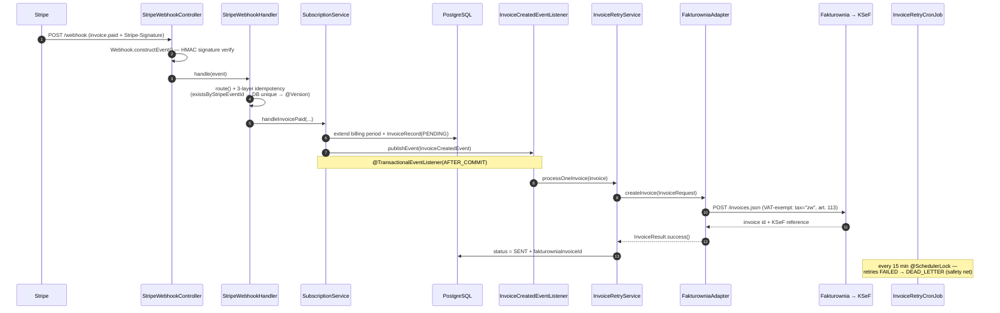

# checkItOut — Backend

> Spring Boot backend for **checkItOut**, a B2B marketplace connecting brands with influencers:
> companies post paid collaboration campaigns, influencers apply, and a Stripe-billed
> subscription tier gates how many campaigns a company can run.

> [!NOTE]
> The package namespace is the legacy `com.sm.instagram.platform`; the product is **checkItOut**.

**Stack:** Java 21 · Spring Boot 3.4.5 · PostgreSQL + Liquibase · Redis · Firebase Auth · Stripe · Fakturownia/KSeF
**Tested:** ~7,972 unit · ~853 integration (Testcontainers) · 175 E2E Cucumber scenarios *(annotation/scenario counts, 2026-06)*

---

## What's actually interesting in here

This isn't a CRUD app. The parts worth reading:

### 1. Event-driven invoicing saga — Stripe → Fakturownia → KSeF

A paid Stripe invoice becomes a legally-compliant Polish VAT invoice (via Fakturownia, which bridges to
the national **KSeF** e-invoicing system) through an after-commit event with triple-layer idempotency and a
retry-to-dead-letter cron as the safety net.



Ports & Adapters keeps the vendor at arm's length: [`InvoicingPort`](src/main/java/com/sm/instagram/platform/subscription/invoicing/InvoicingPort.java) →
[`FakturowniaAdapter`](src/main/java/com/sm/instagram/platform/subscription/invoicing/FakturowniaAdapter.java).
Entry: [`StripeWebhookController`](src/main/java/com/sm/instagram/platform/subscription/stripe/StripeWebhookController.java) ·
orchestration: [`SubscriptionService`](src/main/java/com/sm/instagram/platform/subscription/SubscriptionService.java).

### 2. Subscription state machine — 9 states, event-sourced

Service-driven (not a framework FSM): every transition mutates `SubscriptionStatus`, appends a
`SubscriptionEvent` audit row, and is guarded by an `@Version` optimistic lock. Trial → Business/Enterprise →
downgrade → payment-failure → legal-suspension, with a 38-day terms-grace overlay.
**→ [Full state diagram](docs/diagrams/subscription-state-machine.md)**

### 3. Step-up / TOTP authentication

Sensitive operations require fresh re-authentication. Admins get a TOTP challenge; companies/influencers an
email code. One-time tokens are minted and atomically consumed in Redis (`getAndDelete`); 5 attempts/code,
3 cycles → 24h lockout; TOTP secrets are encrypted at rest and stored in Firestore.
[`auth/stepup/`](src/main/java/com/sm/instagram/platform/auth/stepup/) ·
[`TotpEncryptionService`](src/main/java/com/sm/instagram/platform/common/security/TotpEncryptionService.java).

### 4. Tamper-evident GDPR consent capture

Legal consent is stored as **HMAC-SHA256-signed cookies** (a dedicated secret, separate from the session key),
`SameSite=Lax` so they survive the Instagram OAuth redirect. Signatures are compared in **constant time**
([`HmacUtils`](src/main/java/com/sm/instagram/platform/auth/filter/HmacUtils.java) → `MessageDigest.isEqual`),
and a daily ShedLock cron enforces a 38-day re-consent grace window.
[`legal/ConsentCookieService`](src/main/java/com/sm/instagram/platform/legal/ConsentCookieService.java) ·
[`legal/ConsentEnforcementCronJob`](src/main/java/com/sm/instagram/platform/legal/ConsentEnforcementCronJob.java).

### 5. The system, modeled as a graph

The whole architecture is described in a Neo4j knowledge graph (a NavigationMaster 3-level pattern) used for
impact analysis and AI-assisted navigation — a governance asset, not a runtime dependency.
**→ [Architecture diagram](docs/diagrams/architecture.md)**

---

## Architecture

Six behavioural layers (Controller · Security · Implementation · Lifecycle · External · Config) — see the
**[architecture diagram](docs/diagrams/architecture.md)**. Feature-first packages (`subscription/`,
`partnershipopportunity/`, `legal/`, `auth/`, …), Ports & Adapters for external APIs, `@Version` optimistic
locking on every entity, ShedLock for crons, `@TransactionalEventListener` for decoupled side-effects.

Deep dives start at **[`docs/README.md`](docs/README.md)** — the index: architecture map,
the business domain model (Mermaid lifecycles and flows), per-domain documents,
security, operations and testing. Contributions: [`CONTRIBUTING.md`](CONTRIBUTING.md).

## Run it locally

Fair warning: **the full setup takes a while** — this is a real production system with
real external services, not a toy. The good news: you choose how deep to go. Three
levels, each one a superset of the previous.

### Level 1 — minimal boot (~10 minutes, no external accounts)

Compiles, boots, serves the API with in-memory infrastructure. Good for reading code
with a live debugger.

```bash
# Prereqs: Java 21, Docker (for PostgreSQL), local PostgreSQL superuser
cp .env.example .env                                   # placeholders are fine at this level
./mvnw spring-boot:run -Dspring-boot.run.profiles=no-redis
```

The `no-redis` profile flips `storage.mode` so every Redis-backed component (rate
limits, caches, step-up codes) runs in-memory, and the app **self-provisions its
PostgreSQL database** on first start (database, restricted user, schema — see
[docs/operations/local-dev.md](docs/operations/local-dev.md)). Anything that needs a
real external service (login, mail, uploads) won't work yet — everything else will.

### Level 2 — dev mode with real services (~1-2 hours, free accounts)

This is the "actually use the product locally" level. Work through `.env.example`
top-to-bottom — every key has a comment saying where to get it. The shopping list:

| Service | What you create | Where | Used for |
|---|---|---|---|
| **Firebase** (free) | A project + service account | [console.firebase.google.com](https://console.firebase.google.com) → create project → enable **Authentication** (Email/Password) → Project settings → Service accounts → *Generate new private key* → save as `src/main/resources/service-account.json` (gitignored; template: `service-account.json.example`) | Identity: login, tokens, Firestore (TOTP secrets), Storage |
| **Gmail app password** (free) | A dedicated Gmail account + app password | Create a fresh Gmail for the platform → enable 2-Step Verification → [myaccount.google.com/apppasswords](https://myaccount.google.com/apppasswords) → generate a 16-char app password → `MAIL_PASSWORD` | Transactional mail (verification, notifications, tickets) |
| **Stripe** (free, test mode) | Test API keys + 2 recurring prices | [dashboard.stripe.com](https://dashboard.stripe.com) → API keys (`pk_test_…`, `sk_test_…`) → create Business/Enterprise monthly PLN prices → webhook secret via `stripe listen` | Subscriptions ([sandbox guide](docs/domains/subscription-billing.md#appendix-b--sandbox-wiring--verification)) |
| **JWT & HMAC secrets** | Three random 256-bit strings | `openssl rand -base64 48` ×3 → `JWT_SECRET`, `COOKIE_HMAC_SECRET`, `CONSENT_HMAC_SECRET` | Sessions + consent cookies |
| **HTTPS keystore** | Self-signed cert | One `keytool` command — [docs/operations/local-dev.md §2](docs/operations/local-dev.md) | Required for Instagram OAuth locally |

```bash
docker compose -f docker-compose-dev-redis.yml up -d    # Redis
./mvnw spring-boot:run -Dspring-boot.run.profiles=dev,ssl
curl -k https://localhost:8080/api/actuator/health      # -> {"status":"UP"}
```

### Level 3 — full mode (everything, including the Polish-market integrations)

Add these only when you need the corresponding feature:

| Service | How to get access | Used for |
|---|---|---|
| **Instagram / Meta OAuth** | [developers.facebook.com](https://developers.facebook.com) → create an app → Instagram products → put `META_APP_ID/SECRET`, `INSTAGRAM_CLIENT_ID/SECRET` in `.env` → register the HTTPS redirect URI | Influencer social login + account linking |
| **GUS BIR 1.1** (free, **ask for it**) | Email `regon_bir@stat.gov.pl` with a short request — they issue an API key | Company onboarding: registry lookup by NIP |
| **CEIDG** (free, **ask for it**) | [biznes.gov.pl](https://www.biznes.gov.pl) developer API via *Profil Zaufany* — they issue a JWT token | Sole-proprietorship owner data |
| **MF White List** (free, open) | No key needed (300 req/day limit handled in code) | VAT status + bank accounts |
| **Fakturownia** (trial/paid) | [fakturownia.pl](https://fakturownia.pl) → your subdomain → API token + doc key → create a TEST department | VAT invoices; **KSeF is one API flag** from there |
| **MaxMind GeoLite2** (free) | [maxmind.com](https://www.maxmind.com/en/geolite2/signup) license key → `MAXMIND_LICENSE_KEY`; the app downloads the DB | GeoIP impossible-travel detection |
| **Google Cloud** (production only) | A GCP project with **Secret Manager** (runtime secrets), **KMS** (TOTP secret encryption) and a **GCS bucket** (logs + backups + erasure archives); grant the service account access | Production secrets / crypto / durability |

Production deployment itself (VPS provisioning, hardened host, CI/CD, observability)
is a separate, fully documented path: [docs/operations/deployment.md](docs/operations/deployment.md).

### E2E mode (run the product like the test suite does)

The E2E tier boots the app in a dedicated `e2e` Spring mode with state-management
endpoints and three test actors in **your** Firebase test project — point the actor
identities in `src/test/resources/features/` and `e2e/hooks/` at users you create, and
the 175 Cucumber scenarios become a guided tour of every flow:
[docs/testing/e2e.md](docs/testing/e2e.md).

## Testing

Three tiers, run independently (counts measured on this tree, 2026-06):

```bash
./mvnw test -Dtest=*UnitTest -DskipITs=true   # unit (JUnit 5 + Mockito, no Spring context)
./mvnw verify -Pintegration                   # integration (Testcontainers: PostgreSQL + Redis)
./mvnw verify -Pe2e                           # E2E (15 Cucumber suites against a live stack)
./mvnw jacoco:report                          # coverage
```

| Tier | Count | What it covers |
|---|---|---|
| Unit | 7,970 | services, validators, mappers, security primitives |
| Integration | 842 | repositories, controllers, Redis/DB wiring (Testcontainers) |
| E2E | 175 scenarios (34 `.feature`, 15 runners) | full auth + marketplace + subscription + invoicing flows |

Strategy, decision matrix and the Maven gate wall: [docs/testing/strategy.md](docs/testing/strategy.md).

## Security

Defence in depth from the Cloudflare edge to KMS-encrypted secrets — the full walk:
[docs/security/architecture.md](docs/security/architecture.md). Independent
penetration tests by the Wrocław Centre for Networking and Supercomputing (WCSS,
Wrocław University of Science and Technology) within the WRO4digITal programme
(EDIH Wrocław) are in progress; the [domain model](docs/domain-model.md) doubles as
the testers' briefing.

Found a vulnerability? Please report it privately via a GitHub security advisory
rather than a public issue.

## License

[MIT](LICENSE). Take the platform as a blueprint, swap in your product, ship.

---

*checkItOut — a startup in the box: we build and we share.*
