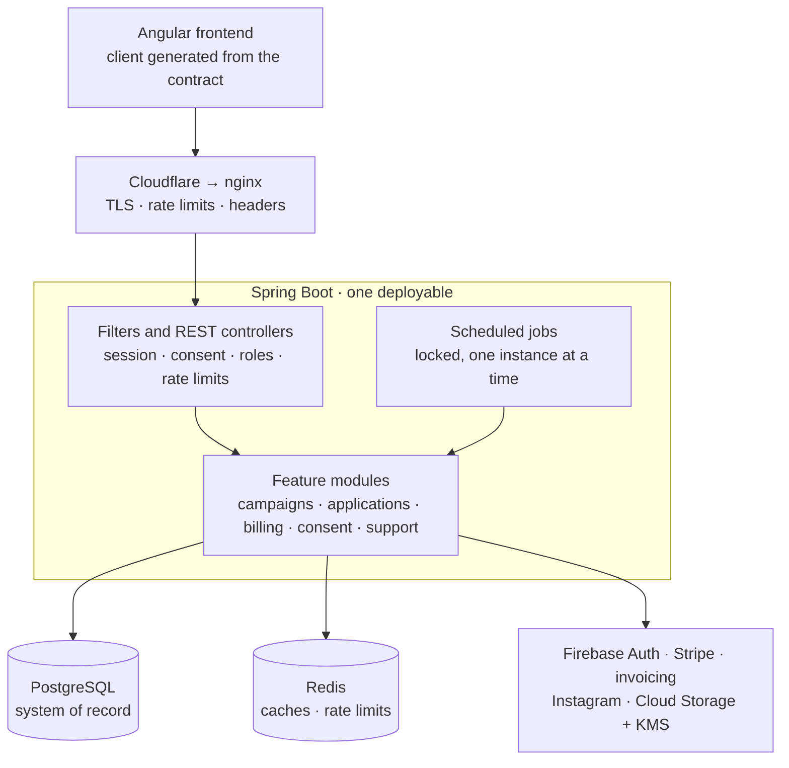

# CheckItOut — Backend

A marketplace platform connecting companies with influencers: a company publishes a campaign,
creators apply, and both sides run the collaboration through content, review and settlement.
Java 21 · Spring Boot 3.4 · PostgreSQL · Redis · Stripe. It ran in production.

[**🔗 Live sandbox — click around**](https://checkitout.app/sandbox/) ·
[**🛡 Penetration test — findings and fixes**](docs/security/pentest-remediation.md) ·
[**📋 Technical survey**](https://checkitout.app/technical-survey/engineering) ·
[**✅ Verified Meta Tech Provider**](docs/evidence/meta-tech-provider.png)

[](https://check-it-out-dev.github.io/checkitout-backend/)
[](https://check-it-out-dev.github.io/checkitout-backend/#quality)
[](https://check-it-out-dev.github.io/checkitout-backend/#quality)
[](https://github.com/Check-It-Out-Dev/checkitout-backend/actions/workflows/pr.yml)
[](https://github.com/Check-It-Out-Dev/checkitout-backend/actions/workflows/nightly.yml)
[](LICENSE)

---

## Highlights

- **More than 11,000 automated tests across the two repositories** — unit tests, integration tests
  on a real PostgreSQL, multi-actor Cucumber scenarios driven over HTTP, and mutation testing to test
  the tests. The exact counts are [measured and gated](#the-numbers).
- **Security evaluated from outside** — an independent penetration test (OWASP methodology, 2026)
  found nothing critical and rated the security above average; every finding and what was done about
  it is [published](docs/security/pentest-remediation.md).
- **Verified Meta Tech Provider** — Meta verified the business and its access, and the application
  went live on the Instagram API ([screenshot](docs/evidence/meta-tech-provider.png)).
- **Contract-first by enforcement** — the OpenAPI document is generated from a running server and the
  frontend's typed client is generated from that document; a change that breaks the client fails the
  build ([how](docs/guide/openapi-contract.md)).
- **AI-reviewed CI** — a Claude reviewer comments on every pull request but cannot approve, and every
  number it cites is machine-checked against the run's own reports ([how](docs/guide/cicd.md)).
- **Self-healing delivery** — releases go to Ansible-provisioned hosts behind a backup, a health
  check and an automatic rollback ([how](docs/guide/cicd.md#the-release-chain)).
- **Billing that survives reality** — Stripe subscriptions with signed, idempotent webhooks and
  invoices that retry; the subscription lifecycle was designed as a graph and runs as a locked state
  machine driven by scheduled jobs ([how](docs/guide/billing-graph.md)).

## The story

CheckItOut was the first system I built end to end. The engineering held up — the penetration test
and Meta's verification confirmed that — but we did it in the wrong order. We spent six months
hardening the platform to enterprise level before we had users to protect, and the competition beat
us to market.

The lesson that stayed with me: even as the technical founder, I should have pushed the team toward
customers earlier — someone validating demand with a spreadsheet and the first ten clients while the
software was still being built. Good engineering at the wrong time is still a bad decision. The code
is open source now; the next project started from one user's real problem and shipped the smallest
thing that solved it.

## Architecture


```mermaid
flowchart TB
    FE["Angular frontend<br/>client generated from the contract"]
    EDGE["Cloudflare → nginx<br/>TLS · rate limits · headers"]
    FE --> EDGE --> API

    subgraph APP["Spring Boot · one deployable"]
        API["Filters and REST controllers<br/>session · consent · roles · rate limits"]
        JOB["Scheduled jobs<br/>locked, one instance at a time"]
        SVC["Feature modules<br/>campaigns · applications · billing · consent · support"]
        API --> SVC
        JOB --> SVC
    end

    SVC --> PG[("PostgreSQL<br/>system of record")]
    SVC --> RD[("Redis<br/>caches · rate limits")]
    SVC --> EXT["Firebase Auth · Stripe · invoicing<br/>Instagram · Cloud Storage + KMS"]
```

A modular Spring Boot monolith: one package per feature, PostgreSQL as the system of record with the
schema owned by Liquibase, Redis for what may be lost, Stripe for billing, and every replaceable
vendor behind a port. It deploys as one container onto Ansible-provisioned hosts.

One page per question, each drawn from the code:

- [Architecture overview](docs/guide/overview.md) — how a request travels, and the decisions behind it
- [Domain model and modules](docs/guide/domain.md)
- [The subscription state machine, as a graph](docs/guide/billing-graph.md)
- [The OpenAPI contract pipeline](docs/guide/openapi-contract.md)
- [Security: authentication, MFA, secrets, hardening](docs/guide/security.md)
- [CI/CD, rollback and the Claude review gate](docs/guide/cicd.md)
- [Load testing on Kubernetes](docs/guide/load-testing.md)
- [Privacy and GDPR: what is built, and what is not](docs/guide/gdpr.md)

The full index is [docs/README.md](docs/README.md).

## Quick start

No credentials, no vendor sign-ups — one command (you need Docker, a JDK 21 and Node):

```bash
git clone https://github.com/Check-It-Out-Dev/checkitout-backend
cd checkitout-backend
node tools/dev-lite.mjs
```

> On Windows, run `git config --global core.longpaths true` **before cloning** — some test paths
> exceed the classic 260-character limit.

The wizard starts PostgreSQL and Redis in Docker, boots the backend on its credential-less
`dev-lite` profile, and starts the frontend if it is checked out next door. It narrates every step
and is safe to re-run. You get a seeded world — campaigns, applications, three accounts to sign in
as — a readable local mailbox and working file uploads, with Firebase, Stripe and the other vendors
simulated at the edge. What is real and what is simulated: **[docs/DEV-LITE.md](docs/DEV-LITE.md)**.

API: `https://localhost:8080/api` · Swagger UI: `https://localhost:8080/api/swagger-ui/index.html`

**As a developer would**, without the wizard:

```bash
docker compose -f docker-compose-dev-redis.yml up -d postgres redis
./mvnw spring-boot:run        # profile `dev`, plain HTTP on :8080; add the `ssl` profile for HTTPS
```

No `.env` is required: every external credential has a blank default, and the feature behind it
fails cleanly instead of stopping the boot. The path from here to production, one vendor at a time,
is [docs/ROLLOUT.md](docs/ROLLOUT.md).

Prefer not to run anything? The [live sandbox](https://checkitout.app/sandbox/) is this backend on
the same credential-less profile.

## Testing and CI

Three tiers, shaped by one rule — simulate what you are not testing, never what you are:

```bash
./mvnw test -Ptest               # unit — no external services, about a minute
./mvnw verify -Pintegration      # services and repositories on Testcontainers: real PostgreSQL, real SMTP
./mvnw verify -Pe2e              # Cucumber — the whole application booted and driven over HTTP by several actors
```

Mutation testing (PIT) covers the security, rate-limit and authentication code; k6 load tests run
against this backend's image in a Kubernetes cluster and report p95 and p99 per journey. Pull
requests run the unit and integration tiers plus the invariants in about seven minutes; every night
runs everything, including Schemathesis against a live server and the security scanners. Results are
public: the [quality dashboard](https://check-it-out-dev.github.io/checkitout-backend/) and an
[Allure report](https://check-it-out-dev.github.io/checkitout-backend/allure/latest/) with history.
Details: [CI/CD](docs/guide/cicd.md) · [testing in depth](docs/testing/README.md).

### The numbers

Measured on this tree by `node tools/ci/measure-counts.mjs`; the unit job re-runs it with `--check`,
so a stale figure fails the build instead of ageing in public.

| | | |
| :-- | --: | :-- |
| **Test methods** | **9,125** | 8,518 `@Test` + 607 `@ParameterizedTest`, across **295** test classes and the **2,165** `@Nested` groups inside them |
| **Test code : main code** | **2.0 : 1** | ~189k lines of test Java against ~93k of main |
| **Demoted from the pull-request tier** | **165** | tests whose every covered line and killed mutant other tests also cover and kill; they still run nightly, nothing is deleted ([how](docs/testing/README.md#test-governance)) |
| **Cucumber** | **34 files** | 148 `Scenario` + 28 `Scenario Outline`, **277 after Examples expansion** |
| **Domain** | **38 entities** | 50 REST controllers |
| **Contract** | **233 paths** | 272 operations · 205 schemas · OpenAPI 3.1 |

And one number worth more than any of them: **`@Disabled` appears zero times** across all 369 test
files. Nothing is quarantined, skipped-and-forgotten, or commented out.

## Who is this for

Teams building a marketplace in the EU:

- **GDPR-aware by design** — versioned legal documents with recorded, provable consent and enforced
  re-consent, cookie consent, and account-erasure paths across every store. What is built and what a
  team must still add (the data export, for one) is [written down](docs/guide/gdpr.md).
- **Subscriptions and invoicing wired end to end** — Stripe checkout and webhooks, invoices through
  a replaceable adapter. It was exercised end to end in Stripe's test mode; the flag that enables it
  is one setting.
- **MIT licensed** — take the whole platform or just the parts you need: the consent module, the
  signed-upload flow, the session design, the release chain.

The frontend lives in [checkitout-frontend](https://github.com/Check-It-Out-Dev/checkitout-frontend)
— Angular, with a typed API client generated from this repository's OpenAPI document. How one person
kept a system this size navigable — the code base modelled as a graph that coding agents query — is
[graph-theory-system-modeling](https://github.com/Check-It-Out-Dev/graph-theory-system-modeling).

## License

MIT — see [LICENSE](LICENSE). Contributions welcome; see [CONTRIBUTING.md](CONTRIBUTING.md).
