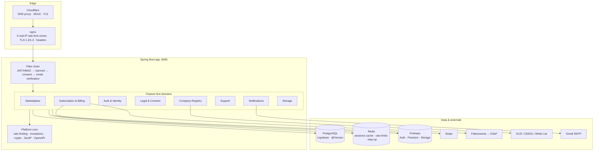

# Architecture — the system in one read

checkItOut's backend is a single Spring Boot 3.4.5 / Java 21 application with
feature-first packages, surrounded by an operational shell (provisioning, CI/CD,
observability) that ships in this repository. This page is the map; every domain links
to a deeper document or a co-located README, and every claim is verifiable in code.

> The architecture is also modeled as a Neo4j knowledge graph (NavigationMaster →
> 18 domain navigators → ~150 implementation nodes with behavioral relationships),
> rebuilt from source for this release. It is a governance asset, not a runtime
> dependency — the docs below were written from it.

## The runtime, layer by layer

## Domain map

| Domain | One sentence | Deep dive |
|---|---|---|
| **Marketplace** | Companies publish campaigns, influencers apply once, a 12-state machine runs the cooperation to content, payment and mutual rating | [domains/marketplace.md](domains/marketplace.md) |
| **Subscription & Billing** | Stripe webhooks drive a nine-state subscription FSM ending in a delivered Polish VAT invoice (Fakturownia → KSeF), three idempotency layers deep, one flag to disable payments entirely | [domains/subscription-billing.md](domains/subscription-billing.md) |
| **Auth & Identity** | HttpOnly HMAC-signed cookie sessions, one minting point, tokenVersion instant revocation (HTTP 419 contract), step-up ladder, admin TOTP in KMS-encrypted Firestore | [security/architecture.md](security/architecture.md) · [security/step-up-authentication.md](security/step-up-authentication.md) |
| **Legal & Consent (RODO)** | Consent as forensic evidence: HMAC cookies + immutable jsonb proof records, hash-triggered re-consent, three enforcement crons, four-system erasure pipeline | [security/consent-gdpr.md](security/consent-gdpr.md) |
| **Company Registry & Onboarding** | NIP-driven onboarding verified against three Polish government registries (GUS SOAP, CEIDG, MF White List) with provenance-stamped evidence and post-commit auto-activation | [domains/company-onboarding.md](domains/company-onboarding.md) |
| **Users & Admin** | User aggregate with dual version columns (JPA lock + tokenVersion), seven-state account machine, preview-then-confirm GDPR cascade delete with a retry ledger | [domain-model.md §4.1, §5.9](domain-model.md) |
| **Support & Ticketing** | Anonymous-capable tickets (identity = reference + email), enum-enforced status machine, mail that can never break the flow | [domain-model.md §5.8](domain-model.md) |
| **Notifications & Mail** | AFTER_COMMIT event pipeline → translated, snapshot-frozen in-app feed + ShedLocked batch email queue | [domains/notifications.md](domains/notifications.md) |
| **Storage & Media** | Direct-to-Firebase uploads via 5-minute V4-signed URLs that bind content-type and size; the backend never relays bytes | [domains/storage.md](domains/storage.md) |
| **Platform Core** | Custom Redis ZSET sliding-window rate limiter (GDPR-anonymizing wrapper), TranslatableException i18n error architecture, KMS crypto, impossible-travel GeoIP | [security/architecture.md](security/architecture.md) |
| **Configuration & Secrets** | 12-profile YAML matrix with pinned JPA invariants, `storage.mode` flips Redis↔in-memory, Secret-Manager-volume pattern, least-privilege dual datasource | [operations/local-dev.md](operations/local-dev.md) |
| **Database & Migrations** | One Liquibase master changelog for every environment (context-gated seeds), `@Version` on every entity, legal documents seeded by content hash | [operations/local-dev.md](operations/local-dev.md) |
| **Dictionaries** | Reference data on a shared CRUD framework, DB-backed translations, locale from an explicit `X-App-Language` header | — |

## The operational shell (ships in this repo)

| Area | One sentence | Deep dive |
|---|---|---|
| **Provisioning & Hardening** | 15 Ansible roles take a blank Ubuntu 24.04 VPS to a hardened host in ~70 minutes, molecule-tested | [ansible/README.md](../ansible/README.md) |
| **CI/CD & Immutability** | Maven gate wall (OWASP fails at CVSS ≥ 7) + chattr-immutable deploy scripts + timestamp-guarded auto-rollback | [operations/deployment.md](operations/deployment.md) · [operations/immutability.md](operations/immutability.md) |
| **Network Perimeter** | Cloudflare → nginx with six real-IP rate-limit zones and a daily CF-range refresh; mTLS on the log store | [security/architecture.md](security/architecture.md) |
| **Observability** | journald → Grafana Alloy → Loki → GCS, with a dedicated pentest-activity alert | [operations/observability.md](operations/observability.md) |
| **Testing** | 7,970 unit · 842 integration (Testcontainers) · 175 E2E Cucumber scenarios, AI-runnable by design | [testing/strategy.md](testing/strategy.md) |

## Architectural conventions

- **Feature-first packages** — `subscription/`, `legal/`, `registry/`… each owns its
  controllers, services, entities; cross-cutting code lives in `common/`.
- **Ports & Adapters for replaceable vendors** (`InvoicingPort` → `FakturowniaAdapter`);
  **direct integration for strategic ones** (Stripe).
- **`@Version` optimistic locking on every entity** — concurrency is handled at the
  aggregate, not with table locks.
- **ShedLock on every cron** — horizontal scale-out never double-fires a job.
- **`@TransactionalEventListener(AFTER_COMMIT)` for side-effects** — notifications,
  invoicing and activation hooks can fail without rolling back business state.
- **The OpenAPI spec is the contract** ([openapi/](openapi/)) — the Angular client is
  generated from it; the payments surface is deliberately excluded while gated.
- **One flag, whole subsystems** — `app.payments.enabled` and `storage.mode` flip
  entire capability sets at the bean level, with boot guards validating consistency.

## Reading order

1. This page — the map.
2. [domain-model.md](domain-model.md) — the business layer: actors, lifecycles, flows
   (Mermaid), invariants.
3. One domain deep-dive that interests you (billing is the showpiece).
4. [security/architecture.md](security/architecture.md) — the defence-in-depth walk.
5. [operations/](operations/) — how it runs in production.
6. [testing/strategy.md](testing/strategy.md) — why you can change it without fear.
