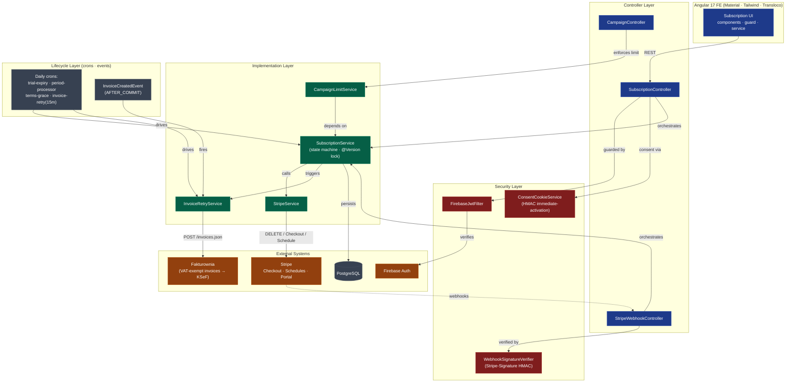

# System Architecture — checkItOut

The platform behind the subscription + invoicing pipeline. Six behavioural layers
(Controller · Security · Implementation · Lifecycle · External · Config), modelled
from the source-of-truth in [`docs/StripeGateway/REQUIREMENTS.md`](../StripeGateway/REQUIREMENTS.md).

