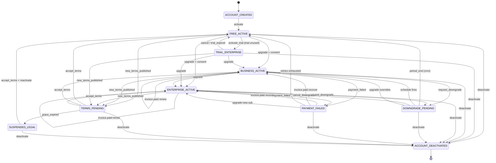

# Subscription State Machine — checkItOut

9 states, service-driven (not a framework FSM): `SubscriptionService` mutates
`SubscriptionStatus` and appends a `SubscriptionEvent` audit row on every transition,
guarded by an `@Version` optimistic lock. Trial → Business/Enterprise → downgrade →
payment-failure → legal-suspension, with a 38-day terms-grace overlay.
Source of truth: [`docs/StripeGateway/REQUIREMENTS.md`](../StripeGateway/REQUIREMENTS.md) §11/§12/§15.

**Terms-grace overlay.** `new_terms_published` moves any active state into `TERMS_PENDING` for a 38-day grace
window. Billing keeps running there (self-loops on `invoice.paid` / `payment_failed` / `trial_expired` /
`sub.updated`); `accept_terms` restores the previous tier. If the grace expires, Stripe is cancelled and the
account drops to `SUSPENDED_LEGAL` (0 campaigns) until the user accepts and reactivates.

## Campaign limits per state

| State | Active campaigns |
|---|---|
| FREE_ACTIVE | 2 |
| TRIAL_ENTERPRISE | 10 |
| BUSINESS_ACTIVE | 5 |
| ENTERPRISE_ACTIVE | 10 |
| DOWNGRADE_PENDING / PAYMENT_FAILED / TERMS_PENDING | previous plan's limit |
| SUSPENDED_LEGAL | 0 |
