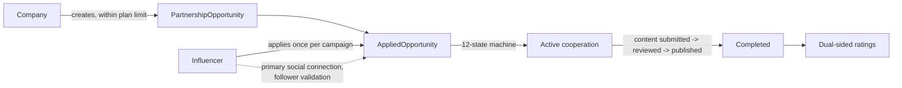

# Marketplace — campaigns, applications, cooperations

The product core: companies publish paid collaboration campaigns
(*PartnershipOpportunities*), influencers apply, and an accepted application runs
through a full cooperation lifecycle to content delivery, payment and mutual rating.
Packages: `partnershipopportunities`, `appliedopportunities`, `activecooperations`,
`usersocialconnection`.

## The shape of the domain



- **Campaign creation passes a plan-limit guard** — quota enforcement
  (`CampaignLimitService`, pessimistic lock per billing period) lives at the domain
  boundary, so a company can never over-publish regardless of request concurrency.
- **One application per influencer per campaign**, enforced by a DB constraint, not
  just service logic.
- **The cooperation lifecycle is a 12-state machine encoded in the `OpportunityStatus`
  enum**: `getNextStatus(current, accept)` computes every legal transition,
  accept-only stages refuse backward motion, three terminal states end the run.
  Every transition is published as a Spring event (notifications hang off it,
  decoupled) and appended to a non-throwing status-history audit trail with actor
  and reason — auditing can never break the business operation.
- **Eligibility is data-driven**: before acceptance the applicant's *primary* social
  connection follower count is validated against the campaign's declared range
  (see [follower-validation.md](follower-validation.md)).
- **Campaigns with in-flight applications are immutable** — edit and deactivation are
  blocked across five active statuses; deletion is always a soft-deactivation.
- **Content review closes the loop**: a submission starts PENDING, auto-advances the
  cooperation into company review, and the published social-media link moves it toward
  payment and completion; afterwards both sides rate each other through role-scoped
  dashboards (per-role Jackson views keep each side's data private).

## Key classes

| Class | Role |
|---|---|
| `PartnershipOpportunity` | Campaign entity — soft delete, `@Version` optimistic lock |
| `PartnershipOpportunityService` | Lifecycle, plan-limit guard, role-aware filtering |
| `PartnershipOpportunityController` | REST surface with tiered rate limits |
| `AppliedOpportunity` | Application entity, unique per influencer+campaign |
| `AppliedOpportunityService` | Apply / accept / reject workflow, follower validation, events |
| `AppliedOpportunityController` | REST + 20-applications/hour anti-spam limit |
| `OpportunityStatus` | The 12-state machine, transitions computed in the enum |
| `AppliedOpportunityStatusHistoryService` | Append-only transition audit (never throws) |
| `AppliedOpportunityContentService` | Content submissions drive the status machine |
| `ActiveCooperationService` | Role-viewed dashboards, dual-sided ratings |
| `UserSocialConnection(+Service)` | Social account binding, primary flag, follower counts |

## Query filtering on the paged endpoints

List endpoints share a `SpecificationBuilder`-based filter language:

```
GET /partnership-opportunity/paged?active=true                  # boolean fields
GET /partnership-opportunity/paged?compensationType=CASH        # enum equality
GET /partnership-opportunity/paged?company.id!=1                # NOT via trailing '!'
GET /partnership-opportunity/paged?active=true&compensationType!=BARTER   # combined
```

Nested paths (`company.id`), booleans and the negation operator compose freely with
pagination and sorting.
