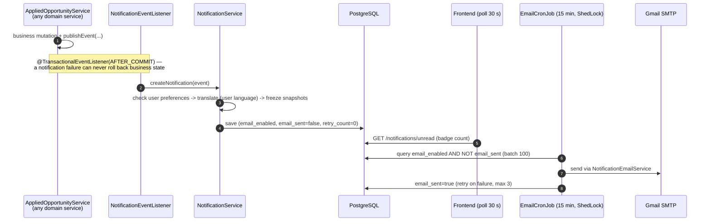

# Notifications & mail

In-app notifications plus transactional email, decoupled from business logic by
after-commit events. Package: `com.sm.instagram.platform.notification` (25 classes).

## The flow

## Key classes

| Class | Role |
|---|---|
| `NotificationEventListener` | The only bridge from domain events to notifications (`AFTER_COMMIT`) |
| `NotificationService` | Preferences check → translation → snapshot → persist |
| `NotificationTranslationService` | Renders content in the recipient's language via the dictionary |
| `ActorSnapshot` / `CampaignSnapshot` / `NotificationSnapshot` | Embeddables freezing actor/campaign data at event time — history stays truthful after renames/deletes |
| `EmailCronJob` + `ShedLockConfig` | 15-minute batch sender (100/run), `@SchedulerLock` so exactly one node sends |
| `NotificationEmailService` | SMTP delivery with templates |
| `NotificationController` | Unread count, list, mark-read / mark-all-read |
| Events: `OpportunityStatusChangedEvent`, `NewUserRegisteredEvent`, `AccountActivatedEvent` | Published by domain services, consumed only here |

## Why it is built this way

| Decision | Choice | Reason |
|---|---|---|
| Event handling | `@TransactionalEventListener(AFTER_COMMIT)` | A failing notification must never roll back the business transaction; the status change survives even if mail is down |
| Email delivery | Cron queue, not send-on-event | Fixed batch size, natural retry on next tick, queue health is one SQL query, trivially extensible to digests |
| Frontend updates | 30-second polling, not WebSocket | A few lines of HTTP instead of reconnection/auth machinery; cookies just work |
| Push notifications | Deferred | Email reaches 100% of B2B users; web push does not |

The pattern set (sync event bus + after-commit listeners + batched queue + polling) is
the boring-on-purpose stack used at scale by the usual suspects; the interesting part
is the snapshot model — notifications render from data frozen at event time, so the
feed never lies about the past.

## Operational notes

- Mail credentials come from `MAIL_PASSWORD` (Gmail app password — see the root README
  for creating one from a Gmail account).
- The cron is ShedLock-guarded; horizontal scale-out does not duplicate sends.
- E2E coverage: the `@notification-e2e` Cucumber suite (`RunNotificationIT`) walks the
  full path with GreenMail standing in for SMTP — see [testing/e2e.md](../testing/e2e.md).
