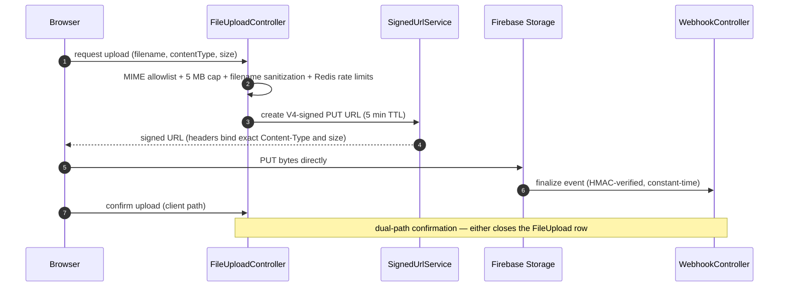

# Storage & media — direct-to-Firebase uploads

The backend **never relays file bytes**. It issues short-lived signed URLs, the browser
uploads straight to Firebase Storage (GCS), and confirmation closes the loop through
two independent paths. Package: `com.sm.instagram.platform.storage`
(co-located deep dive: [`src/main/java/com/sm/instagram/platform/storage/README.md`](../../src/main/java/com/sm/instagram/platform/storage/README.md)).

## The handshake

Key properties:

- **Signed-URL binding** — the V4 signature covers the declared `Content-Type` and
  size headers, so a URL minted for an avatar JPEG cannot be reused to push a
  different payload.
- **Validation** — MIME allowlist (`^image/(jpeg|jpg|png|gif|webp)$`), 5 MB cap,
  filename sanitization, paths shaped `content/{userId}/{timestamp}_{filename}`.
  Honest gap, listed as future work: no magic-byte sniffing / AV scanning yet.
- **Rate limiting** — Redis sliding windows (hourly, daily, global-per-minute) plus a
  cumulative storage quota per user; an in-memory implementation swaps in for dev/E2E.
- **Webhook trust** — Firebase events are HMAC-SHA256-verified with constant-time
  comparison (`WebhookController` → `HmacUtils`).
- **Orphan sweep** — an hourly job fails abandoned PENDING rows
  (`FileTrackingService`).
- **Avatars** — `ProfilePictureProxyService` serves profile pictures first-party with
  1-year immutable `Cache-Control`, keeping third-party URLs out of the UI.
- **Observability** — Prometheus upload metrics + a composite actuator health
  indicator with graceful degradation.

## Key classes

| Class | Role |
|---|---|
| `FileUploadController` | Signed-URL handshake endpoints |
| `SignedUrlService` | V4-signed 5-minute PUT URLs |
| `StorageRateLimitService` | Redis sliding-window quotas |
| `FileTrackingService` | Upload lifecycle + hourly orphan sweep |
| `WebhookController` | HMAC-verified Firebase event receiver |
| `FileUpload` | UUID-keyed tracking entity |
| `FirebaseStorageService` | Server-side GCS operations |
| `ProfilePictureProxyService` | First-party avatar proxy cache |
| `FileUploadProperties` | Size/extension/path policy |
| `UploadSystemHealthIndicator` | Composite health probe |

## Cleanup roadmap (known gaps, by design open)

Identified and documented before release; both are scoped as a scheduled
`StorageCleanupService`:

| Gap | Today | Planned |
|---|---|---|
| Orphaned GCS objects | Hourly sweep fails the **DB row** only; bytes stay in GCS | Delete the GCS object alongside |
| GDPR file cascade | Admin cascade delete archives + erases four systems, but bulk `users/{userId}/` prefixes rely on the cascade pipeline | Prefix-wide GCS deletion + tracking-row purge in the same job |

The admin cascade-delete pipeline (archive-to-GCS first, then PostgreSQL → Firestore →
Storage → Firebase Auth, with a retry ledger) is documented in
[users-and-admin material in the domain model](../domain-model.md#549-account-deletion--erasure-gdpr).
