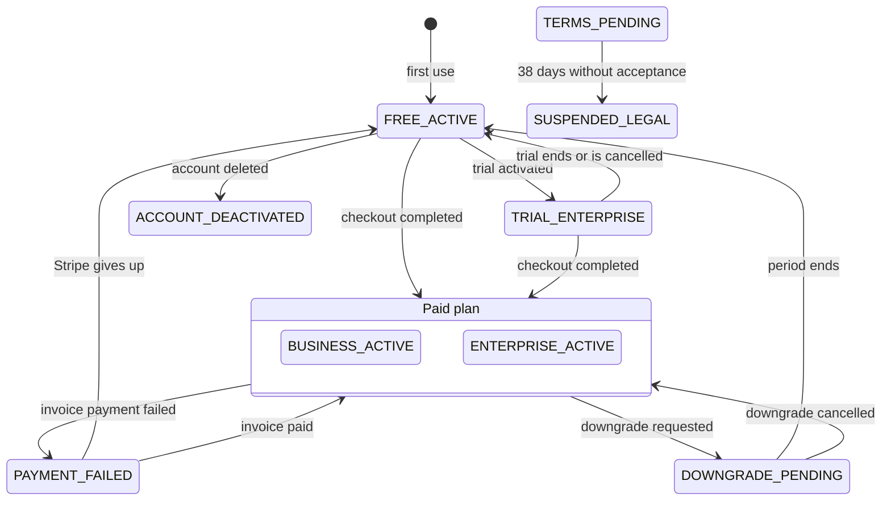

# The subscription state machine, as a graph

Billing is where three actors write the same row: a person clicking in the application, Stripe
calling a webhook, and a nightly job. The design was worked out as a graph — states, transitions,
rules and corner cases as nodes and edges in a graph database — before any code was written, because
"what happens if the payment fails while a downgrade is pending?" is a question about paths, and a
graph answers it by query. The implementation is an enum, guards at each transition, and locks.
**This page is drawn from the code**, not from the design: where the two differ, the code is what runs.

> **Status.** The whole chain — checkout, webhooks, invoices — was exercised end to end on Stripe's
> test mode. In production the feature flag `app.payments.enabled` stayed off: every company was on
> the free plan, and the paid endpoints answered 404. The state machine, its jobs and its tests are
> real; paying customers were not.



`TERMS_PENDING` is entered when new terms are published and left by accepting them; any state can end
in `ACCOUNT_DEACTIVATED`. Both are drawn once to keep the picture readable.

## The states

Nine, in [`SubscriptionStatus`](../../src/main/java/com/sm/instagram/platform/subscription/entity/SubscriptionStatus.java),
mirrored by a `CHECK` constraint in the schema so the database refuses a tenth.

| State | What the account can do |
| :-- | :-- |
| `FREE_ACTIVE` | The free plan's campaign limit |
| `TRIAL_ENTERPRISE` | The enterprise limit for three months, once per company |
| `BUSINESS_ACTIVE`, `ENTERPRISE_ACTIVE` | The plan's limit |
| `DOWNGRADE_PENDING` | Still the old plan's limit until the paid period ends |
| `PAYMENT_FAILED` | Still the old plan's limit while Stripe retries the charge |
| `TERMS_PENDING` | Unchanged limits, with a deadline to accept the new terms |
| `SUSPENDED_LEGAL` | No new campaigns |
| `ACCOUNT_DEACTIVATED` | The account was deleted |

## Who moves it

| Trigger | Transitions it causes | Where |
| :-- | :-- | :-- |
| The user — `POST /subscription/trial/activate`, `/downgrade`, `/downgrade/cancel` | Free → trial; paid → downgrade pending and back; trial → free | `SubscriptionService` |
| Stripe — `checkout.session.completed` | → the purchased plan | `StripeWebhookHandler` |
| Stripe — `invoice.payment_failed`, `invoice.paid` | Paid → payment failed, and back; a paid invoice also creates the invoice record | same |
| Stripe — `customer.subscription.updated`, `.deleted` | Plan changed; → free when the subscription ends | same |
| Job, 04:00 — `SubscriptionPeriodProcessorCronJob` | Expired trials → free; free billing periods roll over | `subscription/cron` |
| Job, 03:00 — `TermsGraceProcessorCronJob` | Terms deadline passed → suspended | same |
| Account deletion | Any state → deactivated | `UserAccountOrchestrator` |

`POST /subscription/upgrade` changes no state: it opens a Stripe checkout and waits for the webhook,
so the application never believes a payment that Stripe has not confirmed. Every transition appends a
row to `subscription_event` in the same transaction — the audit trail and the state can never
disagree.

## What keeps three writers from corrupting one row

- **Webhooks lock the row.** Every webhook handler loads the subscription with
  `PESSIMISTIC_WRITE`; the entity also carries `@Version`. A user request that loses the race gets
  HTTP 409; a webhook that loses it answers 503, and Stripe delivers it again.
- **A webhook is processed once.** The Stripe event id is stored with the event row under a unique
  constraint; a redelivery is recognised before any state is touched, and the constraint catches the
  race the check cannot.
- **Signatures are verified** with Stripe's own library before the payload is read.
- **Jobs run on one instance.** Each job holds a ShedLock lock in PostgreSQL for its run.
- **The flag has a guard.** With payments switched off, `PaymentsDisabledBootGuard` refuses to start
  the application if any company is still in a paid or pending state — switching billing off with
  customers mid-cycle is a mistake the machine will not let you make quietly.

## Invoices

Invoicing is a port ([`InvoicingPort`](../../src/main/java/com/sm/instagram/platform/subscription/invoicing/InvoicingPort.java))
with one adapter, Fakturownia. A paid Stripe invoice writes an `InvoiceRecord` as `PENDING` inside
the transaction; a listener sends it after the commit; a job retries every fifteen minutes, up to
five times, then parks it as `DEAD_LETTER`. The request carries an idempotency key derived from the
record, so a retry after a timeout cannot issue a second invoice.

## Where the code and the design differ

Stated plainly, because a diagram that flatters the code is worth nothing:

- The design counts ten states; the tenth ("account created") is simply the absence of a row.
- Entering and accepting `TERMS_PENDING` is implemented and tested, but in this tree it is triggered
  only from the test profile — the bridge from the legal-documents module was not built.
- `SUSPENDED_LEGAL` has no way back to an active state yet.
- A dead-lettered invoice writes a log line; the design asked for an administrator alert.
- The requirements in [`docs/StripeGateway/`](../StripeGateway/) are the original design and were not
  rewritten after the fact; read them as history.

## Check it yourself

```bash
./mvnw verify -Pe2e -Dcucumber.filter.tags="@subscription"     # the lifecycle, end to end
./mvnw test -Ptest -Dtest='SubscriptionService*UnitTest'        # every transition and its guard
```

The feature files are
[`subscription-e2e.feature`](../../src/test/resources/features/subscription/subscription-e2e.feature)
and [`payments-off.feature`](../../src/test/resources/features/payments_off/payments-off.feature).

Next: [the contract pipeline](openapi-contract.md) · [domain and modules](domain.md) ·
[back to the index](../README.md)
