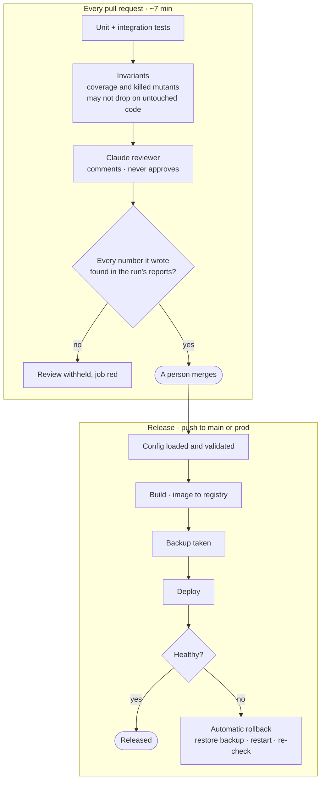

# CI/CD: two test pipelines, a release chain that rolls itself back, and a reviewer that cannot approve

Three questions, three mechanisms. *Is this change safe to merge?* — the pull-request pipeline, in
about seven minutes. *Is the system healthy?* — the nightly pipeline, as long as it takes. *Did the
release work?* — the deployment chain, which takes a backup first and restores it by itself when the
new version does not come up healthy.



## The two test pipelines

| Pipeline | Runs | What it calls |
| :-- | :-- | :-- |
| [`pr.yml`](../../.github/workflows/pr.yml) | every pull request, every push to `main` | unit and integration tiers, the invariants, SonarQube's new-code gate, dependency review |
| [`nightly.yml`](../../.github/workflows/nightly.yml) | 02:30 UTC and on demand | every tier including the Cucumber end-to-end corpus, Schemathesis against a running server, mutation testing, the security scanners |

Every tier is a reusable workflow with no trigger of its own, so nothing fires by itself and each
pipeline ends in one verdict. The end-to-end tier runs on public runners with no credential anywhere:
Firebase is replaced by its emulator suite, seeded with the actors the feature files name. Results
are published on every run — a [quality dashboard](https://check-it-out-dev.github.io/checkitout-backend/)
with pass rate, mutation score, security findings and the tests that failed or flaked in the last ten
runs, and an [Allure report](https://check-it-out-dev.github.io/checkitout-backend/allure/latest/)
with history.

## The reviewer that cannot approve

[`ai-review.yml`](../../.github/workflows/ai-review.yml) runs Claude on a pull request after the test
pipeline finishes. Three limits make it safe to leave switched on:

1. **It has no power.** Its tools are read-only plus writing one file. It cannot post, approve or
   merge: the workflow posts its file as a single comment, and only after the check below. The
   comment's first and last lines say so, every time.
2. **It may not invent numbers.** It writes its review to a file; a script
   (`pr-numbers-check`, invariant I5) then looks up every number in the review in the reports the run
   produced. One number that is not there, and the review is withheld and the job goes red.
3. **It is not the gate.** The gate is the invariants job, which calls no model and holds no secret:
   coverage never lower on code the change did not touch (I1), no mutant that was killed yesterday
   left alive (I2), the suite green in written and in random order (I3), every published number equal
   to the tree (I4).

An agent may propose anything; the invariants dispose; a person merges. The plain-words guide is
[`docs/testing/ai-in-the-loop.md`](../testing/ai-in-the-loop.md).

## The release chain

Deployment runs from [`backend-deployment-prod.yml`](../../.github/workflows/backend-deployment-prod.yml)
(branch `prod`) and its test twin (branch `main`), built from reusable stages:

`config-loader` → `config-validator` → build and push the image → `pre-deployment-backup` →
`deploy-and-secure` → `reload-and-validate` → `auto-rollback` (only if needed) → summary.

- **Scripts are checked before they run.** Every script uploaded to the host is verified against its
  sha256 and made immutable there.
- **Rollback is automatic and narrow.** [`auto-rollback-systemd.yml`](../../.github/workflows/auto-rollback-systemd.yml)
  restores the backup, restarts the unit and re-checks health. It fires only when the backup
  succeeded and a later stage failed: rolling back to a backup that does not exist is worse than
  staying broken, and a failure before the deploy never reached the server.
- **The image is proven before it is promoted.** [`build-image.yml`](../../.github/workflows/build-image.yml)
  boots the freshly built container against real PostgreSQL and Redis, waits for readiness, and only
  then moves the tags — keeping the previous one for a manual rollback.
- **The host is code.** A hardened VPS provisioned by Ansible ([`ansible/`](../../ansible/), fifteen
  roles: base system, users, Docker, secrets, systemd, nginx, monitoring, hardening), running Docker
  Compose under systemd. Kubernetes is used here to *run tests*, not to host the product — one VPS is
  the right size for it. Runbooks: [`deployment/`](../../deployment/).

## Static gates on every build

Enforcer (Java 21), Spotless, PMD, SpotBugs with FindSecBugs, OWASP dependency-check (fails at
CVSS ≥ 7) and JaCoCo run in the Maven build itself; CodeQL, Semgrep, Checkov and Trivy write into
GitHub code scanning. If a gate blocks a change, the cause is fixed, never the gate.

## Check it yourself

```bash
./mvnw test -Ptest                         # the unit tier, about a minute
node tools/ci/measure-counts.mjs --check   # invariant I4: published numbers equal the tree
gh run list --workflow nightly.yml -R Check-It-Out-Dev/checkitout-backend --limit 5
```

Next: [load testing](load-testing.md) · [testing in depth](../testing/README.md) ·
[back to the index](../README.md)
