# Domain model and modules

The product in one sentence: a company publishes a campaign, an influencer applies, and the two run
the collaboration to its end — content submitted, reviewed, published, checked, settled. Everything
else in the code base exists to make that safe: accounts and consent, billing, files, support.

## The collaboration, as the code states it

One application by one influencer to one campaign is an `AppliedOpportunity`, and its life is a state
machine written down next to the enum that implements it
([`OpportunityStatus`](../../src/main/java/com/sm/instagram/platform/appliedopportunities/OpportunityStatus.java)).
Each arrow is taken by exactly one side, and every change is appended to a status history.

```mermaid
stateDiagram-v2
    direction LR
    [*] --> APPLIED
    APPLIED --> ACCEPTED_BY_COMPANY: company accepts
    APPLIED --> REJECTED_BY_COMPANY: company rejects
    ACCEPTED_BY_COMPANY --> ACCEPTED_BY_INFLUENCER: influencer confirms
    ACCEPTED_BY_COMPANY --> REJECTED_BY_INFLUENCER: influencer declines
    ACCEPTED_BY_INFLUENCER --> CONTENT_SEND_TO_ACCEPT: content submitted
    CONTENT_SEND_TO_ACCEPT --> CONTENT_APPROVED: company approves
    CONTENT_SEND_TO_ACCEPT --> CONTENT_REJECTED: company asks for changes
    CONTENT_REJECTED --> CONTENT_SEND_TO_ACCEPT: resubmitted
    CONTENT_REJECTED --> REJECTED_BY_INFLUENCER: influencer withdraws
    CONTENT_APPROVED --> CONTENT_POSTED: published
    CONTENT_POSTED --> TO_BE_PAID: publication confirmed
    CONTENT_POSTED --> CONTENT_POSTED_REJECTED: publication disputed
    CONTENT_POSTED_REJECTED --> CONTENT_POSTED: corrected
    TO_BE_PAID --> DONE: settled
    REJECTED_BY_COMPANY --> [*]
    REJECTED_BY_INFLUENCER --> [*]
    DONE --> [*]
```

## Modules

One package per feature under
[`com.sm.instagram.platform`](../../src/main/java/com/sm/instagram/platform/); each owns its
controllers, services, entities and repository.

| Package | What it owns |
| :-- | :-- |
| `partnershipopportunities` | Campaigns a company publishes, their photos, filtering and search |
| `appliedopportunities` | Applications, submitted content, the lifecycle above and its history |
| `activecooperations` | The read side of running collaborations, for both parties |
| `subscription` | Plans, the [subscription state machine](billing-graph.md), Stripe, invoicing, the billing jobs |
| `auth` | Sign-in through Firebase, the backend's own session, two-factor and step-up, Instagram connection and Meta's callbacks |
| `legal`, `consent` | Versioned legal documents, recorded proof of consent, optional consents and their history ([privacy](gdpr.md)) |
| `support` | Tickets with magic-link access for people without an account, attachments, the FAQ |
| `storage` | Signed upload URLs, tracked uploads, quotas — the client never chooses where a file lands |
| `registry` | Company data looked up in the Polish registries (GUS, CEIDG, VAT) behind one port |
| `notification` | In-app notifications and the e-mail queue |
| `admin` | Deleting an account everywhere it lives, with a task ledger and retries |
| `user`, `address`, `usersocialconnection`, `userpreferences` | Accounts and their data |
| `city`, `currency`, `contenttype`, `servicetype`, `platform`, `dictionary` | Reference data |
| `common` | What every feature uses: security filters, rate limiting, error handling, validation, logging |
| `config`, `secrets`, `dev`, `health` | Wiring, mounted secrets, the credential-less mode's helpers |

## Rules that hold across modules

- **Constructor injection, DTOs at the edge.** Entities do not leave the service layer; request and
  response types are named `…DtoIn` and `…DtoOut`.
- **Errors are translation keys.** A service throws a key; the response carries the message in the
  caller's language.
- **A side effect is an event.** The service publishes it; a listener acts after the commit.
- **A vendor that can be swapped has a port.** The stub adapter is what the credential-less mode and
  the tests run against.

The written conventions are in [CONTRIBUTING.md](../../CONTRIBUTING.md). Where the code base follows
them only in part is measured, not hidden: the
[prompt-under-test study](https://github.com/Check-It-Out-Dev/graph-theory-system-modeling#part-2--how-to-make-sure-ai-wont-turn-your-codebase-into-spaghetti)
counted the exceptions before asking a coding agent to follow the rules.

Next: [the subscription state machine](billing-graph.md) · [architecture overview](overview.md) ·
[back to the index](../README.md)
