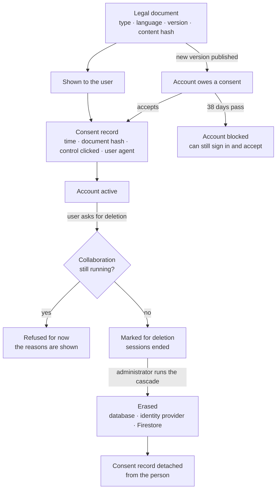

# Privacy and GDPR: a base you can build on

The parts that are hard to add later are built: consent you can prove, legal documents with
versions, a log line for every operation on personal data. The parts that happen a few times a year
are left to a person: an administrator finishes a deletion, and a copy of someone's data is put
together by hand when they ask. This page says which is which, lists three known bugs, and shows
what to add when you need more.

It is not a complete GDPR programme, and no software is: the records of processing, the agreements
with processors and the breach procedure are an organisation's documents.

**In one line: GDPR-aware by design — partly automatic, partly a person's job, and honest about
both.**

## What is automatic, and what a person does

| Area | Automatic | Done by a person |
| :-- | :-- | :-- |
| Consent and legal documents | Recording each acceptance, tying it to the document version, asking again after a new version, blocking after 38 days | Publishing a new version |
| Cookie choice | The banner, the signed cookie, the record | — |
| Log of operations on personal data | Every such operation writes a `GDPR:` line | Reading the log when someone asks what happened |
| Correcting data | The user does it in their profile | — |
| Erasure | Taking the request, checking for a running collaboration, ending the sessions, deferring Meta's requests | An administrator previews and runs the cascade |
| A copy of the data, restriction, objection | — | By hand, when the user writes — the support tickets are the channel |
| Retention | Anonymous consent records, rate-limit data, location data, application logs | Everything else in your schedule |
| The organisation's documents | — | Records of processing, processor agreements, breach procedure |

### Why erasure is a request and not a button

On a marketplace one side cannot vanish in the middle of a collaboration: the other side has
delivered content, or is owed it. So a deletion request first meets the blockers — active or
pending applications, campaigns with applications — and the user sees why it has to wait. When
nothing blocks it, the account is marked and signed out, and an administrator finishes the job with
one cascade. A request can also arrive as a support ticket: tickets have a reference, a status page
and an administrator's queue. This is simpler to build than a self-service purge, and it keeps a
person in the one step that cannot be undone.

## What is built, and where

| Obligation | What the code does | Where |
| :-- | :-- | :-- |
| **Consent that can be proven** (Art. 7) | Every acceptance stores which document version was shown (by content hash), when, through which control and from which user agent. The record is append-only | `legal/ConsentRecord`, `LegalController` (`/legal/consent/prepare`, `/record-batch`); `consent-lifecycle.feature`, `consent-module.feature` |
| **Versioned terms and re-consent** | Legal documents are unique by type, language and version. Publishing a new version puts accounts into a grace period; a filter then limits a non-consenting account to signing in and accepting; a nightly job blocks it when the grace period ends | `legal/LegalDocument`, `ConsentEnforcementFilter`, `ConsentEnforcementCronJob` |
| **Cookie consent before an account exists** | Categories are served by the backend, an anonymous choice is recorded, the cookie carrying it is HMAC-signed and survives the OAuth round trip. Every cookie the backend sets is either necessary or the record of a choice | `LegalController`, `ConsentCookieService`; `oauth-consent-cookie-survival.feature` |
| **Optional consents, and withdrawing them** (Art. 7(3)) | Marketing-type consents are separate, each change is a new immutable row, and withdrawal is the same call as granting | `consent/ConsentService` (`POST /consent/my`), `UserConsent` |
| **A log of what was done with personal data** | Reads, changes, deletions and administrator actions on personal data each write a structured `GDPR:` line — the operation, who did it, to whom, for what purpose — close to a thousand statements across about a hundred classes | `log.*("GDPR: …")` throughout `user/`, `auth/`, `admin/`, `legal/`, `support/` |
| **Rectification** (Art. 16) | A user edits their own profile, addresses and e-mail; changing a name, e-mail, phone or tax number triggers verification again | `UserController` (`PATCH /users/{id}`), `ProfileFieldCriticality`; `UserService_Patch_IntegrationTest` |
| **Seeing your own data** (Art. 15) | Profile, preferences, consents and their history, company data, notifications, tickets, subscription and invoices each have a read endpoint for their owner | `GET /users/me`, `/consent/my`, `/legal/consent/my`, `/support/ticket/my-tickets`, `/subscription/invoices` |
| **Erasure on request** (Art. 17) | The user asks from the account settings; the account is marked for deletion and its sessions end. An administrator previews and runs the cascade, which deletes across PostgreSQL, both Firestore collections and Firebase Auth, with a task ledger and a daily retry | `UserAccountOrchestrator`, `admin/cascade/` |
| **Refusing or deferring erasure while a collaboration runs** (Art. 17(3)) | An eligibility check lists what blocks a deletion — active or pending applications, campaigns that are active or have applications, the last administrator — each with a reason the user can read. Meta's deletion request is deferred and retried daily until the collaboration ends | `UserAccountOrchestrator` (`checkDeletionEligibilityForUser`), `DeferredDeletionCronJob` |
| **Meta's callbacks are verified** | The `signed_request` of Instagram's data-deletion and deauthorisation callbacks is checked with HMAC-SHA256 before the request is acted on | `InstagramCallbackController` |
| **What survives erasure** | Consent records and support tickets are detached from the person (`ON DELETE SET NULL`) rather than deleted | schema: `consent_record`, `support_ticket` |
| **Audit of consent** | Administrators can read a user's consent records and history | `/admin/legal/consent-records/{userId}`, `/admin/consent/users/{id}/history/{type}` |
| **Retention that a job or a timer enforces** | Anonymous consent records older than a year (weekly job); rate-limit data after 24 hours; the location cache after 7 days and travel events after 30; application logs after 30 days in Loki | `legal/AnonymousConsentCleanupCronJob`, `common/ratelimit/`, `common/security/geoip/`, Loki configuration under `deployment/` |
| **Private by default, where it was decided** | A phone number is shown to the other party only after its owner opts in; e-mail notifications have a master switch and one per category, and both are honoured | `userpreferences/`, `NotificationService` |
| **Less personal data in logs** | A shared utility masks e-mail and IP addresses before logging, at about 165 call sites | `common/util/PiiMaskingUtils`, `LogSafe` |
| **Encryption** | TLS at the edge (the origin sets HSTS; see [security](security.md) for the Cloudflare caveat), `Secure` cookies; third-party tokens and authenticator secrets encrypted with Cloud KMS | [security](security.md) |

## Known bugs

Three, all on the erasure path and none on the consent side. They were found by reading the code
on 1 October 2026. No erasure path has a test against a real database yet, which is how they
survived; one integration test per entry point would pin all three.

| Bug | What happens | The fix |
| :-- | :-- | :-- |
| **Meta's callbacks write a status the database refuses** | The data-deletion and deauthorisation callbacks set the Instagram connection to `DISCONNECTED`. The table's `CHECK` allows `CONNECTED`, `EXPIRED` and `REVOKED`, so the transaction rolls back — and the controller still answers Meta with success | A migration that adds `DISCONNECTED` to the `CHECK` on `user_social_connection.connection_status`; answer with an error when the work failed |
| **Three foreign keys stop a permanent delete** | `applied_opportunity.influencer_id` is `NOT NULL` with `ON DELETE SET NULL`; `pending_data_deletion_request.user_id` and `address.source_address_id` have no delete rule. Depending on what the user has — an application, a deletion request that came through Meta, an address a campaign copied — the permanent delete or the cascade stops on a constraint | Decide the rule per key (`CASCADE`, or delete the rows in the service first) and migrate |
| **The cascade removes files under the wrong prefix** | The storage step deletes `users/{uid}/`; uploads are written to `content/{uid}/` and avatar copies to `profile-pictures/{uid}/`. The step reports success and the files stay | Delete all three prefixes |

Until they are fixed, the administrator who finishes a deletion checks the result by hand: the
user's row is gone, and the user's files are removed from the bucket.

## Left to the team that runs it

| Area | State |
| :-- | :-- |
| **Export of a user's data** (Art. 15, 20) | No single export endpoint. Own data is readable on the screens above, and two narrow exports exist (rate-limit and location data); a full copy is put together by hand on request |
| **Outside services** | The cascade covers the database, Firestore and the identity provider. The customer at the payment provider and the buyer at the invoicing provider are removed or kept by the operator, according to its retention schedule |
| **Retention schedule** | The jobs listed above exist. The rest of a schedule — inactive accounts, support tickets, campaign and accounting records — is the operator's to enforce; note that the cascade deletes campaign and invoice rows, so a schedule that keeps them for years should anonymise instead |
| **Withdrawing acceptance of the terms** | Only by deleting the account |
| **Masking is not universal** | Some log statements still write a raw e-mail address |
| **Backups** | Operator settings: switched on by hand, with point-in-time recovery, in the cloud console and at the hosting provider while the platform ran for real users. Nothing in this repository configures or schedules them |
| **Encryption of the database at rest** | A property of the hosting, not shown in this repository |
| **Records of processing, processor agreements, breach procedure** | Organisational documents; none in this repository |

## If you reuse this

Take the consent module as it is — it is the most complete part, and the most tedious to get right.

**Write your terms and your consents to match what your installation does, and keep them in
step.** Ours were written while the platform was running for real users, and they matched how it
was set up then — backups with point-in-time recovery among them. When the two drift apart, as
ours have in places since, correcting the terms removes most of what would otherwise read as a
gap: it becomes your stated process. So say that an account is closed on request, by the
operator, within a month, once running collaborations are settled. Publish the retention periods
you enforce. Name the processors you actually use. Promise an age check, analytics or backups
only once they are switched on. Users accept those terms through the consent module, with the
version recorded, so what you promised is on file.

**Set the backups up yourself.** They are operator settings, not code. While the platform ran
for real users, backups with point-in-time recovery were switched on by hand — in the cloud
console and at the hosting provider — as the terms promised. Nothing in this repository turns
them on or chooses how long they are kept; when you run this, you set both.

**Keep application logs at least 30 days.** That is the floor here: long enough to answer a
request from the authorities and to look into an incident. Put the same number in your retention
policy.

**Not everything has to be automated.** A request that arrives a few times a year is cheaper and
safer in the hands of a person with a checklist than in code nobody exercises. If you are just
starting, find an administrator who will look after this for you — answer the requests, run the
cascade, check the backups — before you write a line of automation. Keep a note of each request
and the date it was answered, and automate when the volume asks for it.

**When the product earns its keep**, do more: fix the three bugs with an integration test each,
add a job that runs the cascade when a marked account's retention ends, add the export endpoint,
and write your processing records before someone asks for them.

**About fines.** Nothing here is a promise or legal advice. GDPR fines are sized to turnover — up
to 2 % for the organisational duties, up to 4 % for the principles and people's rights — and to
what the operator did before anyone asked (Art. 83(2)). Small companies are within reach too;
for a minor infringement the regulator can issue a reprimand instead of a fine (Recital 148), and
for a small operator who cooperates that is often the first step. This base is the "before":
consent on file, operations logged, requests answered, known limits written down. Do less than
this and the risk is yours to explain. Do this much, fix what you are told to fix, and automate
more as the business grows.

Take the code, skip our mistakes, and build your business.

The older, longer design
note [`docs/Architecture/04_DATA_PRIVACY_COMPLIANCE.md`](../Architecture/04_DATA_PRIVACY_COMPLIANCE.md)
describes several endpoints that were planned and never built; this page is the one that matches the
code.

Next: [security](security.md) · [domain and modules](domain.md) · [back to the index](../README.md)
