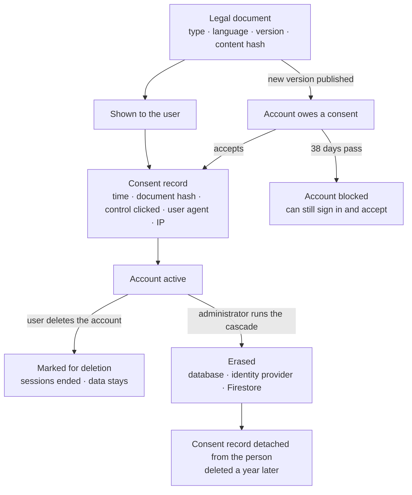

# Privacy and GDPR: what is built, and what is not

The platform was designed with the regulation in mind — consent you can prove, documents with
versions, an administrator's deletion with a ledger — and this page lists exactly what the code
does. It also lists what it does not do, and where a path that exists has never been proven
against a real database. Nobody should take the software for a complete GDPR programme: that also
needs records of processing, agreements with processors and a breach procedure, which are an
organisation's documents and are not in this repository.

**In one line: the consent module is complete; erasure and export are not. GDPR-aware by design,
not "GDPR compliant".**

## Built, with the code and the test that proves it

| Obligation | What the code does | Where |
| :-- | :-- | :-- |
| **Consent that can be proven** (Art. 7) | Every acceptance stores which document version was shown (by content hash), when, through which control, from which user agent and IP address. The record is append-only | `legal/ConsentRecord`, `LegalController` (`/legal/consent/prepare`, `/record-batch`); `consent-lifecycle.feature`, `consent-module.feature` |
| **Versioned terms and re-consent** | Legal documents are unique by type, language and version. Publishing a new version puts accounts into a grace period; a filter then limits a non-consenting account to signing in and accepting; a nightly job blocks it when the grace period ends | `legal/LegalDocument`, `ConsentEnforcementFilter`, `ConsentEnforcementCronJob` |
| **Cookie consent before an account exists** | Categories are served by the backend, an anonymous choice is recorded, the cookie carrying it is HMAC-signed and survives the OAuth round trip. Every cookie the backend sets is either necessary or the record of a choice | `LegalController`, `ConsentCookieService`; `oauth-consent-cookie-survival.feature` |
| **Optional consents, and withdrawing them** (Art. 7(3)) | Marketing-type consents are separate, each change is a new immutable row, and withdrawal is the same call as granting. The API is complete; no screen of the frontend calls it yet | `consent/ConsentService` (`POST /consent/my`), `UserConsent` |
| **Rectification** (Art. 16) | A user edits their own profile, addresses and e-mail; changing a name, e-mail, phone or tax number triggers verification again | `UserController` (`PATCH /users/{id}`), `ProfileFieldCriticality`; `UserService_Patch_IntegrationTest` |
| **Seeing your own data** (Art. 15, on screens) | Profile, preferences, consents and their history, company data, notifications, tickets, subscription and invoices each have a read endpoint for their owner | `GET /users/me`, `/consent/my`, `/legal/consent/my`, `/support/ticket/my-tickets`, `/subscription/invoices` |
| **Administrator's erasure cascade** (Art. 17) | A preview, then deletion across PostgreSQL, both Firestore collections and Firebase Auth, with a task ledger and a daily retry. Its limits are in the next table | `admin/cascade/` |
| **Meta's callbacks are verified** | The `signed_request` of Instagram's data-deletion and deauthorisation callbacks is checked with HMAC-SHA256 before the request is acted on; a deletion is deferred while a collaboration is still running. What happens after the check is in the next table | `InstagramCallbackController`, `DeferredDeletionCronJob` |
| **Refusing or deferring erasure while a collaboration runs** (Art. 17(3)) | An eligibility check lists what blocks a deletion — active or pending applications, campaigns that are active or have applications, the last administrator — each with a reason the user can read. Meta's deletion request is deferred and retried daily until the collaboration ends | `UserAccountOrchestrator` (`checkDeletionEligibilityForUser`), `DeferredDeletionCronJob` |
| **Audit of consent** | Administrators can read a user's consent records and history | `/admin/legal/consent-records/{userId}`, `/admin/consent/users/{id}/history/{type}` |
| **Retention that a job or a timer enforces** | Anonymous consent records older than a year (weekly job); rate-limit data after 24 hours; the location cache after 7 days and travel events after 30; application logs after 30 days in Loki | `legal/AnonymousConsentCleanupCronJob`, `common/ratelimit/`, `common/security/geoip/`, Loki configuration under `deployment/` |
| **Private by default, where it was decided** | A phone number is shown to the other party only after its owner opts in; e-mail notifications have a master switch and one per category, and both are honoured | `userpreferences/`, `NotificationService` |
| **Less personal data in logs** | A shared utility masks e-mail and IP addresses before logging, at about 165 call sites | `common/util/PiiMaskingUtils`, `LogSafe` |
| **Encryption** | TLS at the edge (the origin sets HSTS; see [security](security.md) for the Cloudflare caveat), `Secure` cookies; third-party tokens and authenticator secrets encrypted with Cloud KMS | [security](security.md) |

## Not built, or built only in part

Read against the code on 1 October 2026. "Would fail" below is a reading of the schema and the
services, not the result of a run: no erasure path has a test against a real database, and that
absence is the first gap.

| Gap | State |
| :-- | :-- |
| **Export of a user's data** (Art. 15, 20) | Not built. Two narrow exports exist: rate-limit data, and location data — whose controller is behind `geoip.gdpr.enabled`, a property the production profile does not set |
| **After a deletion request, nothing completes the erasure** | The frontend calls `DELETE /users/{id}`. That marks the account `TO_BE_DELETED`, ends its sessions, withdraws pending applications and, for a company, cancels the subscription and blanks the contact person. Keeping the rest for a time can be legitimate — a contract still running, claims, accounting — but the code sets no period and has no job that erases when the period ends. `DELETE /auth/delete-account` does remove the database user and the identity-provider user, but nothing calls it, it needs a password — an Instagram-only account has none — and it does not cancel a subscription |
| **The refusal lives in the screen** | The frontend asks the eligibility endpoint before it offers deletion; `DELETE /users/{id}` itself does not check the blockers. A refusal leaves no record of when and why. A deferred request from Meta marks the account at once, and a marked account cannot sign in to finish the collaboration that defers it |
| **Erasure paths are unproven** | No test deletes a user from a real database. Three places where a path would fail: Meta's callbacks set a connection status, `DISCONNECTED`, that the table's `CHECK` does not allow, and the controller answers Meta with success whatever happened; three foreign keys have no usable delete rule (`applied_opportunity.influencer_id` is `NOT NULL` with `SET NULL`, `pending_data_deletion_request.user_id` and `address.source_address_id` have none); the cascade's storage step deletes `users/{uid}/` while uploads live under `content/{uid}/` and `profile-pictures/{uid}/` |
| **What the cascade does not reach** | Uploaded files (above), the Stripe customer, the buyer at the invoicing provider, support tickets (the user is detached; e-mail, IP address and text stay), the person's name and picture inside other users' notifications |
| **Consent proof after erasure** | The record is detached from the person (`ON DELETE SET NULL`) and keeps the IP address and user agent. Detached records count as anonymous, so the weekly job deletes them after a year: the proof outlives the account by twelve months, not for good |
| **Withdrawing a choice** | Acceptance of the terms can be withdrawn only by deleting the account. The cookie banner cannot be reopened once answered; today its two optional categories switch nothing on, because the frontend loads no analytics or marketing script |
| **Marketing switch** | A setting, off by default, whose only trace is a log line. No marketing e-mail is sent by this code |
| **Age** | Registration asks for no age and no confirmation of one |
| **Invoices** | Local invoice rows are deleted with the user (`ON DELETE CASCADE`). The fiscal copies remain at the invoicing provider and at Stripe; there is no local retention of accounting records |
| **Retention for everything else** | Accounts marked for deletion, support tickets, notifications, uploads and consent records that still have a user are kept until someone deletes them; a purge query for notifications exists and nothing calls it. In the other direction the cascade deletes campaign and invoice rows at once, so a retention schedule that keeps them for years needs the cascade to anonymise instead of delete |
| **Masking is not universal** | More than a dozen log statements write a raw e-mail address; failed sign-in logs the e-mail and IP address in full, on purpose; the handlers for validation and server errors log up to 2 KB of the request body. About a thousand statements carry a user id |
| **Administrator access** | Logged as application log lines kept 30 days, not as an audit record |
| **Encryption of the database at rest** | A property of the hosting, not shown in this repository |
| **Records of processing, processor agreements, DPIA, breach procedure** | Organisational documents; none in this repository |

## For a team reusing this

Take the consent module as it is — it is the most complete part, and the most tedious to get right.
Before going live: write one integration test per erasure entry point and fix what it finds, make
the user's own deletion end in the cascade when its retention period ends, check the blockers on
the server, add the data export, write your retention schedule as one table — category, ground,
period, the job that enforces it — and write your own processing records. The older, longer design
note [`docs/Architecture/04_DATA_PRIVACY_COMPLIANCE.md`](../Architecture/04_DATA_PRIVACY_COMPLIANCE.md)
describes several endpoints that were planned and never built; this page is the one that matches the
code.

Next: [security](security.md) · [domain and modules](domain.md) · [back to the index](../README.md)
