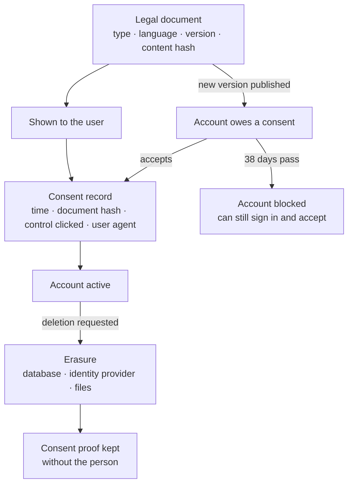

# Privacy and GDPR: what is built, and what is not

The platform was designed with the regulation in mind — consent you can prove, documents with
versions, deletion that reaches every store — and this page lists exactly what the code does. It
also lists what it does not do. Nobody should take the software for a complete GDPR programme: that
also needs records of processing, agreements with processors and a breach procedure, which are an
organisation's documents and are not in this repository.

**In one line: GDPR-aware by design, not "GDPR compliant" out of the box.**

## Built, with the code and the test that proves it

| Obligation | What the code does | Where |
| :-- | :-- | :-- |
| **Consent that can be proven** (Art. 7) | Every acceptance stores which document version was shown (by content hash), when, through which control and from which user agent. The record is append-only | `legal/ConsentRecord`, `LegalController` (`/legal/consent/prepare`, `/record-batch`); `consent-lifecycle.feature`, `consent-module.feature` |
| **Versioned terms and re-consent** | Legal documents are unique by type, language and version. Publishing a new version puts accounts into a grace period; a filter then limits a non-consenting account to signing in and accepting; a nightly job blocks it when the grace period ends | `legal/LegalDocument`, `ConsentEnforcementFilter`, `ConsentEnforcementCronJob` |
| **Optional consents, and withdrawing them** (Art. 7(3)) | Marketing-type consents are separate, each change is a new immutable row, and withdrawal is the same call as granting | `consent/ConsentService` (`POST /consent/my`), `UserConsent` |
| **Cookie consent before an account exists** | Categories are served by the backend, an anonymous choice is recorded, the cookie carrying it is HMAC-signed and survives the OAuth round trip | `LegalController`, `ConsentCookieService`; `oauth-consent-cookie-survival.feature` |
| **Erasure** (Art. 17) | Three paths. *Self-service*: the user deletes the account after re-entering the password. *Administrator cascade*: a preview, then deletion across PostgreSQL, Firestore, Cloud Storage and Firebase Auth, with a task ledger and a daily retry for anything left behind. *Meta's callback*: Instagram's data-deletion and deauthorisation requests are verified and honoured, deferred while a collaboration is still running | `FirebaseAuthProxyController` (`DELETE /auth/delete-account`), `admin/cascade/`, `InstagramCallbackController` |
| **What survives erasure** | Consent proof stays, detached from the person (`ON DELETE SET NULL`), so the controller can still show that consent was given | schema: `consent_record` |
| **Audit of consent** | Administrators can read a user's consent records and history | `/admin/legal/consent-records/{userId}`, `/admin/consent/users/{id}/history/{type}` |
| **Retention jobs** | Anonymous consent older than a year, accounts that never consented, deferred deletions, location and rate-limit data are each cleaned by a scheduled job; application logs are kept 30 days | `consent/`, `auth/`, Loki configuration under `deployment/` |
| **Less personal data in logs** | E-mail addresses and identifiers are masked by a shared utility before logging | `common/util/PiiMaskingUtils`, `LogSafe` |
| **Encryption** | TLS at the edge with HSTS, `Secure` cookies; third-party tokens and authenticator secrets encrypted with Cloud KMS | [security](security.md) |

## Not built, or built only in part

| Gap | State |
| :-- | :-- |
| **Export of a user's data** (Art. 15, 20) | Not built. Only two narrow exports exist (rate-limit and location data). A team adopting this code needs to add the account-data export |
| **Self-service deletion is the thin path** | It removes the database user and the identity-provider user, but it does not cancel a Stripe subscription or sweep files the way the administrator cascade does, and it needs a password — an Instagram-only account has none |
| **Invoices** | Local invoice rows are deleted with the user (`ON DELETE CASCADE`). The fiscal copies remain at the invoicing provider and at Stripe; there is no local retention of accounting records |
| **Withdrawing acceptance of the terms** | Only by deleting the account |
| **Soft-deleted accounts** | An administrator's archive marks an account for deletion and blanks company fields; no job purges those accounts later |
| **Masking is not universal** | At least one log statement still writes a raw e-mail address |
| **Encryption of the database at rest** | A property of the hosting, not shown in this repository |
| **Records of processing, processor agreements, breach procedure** | Organisational documents; none in this repository |

## For a team reusing this

Take the consent module as it is — it is the most complete part, and the most tedious to get right.
Before going live: add the data export, route self-service deletion through the cascade, decide your
retention for accounting records, and write your own processing records. The older, longer design
note [`docs/Architecture/04_DATA_PRIVACY_COMPLIANCE.md`](../Architecture/04_DATA_PRIVACY_COMPLIANCE.md)
describes several endpoints that were planned and never built; this page is the one that matches the
code.

Next: [security](security.md) · [domain and modules](domain.md) · [back to the index](../README.md)
