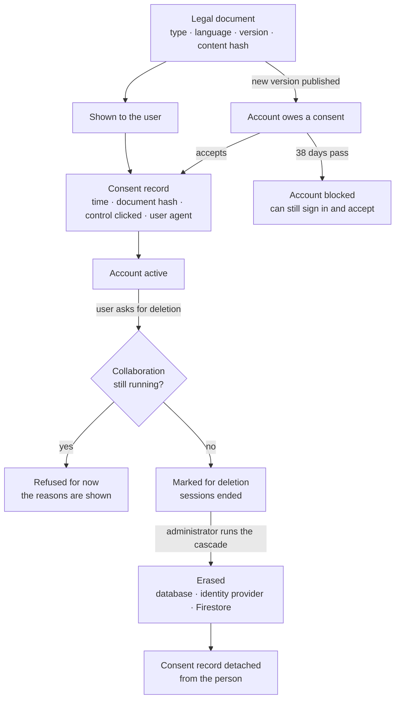

# Privacy and GDPR: what is built, and what is left to the operator

The platform was designed with the regulation in mind — consent you can prove, documents with
versions, erasure on request with a ledger — and this page lists what the code does. It also says
what it leaves to the team that runs it. Software alone is never a complete GDPR programme: the
records of processing, the agreements with processors and the breach procedure are an
organisation's documents, and they are not in this repository.

**In one line: GDPR-aware by design — consent is provable and versioned, erasure runs on request
through an administrator, and the operator's own documents stay the operator's.**

## What is built, and where

| Obligation | What the code does | Where |
| :-- | :-- | :-- |
| **Consent that can be proven** (Art. 7) | Every acceptance stores which document version was shown (by content hash), when, through which control and from which user agent. The record is append-only | `legal/ConsentRecord`, `LegalController` (`/legal/consent/prepare`, `/record-batch`); `consent-lifecycle.feature`, `consent-module.feature` |
| **Versioned terms and re-consent** | Legal documents are unique by type, language and version. Publishing a new version puts accounts into a grace period; a filter then limits a non-consenting account to signing in and accepting; a nightly job blocks it when the grace period ends | `legal/LegalDocument`, `ConsentEnforcementFilter`, `ConsentEnforcementCronJob` |
| **Cookie consent before an account exists** | Categories are served by the backend, an anonymous choice is recorded, the cookie carrying it is HMAC-signed and survives the OAuth round trip. Every cookie the backend sets is either necessary or the record of a choice | `LegalController`, `ConsentCookieService`; `oauth-consent-cookie-survival.feature` |
| **Optional consents, and withdrawing them** (Art. 7(3)) | Marketing-type consents are separate, each change is a new immutable row, and withdrawal is the same call as granting | `consent/ConsentService` (`POST /consent/my`), `UserConsent` |
| **Rectification** (Art. 16) | A user edits their own profile, addresses and e-mail; changing a name, e-mail, phone or tax number triggers verification again | `UserController` (`PATCH /users/{id}`), `ProfileFieldCriticality`; `UserService_Patch_IntegrationTest` |
| **Seeing your own data** (Art. 15) | Profile, preferences, consents and their history, company data, notifications, tickets, subscription and invoices each have a read endpoint for their owner | `GET /users/me`, `/consent/my`, `/legal/consent/my`, `/support/ticket/my-tickets`, `/subscription/invoices` |
| **Erasure on request** (Art. 17) | The user asks from the account settings; the account is marked for deletion and its sessions end. An administrator previews and runs the cascade, which deletes across PostgreSQL, both Firestore collections and Firebase Auth, with a task ledger and a daily retry | `UserAccountOrchestrator`, `admin/cascade/` |
| **Refusing or deferring erasure while a collaboration runs** (Art. 17(3)) | An eligibility check lists what blocks a deletion — active or pending applications, campaigns that are active or have applications, the last administrator — each with a reason the user can read. Meta's deletion request is deferred and retried daily until the collaboration ends | `UserAccountOrchestrator` (`checkDeletionEligibilityForUser`), `DeferredDeletionCronJob` |
| **Meta's callbacks are verified** | The `signed_request` of Instagram's data-deletion and deauthorisation callbacks is checked with HMAC-SHA256 before the request is acted on | `InstagramCallbackController` |
| **What survives erasure** | Consent records and support tickets are detached from the person (`ON DELETE SET NULL`) rather than deleted | schema: `consent_record`, `support_ticket` |
| **Audit of consent** | Administrators can read a user's consent records and history | `/admin/legal/consent-records/{userId}`, `/admin/consent/users/{id}/history/{type}` |
| **Retention that a job or a timer enforces** | Anonymous consent records older than a year (weekly job); rate-limit data after 24 hours; the location cache after 7 days and travel events after 30; application logs after 30 days in Loki | `legal/AnonymousConsentCleanupCronJob`, `common/ratelimit/`, `common/security/geoip/`, Loki configuration under `deployment/` |
| **Private by default, where it was decided** | A phone number is shown to the other party only after its owner opts in; e-mail notifications have a master switch and one per category, and both are honoured | `userpreferences/`, `NotificationService` |
| **Less personal data in logs** | A shared utility masks e-mail and IP addresses before logging, at about 165 call sites | `common/util/PiiMaskingUtils`, `LogSafe` |
| **Encryption** | TLS at the edge (the origin sets HSTS; see [security](security.md) for the Cloudflare caveat), `Secure` cookies; third-party tokens and authenticator secrets encrypted with Cloud KMS | [security](security.md) |

## Left to the team that runs it

| Area | State |
| :-- | :-- |
| **Export of a user's data** (Art. 15, 20) | No single export endpoint. Own data is readable on the screens above, and two narrow exports exist (rate-limit and location data); a full copy is assembled by the operator on request |
| **Erasure is completed by a person** | The user's request marks the account; an administrator runs the cascade. A team that wants it automatic adds a job that runs the cascade when its retention period ends |
| **Files and outside services** | The cascade covers the database, Firestore and the identity provider. Uploaded files, the customer at the payment provider and the buyer at the invoicing provider are the operator's to remove or keep, according to its retention schedule |
| **Retention schedule** | The jobs listed above exist. The rest of an operator's schedule — inactive accounts, support tickets, campaign and accounting records — is the operator's to enforce; note that the cascade deletes campaign and invoice rows, so a schedule that keeps them for years should anonymise instead |
| **Withdrawing acceptance of the terms** | Only by deleting the account |
| **Masking is not universal** | Some log statements still write a raw e-mail address |
| **Encryption of the database at rest** | A property of the hosting, not shown in this repository |
| **Records of processing, processor agreements, breach procedure** | Organisational documents; none in this repository |

## For a team reusing this

Take the consent module as it is — it is the most complete part, and the most tedious to get right.
Before going live: cover the erasure cascade with an integration test against your own schema,
decide whether erasure stays an administrator's action or becomes a job, add the data export if
you expect many requests, write your retention schedule as one table — category, ground, period,
the job that enforces it — and write your own processing records. The older, longer design
note [`docs/Architecture/04_DATA_PRIVACY_COMPLIANCE.md`](../Architecture/04_DATA_PRIVACY_COMPLIANCE.md)
describes several endpoints that were planned and never built; this page is the one that matches the
code.

Next: [security](security.md) · [domain and modules](domain.md) · [back to the index](../README.md)
