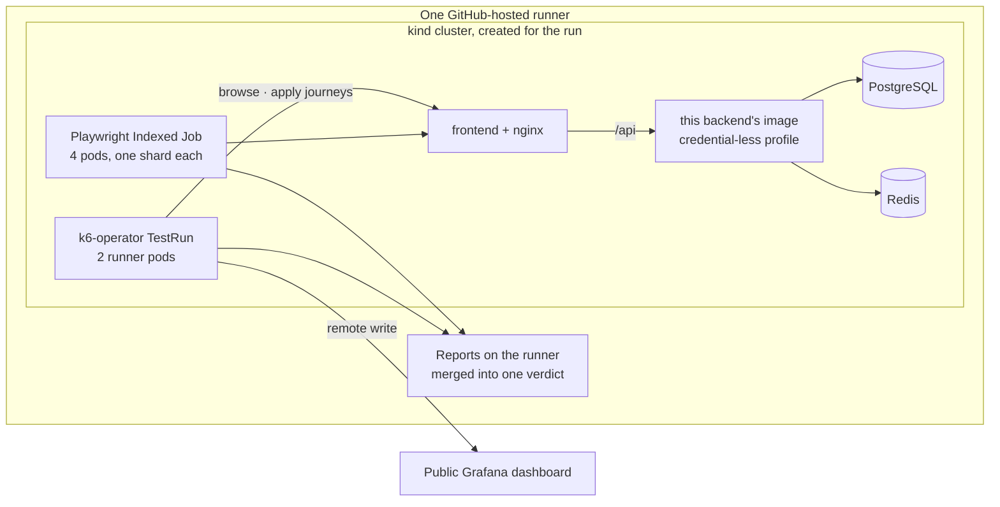

# Load testing on Kubernetes

This backend is load-tested from the outside, the way a browser reaches it: through the frontend's
nginx, with real sessions, against the published container image. The script and the cluster
definition live in the [frontend repository](https://github.com/Check-It-Out-Dev/checkitout-frontend),
which owns the user journeys; this page says what is measured and how to read it.

## What is measured

Two journeys, tagged so their numbers never blur
([`api-journeys.js`](https://github.com/Check-It-Out-Dev/checkitout-frontend/blob/main/e2e-tests/perf/k6/api-journeys.js)):

| Journey | What a virtual user does | Why it is shaped this way |
| :-- | :-- | :-- |
| **browse** | Signs in, pages through the campaign catalogue, opens one campaign | One account per virtual user: the backend rate-limits per user, so users sharing an account would only measure the limiter |
| **apply** | The seeded influencer applies to campaigns it qualifies for | Applications are one per user and campaign and limited per hour, so this is a functional probe with latency, not load |

The pass condition is a set of thresholds, not a headline number: fewer than 1 % failed requests,
more than 99 % of checks passing, and a p95 budget per journey and per endpoint. The summary reports
average, median, p95, p99 and maximum.

## Where it runs

- **In a Kubernetes cluster inside CI** —
  [`k8s-test-execution.yml`](https://github.com/Check-It-Out-Dev/checkitout-frontend/blob/main/.github/workflows/k8s-test-execution.yml)
  creates a kind cluster on the runner, deploys PostgreSQL, Redis, this backend's image on its
  credential-less profile and the frontend behind nginx, then runs k6 as a `TestRun` of the
  k6-operator beside the browser tests. The cluster dies with the runner.
- **Against the live sandbox after every deploy**, one virtual user at a polite rate.
- **On a developer machine**: `npm run perf:k6:api` in the frontend checkout, against the pair
  started by `node tools/dev-lite.mjs` here.

Results are public: the [k6 dashboard for the API journeys](https://checkitoutapp.grafana.net/public-dashboards/bc4987ccdb234296a33afd3a794f1f4e)
and the [sandbox dashboard](https://checkitoutapp.grafana.net/public-dashboards/f48c40b8b3244bdfa019117fa9fdcbbe).

## What this is, and is not

It is a regression gate: a change that makes the catalogue slow or starts failing requests turns the
run red. It is not a capacity study — the cluster is one shared CI runner and the load is a handful
of virtual users. Kubernetes appears here as the place tests run; the product itself is hosted on
Docker Compose under systemd on one VPS, which is the right size for it ([CI/CD](cicd.md)).

Next: [testing in depth](../testing/README.md) · [back to the index](../README.md)
