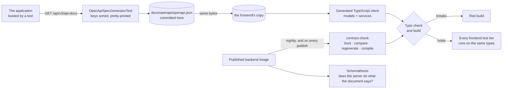

# The OpenAPI contract pipeline

The frontend never talks to this backend through hand-written types. The API description is taken
from a server that actually booted, committed as a file, and the frontend's client is generated from
that file. A contract change that breaks the client is a compile error in the frontend's build, long
before it could be a bug report.



## How each step is kept honest

**The document comes from running code.**
[`OpenApiSpecGeneratorTest`](../../src/test/java/com/sm/instagram/platform/openapi/OpenApiSpecGeneratorTest.java)
starts the whole application on a random port, fetches `/api/v3/api-docs` from the server it just
started, sorts the JSON keys and writes [`docs/openapi/openapi.json`](../openapi/openapi.json). A
document produced that way cannot describe an endpoint that does not exist, and because the output is
canonical, the same code always produces the same bytes — any diff means the API changed.

**Both repositories hold the same file.** Compare the committed blobs (on Windows the working copy
has CRLF line endings, so hash what git stores, not the file on disk):

```bash
git show HEAD:docs/openapi/openapi.json | sha256sum
# 376699dae1d86d29083ec0fa773420185c8ca5e5f0c0bf8ae3e7ab86cad1ba41   — here and in the frontend, 2026-10-01
```

**Drift is found by a machine, not by a person remembering.** The two copies once fell seven contract
commits apart in a single evening without one red build, because the sync ran only when someone ran
it. Since then the frontend's
[`contract-check`](https://github.com/Check-It-Out-Dev/checkitout-frontend/blob/main/.github/workflows/contract-check.yml)
boots this backend's published image every night and on every publish, compares the document the
server serves with the copy the frontend compiles against, and on a difference regenerates the client
and builds against it. The honest edge: it goes red only when the regenerated client no longer
compiles; a difference that still compiles is reported in the run summary, not failed.

**The server is checked against its own document.**
[`api-fuzz.yml`](../../.github/workflows/api-fuzz.yml) runs Schemathesis nightly: requests generated
from the schema, sent to a running instance, every answer compared with what the document promised.
On its first run it found that every secured operation answered 401 while the document declared no
401 at all — a contract defect, because the client is generated from that document. It was fixed in
one place (`AuthFailureResponsesCustomizer`), and the fuzzer has run every night since.

## Regenerating the contract

```bash
./mvnw verify -Pintegration -DskipPmd=true -Dfailsafe.includes='**/OpenApiSpecGeneratorTest.java'
```

Docker must be running (the test uses Testcontainers) and the JDK must be 21. Then, in the frontend
checkout, `npm run openapi:cycle:fast` copies the document across, regenerates the client and type
checks. Commit the backend change, the document and the regenerated client as three commits. The short
version of this is [`docs/openapi/REGENERATE.md`](../openapi/REGENERATE.md).

The current size of the contract — paths, operations, schemas — is in the numbers table of the
[README](../../README.md#the-numbers), which a gate keeps equal to the file.

Next: [security](security.md) · [CI/CD](cicd.md) · [back to the index](../README.md)
