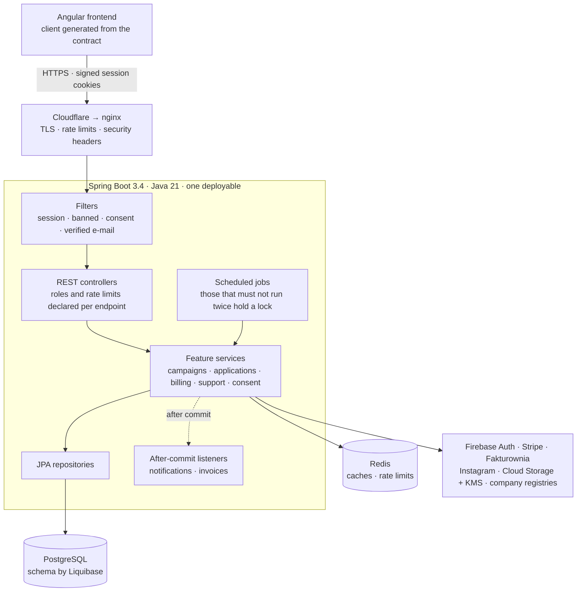

# Architecture overview

One deployable: a modular Spring Boot application. PostgreSQL is the system of record, Redis holds
what may be lost (caches, rate-limit counters), and every outside vendor sits behind its own package.
There is no service mesh and no message broker, because one team and one product never needed them.



## How a request travels

1. **The edge** (Cloudflare, then nginx) terminates TLS, applies coarse rate limits and sets the
   security headers. The application never sees plain HTTP.
2. **Filters** run in a fixed order: the session is validated from two cookies without calling any
   outside service, then banned accounts are stopped, then accounts that owe a consent, then accounts
   with an unverified e-mail. The order is in
   [`WebSecurityConfiguration`](../../src/main/java/com/sm/instagram/platform/common/authorization/WebSecurityConfiguration.java).
3. **Controllers** declare who may call them (`@PreAuthorize`) and how often (`@RateLimit` with a
   named profile). Nothing is authorised by URL pattern alone.
4. **Services** hold the business rules, one package per feature. Where two actors can write the same
   row — a user, a Stripe webhook, a nightly job — the row is locked or versioned
   ([billing](billing-graph.md) is the clearest case).
5. **Side effects wait for the commit.** E-mails, notifications and invoices are sent by listeners
   that fire after the transaction commits, so a rolled-back change never tells anyone it happened.

## Decisions worth knowing

| Decision | Why |
| :-- | :-- |
| Feature-first packages | A feature's controller, service, entities and repository sit together; you can read one folder and understand one capability ([modules](domain.md)) |
| Ports and adapters only where the vendor can be replaced | Invoicing (`InvoicingPort` → Fakturownia) and company registries (`CompanyRegistryPort` → GUS, CEIDG, VAT) have ports and stub adapters. Stripe and Firebase are used directly: an abstraction over them would promise a portability nobody will use |
| The schema is owned by Liquibase | One SQL changeset per change, applied on boot; the application creates nothing by `ddl-auto` |
| Scheduled jobs take a lock | The jobs that must not run twice hold a ShedLock lock in PostgreSQL, so a second instance skips the run |
| Every credential is optional at boot | A missing vendor key disables that feature with a clear error instead of stopping the application — which is what makes the [credential-less mode](../DEV-LITE.md) possible |
| The contract is generated, never written | The OpenAPI document comes from a running server ([contract pipeline](openapi-contract.md)) |

## Check it yourself

```bash
node tools/dev-lite.mjs          # the whole thing, no credentials — docs/DEV-LITE.md
ls src/main/java/com/sm/instagram/platform/        # one folder per feature
```

Next: [domain and modules](domain.md) · [the subscription state machine](billing-graph.md) ·
[security](security.md) · [back to the index](../README.md)
