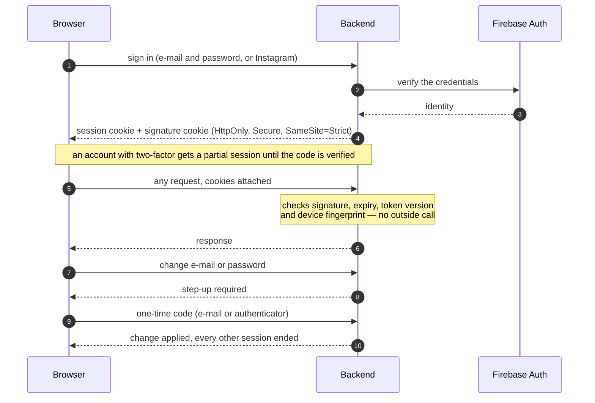

# Security: authentication, MFA, secrets, hardening

The rule the design follows: the browser holds nothing it could leak, the server trusts nothing it
did not sign, and a sensitive change always costs a second proof. An independent team then tried to
break it — their findings and what was done about each are at the end.

## Sessions

- **Firebase proves who you are; the backend issues its own session.** After Firebase verifies the
  credentials, the backend mints a token carrying a *token version* and stores it in an `HttpOnly`
  cookie, with an HMAC signature in a second cookie. JavaScript can read neither.
- **The session is bound to the device.** The signature covers a fingerprint of the client; a cookie
  copied to another machine fails the check, which is compared in constant time.
- **Revocation is one integer.** Changing a role, a password or an e-mail, or deleting an account,
  bumps the user's token version; every session issued before stops working on its next request.
- **Validation needs no network.** Each request is checked from the cookies and a cached user status
  — Firebase is not called per request, so its availability is not the application's.

## Second factors and step-up

- **Two-factor (TOTP) is mandatory for administrators.** A promoted account stays `PENDING_ADMIN`
  until the authenticator is set up; the secret is encrypted with a Cloud KMS key, the backup codes
  hashed and then encrypted.
- **Step-up for sensitive changes.** Changing an e-mail or a password requires a fresh one-time code
  even inside a valid session ([design](../StripeGateway/StepUpAuthentication.md)).
- Passkeys were designed ([proposal](../features/COMPANY_2FA_PASSKEYS.md)) and not built.

## Limits, consent, headers

- **Rate limits are declared on the endpoint** — `@RateLimit` with a named profile
  ([`RateLimitProfile`](../../src/main/java/com/sm/instagram/platform/common/ratelimit/RateLimitProfile.java):
  the tightest is administrator sign-in, three attempts in fifteen minutes), counted in Redis; nginx
  applies a coarser limit in front.
- **Filters enforce state, in order**: a valid session, not banned, consents given, e-mail verified.
  An account that owes a consent can still sign in and accept it — and do nothing else.
- **Consent is provable.** Each acceptance stores the document's hash, the time and the control that
  was clicked; the consent cookie is HMAC-signed ([privacy](gdpr.md)).
- **Headers are set once, at the edge**: HSTS, a content security policy, `X-Frame-Options: DENY`,
  `nosniff`, a referrer and a permissions policy. CSRF tokens are not used: the session cookie is
  `SameSite=Strict`, a unit test fails the build if anyone loosens that, and the reasoning is written
  next to the line that disables them in
  [`WebSecurityConfiguration`](../../src/main/java/com/sm/instagram/platform/common/authorization/WebSecurityConfiguration.java).

## Secrets and files

- **No secret is in the repository or in the image.** In production an init container fetches them
  from Google Secret Manager into a mounted directory; locally nothing is needed
  ([credential-less mode](../DEV-LITE.md)).
- **Third-party tokens are encrypted at rest** with Cloud KMS (Instagram tokens, TOTP secrets).
- **The client never names a file's location.** An upload is a signed URL the server minted and
  tracked; later requests carry only the upload's id, and the server resolves the URL itself after
  checking the caller owns it. This design is the fix for the one high-severity finding below.
- **Meta's callbacks are verified**: the `signed_request` of the data-deletion and deauthorisation
  callbacks is checked with HMAC-SHA256 before anything is deleted.

## Evaluated from outside

A grey-box penetration test by an independent team (OWASP methodology, June–July 2026) found
**nothing critical** and rated the security posture **above average**: 1 high, 4 medium, 4 low and
2 informational findings. The high and all four medium findings were fixed; one low finding was
fixed, two were accepted as design decisions with their reasoning, one (a nonce-based content
security policy) is deferred with a plan; both informational ones were fixed. Finding by finding:
[`docs/security/pentest-remediation.md`](../security/pentest-remediation.md). A penetration test is
not something one passes — a re-test of the fixes was recommended and has not been done.

Meta also reviewed the platform: the business is a verified **Tech Provider** for the Instagram API
([screenshot of the verification](../evidence/meta-tech-provider.png)).

The static side runs on every pull request and every night: CodeQL, Semgrep, Checkov, Trivy with an
SBOM, OWASP dependency-check, SpotBugs with FindSecBugs ([CI/CD](cicd.md)). The one rule that was
dismissed in bulk has a written disposition and a test that fails if the control is removed
([log injection](../security/log-injection-disposition.md)).

Next: [privacy and GDPR](gdpr.md) · [CI/CD](cicd.md) · [back to the index](../README.md)
