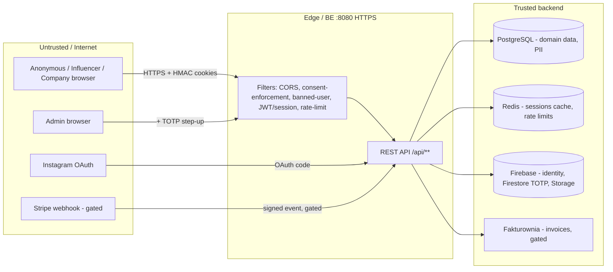
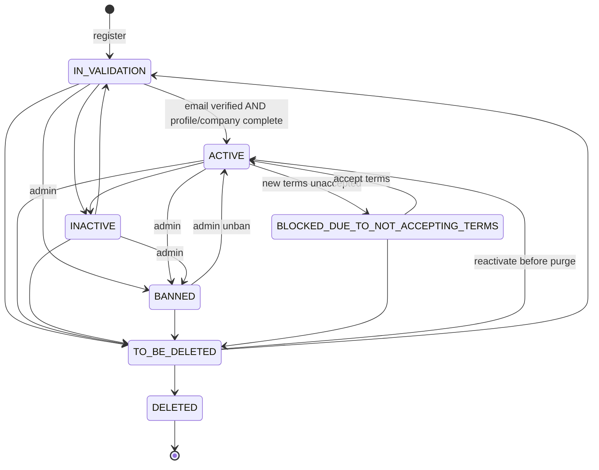
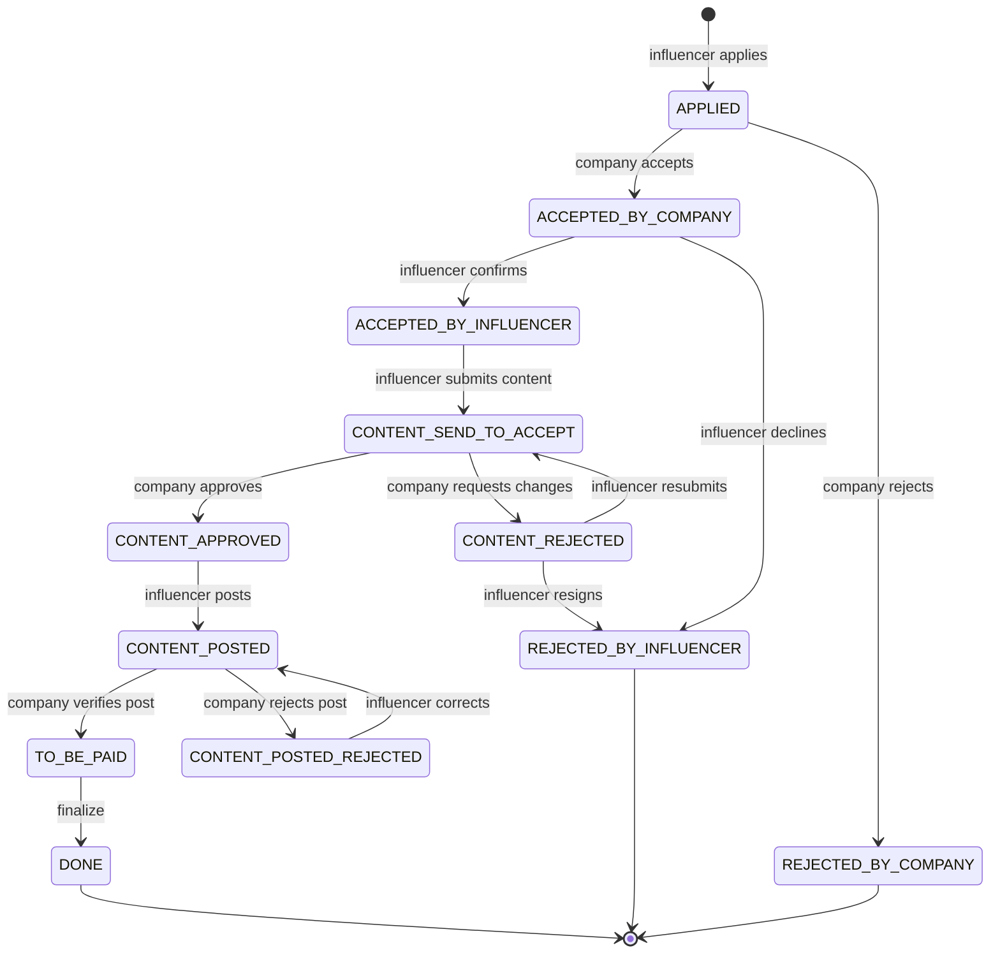
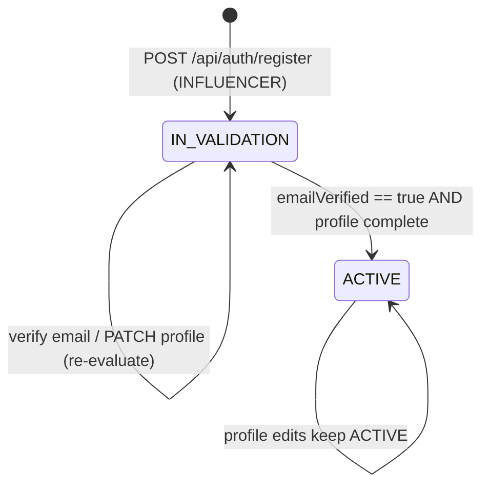
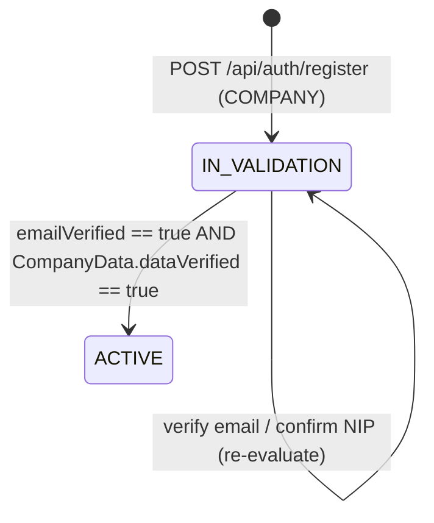
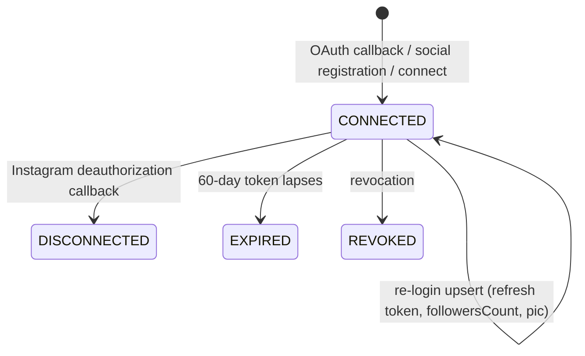
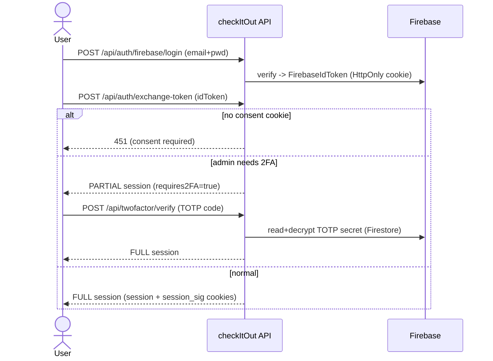
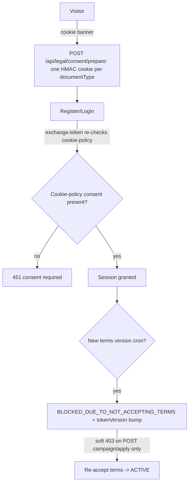
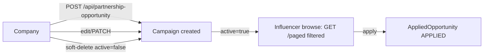
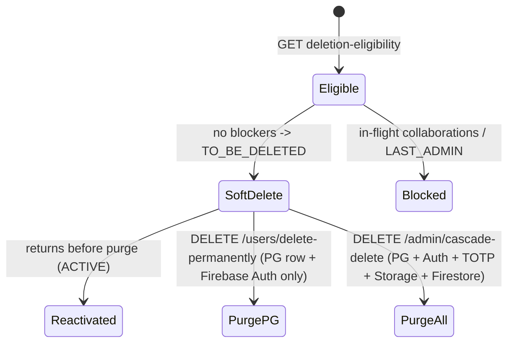

# checkItOut — Business Domain Model (for black-box security testing)

> **Purpose.** This document explains *what checkItOut is, who uses it, and how its
> business processes flow and change state*. It is the **business layer** companion to
> the technical contract in [`docs/openapi/openapi.json`](../openapi/openapi.json).
>
> **Audience.** A security team performing **black-box** testing. Read this first to
> understand the domain, the actors, the value at stake, and the valid/invalid state
> transitions; then use the OpenAPI spec for the concrete request/response shapes.
>
> **Notation.** Mermaid diagrams (BPMN-like): `flowchart`/`sequenceDiagram` for
> processes, `stateDiagram-v2` for entity lifecycles. Every flow links to the endpoints
> that drive it.
>
> **Scope.** All core flows. Subscription/billing (Stripe) is **payments-gated** and is
> intentionally **excluded from the published OpenAPI** — noted here for context only.

---

## 1. What the system is

checkItOut is a **two-sided influencer-marketing marketplace**. **Companies** publish
paid collaboration offers ("campaigns" / *partnership opportunities*); **influencers**
browse and apply; once both sides accept, the influencer produces content, the company
reviews and verifies it, and the collaboration completes (and optionally pays out).
**Admins** moderate users and legal documents. The platform is GDPR-driven: consent
capture, terms versioning, and data-subject rights (export/deletion) are first-class.

| Property | Value |
|---|---|
| Domain | Influencer ↔ brand collaboration marketplace |
| Primary value exchanged | Campaign briefs, applications, content, ratings, money (gated), **PII + consent** |
| Identity provider | Firebase Auth (email/password + social OAuth); **admin 2FA = TOTP** |
| Session model | **HttpOnly, HMAC-signed cookies** (no client-side token storage) |
| Regulatory posture | GDPR (consent, terms versioning, export, erasure), Polish company registry (GUS) |
| Externals | Firebase (Auth/Firestore/Storage), Instagram (OAuth), GUS/registry, Fakturownia (invoicing, gated), Stripe (payments, gated), SMTP |

---

## 2. Actors & roles

| Actor | Auth state | Can do | Notes for testers |
|---|---|---|---|
| **Anonymous** | none | View landing, browse limited public data, register, login, prepare consent | Entry surface; consent cookies are set *pre-auth* |
| **INFLUENCER** | session cookie | Browse/apply to campaigns, submit content, rate companies, manage profile/social links, export/delete own data | Activated after email verified **and** profile complete |
| **COMPANY** | session cookie | Create/edit campaigns, accept/reject applications, review content, rate influencers, confirm company data (NIP/GUS) | Activated after email verified **and** company data confirmed |
| **PENDING_ADMIN** | partial session | Limited admin until 2FA is configured | Admin without TOTP enrolled yet |
| **ADMIN** | full session **+ TOTP** | Moderate users (activate/ban/inactivate), manage legal docs & consent records, cascade-delete, view registry | **Step-up 2FA required**; admin actions bump the *target's* tokenVersion |

**External / non-human actors:** Firebase (token issuance, Firestore-stored TOTP secret,
Storage), Instagram OAuth callback, GUS registry lookup, Fakturownia (invoices, gated),
Stripe webhooks (gated), email (verification, notifications).

---

## 3. Trust boundaries & sensitive assets (black-box relevance)



| Asset | Where | Why it matters |
|---|---|---|
| **PII** | PG `users`, `address`, `company_data` | email, phone, names, addresses, NIP/REGON |
| **Consent records** | PG (consent), HMAC cookies | GDPR legal basis; tamper = compliance breach |
| **TOTP secret** | **Firestore** (encrypted) | admin 2FA; not in PG, not seed-able via mock-session |
| **Session/JWT + HMAC secrets** | server config (`.env`) | forge = full account takeover |
| **Firebase ID token** | HttpOnly cookie | exchanged for app session |
| **Payment data** | Stripe (gated) | out of current API surface |
| **Uploaded content** | Firebase Storage (signed URLs) | IDOR / signed-URL scope is a key test target |
| **OAuth access token** | **Firestore** (encrypted) | long-lived (60-day) Instagram token; never in PG (`UserSocialConnection` has no token column) |

**Hard auth facts for testers:** sessions are **HttpOnly HMAC-signed cookies only** —
no `Authorization: Bearer`, no `localStorage` tokens (the BE rejects them). A stale
`tokenVersion` yields **419** (silent-refresh contract), not 401. Missing consent on
token-exchange yields **451**.

---

## 4. Core entity lifecycles (state machines)

These are the highest-value artifacts for black-box testing: each edge is a legal
transition; **everything not drawn is an invalid transition** and a test case.

> **Intended vs. enforced — read this first.** A diagram here is the *intended* machine (the
> enum's `canTransitionTo`). Whether the code actually *enforces* it varies, and the gap is itself
> the test target:
> - **§4.1 Account** — `canTransitionTo` exists but is **not called** on the admin status-change
>   path; any admin-supplied status is applied (only `old == new` is skipped). Treat every
>   "invalid" account transition as *reachable by an admin*.
> - **§4.2 Collaboration** — enforced (`canTransitionTo` + a role gate), **but** the role gate is
>   an asymmetric *blocklist* and an admin can teleport to any status (see §4.2).

### 4.1 Account lifecycle — `AccountStatus` (every user)



- **Login gate:** `canLogin()` is true only for `ACTIVE`, `IN_VALIDATION`,
  `BLOCKED_DUE_TO_NOT_ACCEPTING_TERMS`. `BANNED` users *can* still refresh a session (to load the
  ban page) but every non-whitelisted endpoint is blocked by the banned-user filter, which returns
  **403** (not 401). Whitelist: `/users/me/**`, `/support/**`, `/auth/sign-out`,
  `/auth/refresh-session`, `/notifications/**`, `/health`, `/error`, `/actuator`.
- **Transitions are NOT machine-enforced on the admin path.** The enum defines `canTransitionTo`,
  but the admin status-change handler never calls it — it applies the supplied `accountStatus`
  unconditionally (skips only when `old == new`). An admin can drive *any* status pair, including
  edges this diagram omits. The diagram is product intent, not a server guarantee.
- **No dedicated `/ban` / `/activate` endpoints** — admin status changes ride the generic
  `PATCH /api/users/{id}` with `accountStatus` in the body (`ADMIN`-guarded).
- **Admin status change** bumps the **target's** `tokenVersion` and evicts their cache; emits
  `AccountActivatedEvent` only when the new status is `ACTIVE`. Firebase claim writes are
  deferred/best-effort, so a target-side Firebase failure must **not** affect the admin's session.

### 4.2 Collaboration lifecycle — `OpportunityStatus` (an *application* / AppliedOpportunity)



- **Terminal states:** `REJECTED_BY_COMPANY`, `REJECTED_BY_INFLUENCER`, `DONE`. The edge set above
  is enforced (`OpportunityStatus.canTransitionTo`).
- **Per-transition authority — the prime BAC / forced-transition surface.** Two endpoints drive
  transitions with *different* guards, plus an admin override:

  | Transition (from) | Driven by | Who is allowed |
  |---|---|---|
  | `APPLIED` → accept/reject | `PATCH /applied-opportunity/status/update/{id}` | **Neither role via this endpoint** — company is in `COMPANY_LOCKED_STATES` (company acceptance rides a different/admin path) |
  | `ACCEPTED_BY_COMPANY` → confirm/decline | same | **Influencer** owner only |
  | `ACCEPTED_BY_INFLUENCER` → submit content | content sub-controller | **Influencer** owner |
  | `CONTENT_SEND_TO_ACCEPT` → approve/reject | content sub-controller | **ADMIN or COMPANY** owner |
  | `CONTENT_REJECTED` / `CONTENT_APPROVED` / `CONTENT_POSTED_REJECTED` | `/status/update` | influencer owner — **but company is NOT blocked** (the gate is a blocklist; a company can drive these influencer-side edges) ⚠ |
  | `CONTENT_POSTED` → verify/reject | `/status/update` | **Company** owner |
  | `TO_BE_PAID` → `DONE` | `/status/update` | **Company** owner |
  | **any → any** | `PATCH /applied-opportunity/rate/update/{id}` | **ADMIN only** — bypasses `canTransitionTo` (status teleport) |

  Ownership (influencer = applicant; company = opportunity owner) is checked on both branches.
- **Content transitions actually fire from the content sub-controller** (`POST`/`PUT
  /applied-opportunity/content`), not from `/status/update`.
- **CORRECTION — ratings are *not* `DONE`-gated in code.** Source enforces no status precondition
  on the rating endpoints (only the *in-progress listing* filter hides terminals); re-rating is
  blocked once a rating is non-default. Probe: rate before `DONE`.
- Influencer may `DELETE` an application only while `APPLIED`; admin at any status.

### 4.3 Influencer onboarding (activation predicate)



- **Guard (both required):** `emailVerified == true` **AND** profile complete —
  `firstName`, `lastName`, `email`, `phoneNumber` all non-blank **and** a *primary* `Address`
  with `street`, `city`, `postalCode`, `country`, `state`. **No social/Instagram connection
  is required to activate an influencer.**
- **Verify-first & idempotent:** activation only fires *from* `IN_VALIDATION`; an already
  `ACTIVE` user is never re-activated. Re-evaluation is triggered by
  `syncEmailVerificationStatus` (email verified) and profile `PATCH`.
- **Side effects on activation:** `tokenVersion++` (forces token refresh), a *deferred*
  Firebase role-claim write (best-effort — PG is source of truth), `AccountActivatedEvent`,
  cache evict.

### 4.4 Company onboarding (activation predicate)



- **Guard (both required):** `emailVerified == true` **AND** `CompanyData.dataVerified == true`
  (set when the NIP is confirmed against the GUS registry). The company *profile* fields are
  **not** part of the activation guard — only email + verified company data.
- **Re-evaluation triggers:** `syncEmailVerificationStatus` and `confirmCompanyData` (which
  contains an inline activation check after writing `dataVerified`).
- **Side effects:** same as influencer — `tokenVersion++`, deferred role claim, event, evict.
- **Asymmetry note (testers):** the *admin-driven* activation path also writes Firebase claims
  `pendingActivation`/`activated`/`inactive`; the *self-service* onboarding path treats the PG
  status as source of truth (`initialAccountSetupCompleted` is PG-wins).

### 4.5 Social connection lifecycle — `UserSocialConnection` (influencer)



- **States** (`ConnectionStatus`): `CONNECTED`, `EXPIRED`, `REVOKED`, `DISCONNECTED`.
- **Eligibility coupling:** campaign application requires the **primary** connection to be
  `CONNECTED`; any other state ⇒ the influencer cannot apply (follower count "unverifiable").
- **Token storage:** access tokens live **encrypted in Firestore**, never in this PG entity.
- **Deauthorization** is driven by Meta's `POST /api/auth/instagram/deauthorize`
  (`signed_request`-verified) → `DISCONNECTED`.

---

## 5. Core business processes (flows)

Each flow: business goal → actors → steps → key business rules → driving endpoints.

### 5.1 Registration & onboarding

**Goal:** create an influencer or company account; reach `ACTIVE` only when eligible.

checkItOut has **five distinct account-creation entry points**. Only the first three create a
domain (`User`) row; treat each as a separate attack surface.

| # | Entry point | Who | Creates | Consent gate | Verification email |
|---|---|---|---|---|---|
| 1 | `POST /api/auth/register` | COMPANY or INFLUENCER (email+pwd) | Firebase identity + PG `User` (+ `Address` for company) + `UserPreferences` + consent records | **3 HMAC consent cookies → 400 if missing** | **COMPANY only**; INFLUENCER via this path gets **none** |
| 2 | `POST /api/auth/complete-social-registration` | INFLUENCER (two-step social) | Firebase social identity (no pwd) + PG `User` + `UserSocialConnection` (CONNECTED, primary) + Firestore IG doc + consents | 3 HMAC consent cookies (else error) | n/a (social) |
| 3 | `GET /api/auth/social/callback/instagram` | INFLUENCER (Instagram OAuth, auto-create) | Firebase identity (no email) + PG `User` (firstName/lastName/email **NULL**) + profile pic → Storage + `UserSocialConnection` + Firestore IG doc | 3 cookies (else redirect `?reason=consent_required`) | n/a; email collected later in onboarding |
| 4 | `POST /api/auth/firebase/register` | low-level Firebase proxy | **Firebase identity only — no PG row** | reCAPTCHA; **no consent check** | Firebase-managed |
| 5 | `AdminCheckRunner` (startup) | first-admin bootstrap | Firebase admin + PG `User` (ACTIVE, emailVerified) | n/a (not HTTP) | n/a |

```mermaid
sequenceDiagram
  actor U as New user
  participant BE as checkItOut API
  participant FB as Firebase
  participant GUS as Registry (company only)
  U->>BE: POST /api/auth/register (email+pwd, userType=COMPANY or INFLUENCER)
  Note over BE: validate 3 HMAC consent cookies → 400 if absent
  BE->>FB: create identity (Firebase first)
  BE->>BE: save PG User (IN_VALIDATION); on PG failure → delete Firebase user (rollback)
  alt COMPANY
    BE-->>U: IN_VALIDATION + verification email
    U->>BE: verify email
    U->>BE: confirm company data (NIP)
    BE->>GUS: lookup NIP → name, address, PKD; set CompanyData.dataVerified
  else INFLUENCER
    BE-->>U: IN_VALIDATION (NO verification email via this path)
    U->>BE: verify email (triggered separately) + complete profile (PATCH)
  end
  Note over BE: auto-activate ONLY when the role guard holds (see 4.3 / 4.4)
  BE-->>U: ACTIVE (deferred role claim, tokenVersion bumped, AccountActivatedEvent)
```

- **Two consent gates, two status codes (key for testers):**
  - **400** at registration / social-registration — the **three** HMAC consent cookies
    (`consent_cookie_policy`, `consent_terms_of_service`, `consent_privacy_policy`) must all be
    present. They are minted one-per-call by **public** `POST /api/legal/consent/prepare` (the FE
    calls it 3×) as `SameSite=Lax` HMAC cookies.
  - **451** at `POST /api/auth/exchange-token` — for an *already-registered* user, only the
    **cookie-policy** consent is re-checked when issuing a session.
- **Firebase → PG ordering with orphan rollback:** identity is created in Firebase *first*, the
  PG row *second*; a PG failure **deletes** the just-created Firebase user (split-brain
  protection). `followers_count` parsing was hardened because an unparseable value once threw
  *after* the Firebase + Firestore writes, orphaning accounts (see §5.2).
- **Per-role activation differs** — see the dedicated machines in **§4.3** (influencer) and
  **§4.4** (company). No social/Instagram connection is required to activate an influencer.
- **Endpoints:** `/api/auth/register`, `/api/auth/complete-social-registration`,
  `/api/auth/social/callback/instagram`, `/api/auth/firebase/**`, `/api/registry/**` (company
  data + NIP lookup), `/api/legal/consent/prepare` + `/api/legal/**`.

### 5.2 Social login & Instagram OAuth (register-or-login)

**Goal:** let an influencer authenticate / register with an Instagram **Business** account.
Only **Instagram** is wired (`SocialPlatformFactory` supports `{"instagram"}`; TikTok / YouTube
/ Snapchat are commented-out stubs that throw). High-value black-box target — the state/CSRF and
single-use-code findings below are server-side gaps.

```mermaid
sequenceDiagram
  actor U as Influencer browser
  participant IG as Instagram / Meta
  participant BE as checkItOut API
  participant FB as Firebase (Firestore + Storage)
  U->>IG: authorize (FE-built URL, scope=instagram_business_basic, state)
  IG-->>U: redirect with ?code (&state)
  U->>BE: GET /api/auth/social/callback/instagram?code&state
  BE->>IG: POST oauth/access_token (code) → short-lived token + user_id
  BE->>IG: GET access_token (ig_exchange_token) → long-lived token (60d, 3x retry)
  BE->>IG: GET /me fields=id,username,account_type,followers_count,profile_picture_url
  BE->>BE: lookup UserSocialConnection by (platform=Instagram, social user_id)
  alt connection exists → LOGIN
    BE->>FB: refresh token if under 14 days to expiry; sync pic + followersCount
    BE-->>U: 302 /auth/success (session cookies)
  else no connection → REGISTER (auto-create)
    Note over BE: validate consent cookies → redirect ?reason=consent_required if absent
    BE->>FB: createUser; proxy profile pic → Storage; store encrypted token in Firestore
    BE->>BE: PG User (INFLUENCER, IN_VALIDATION, email NULL) + UserSocialConnection (CONNECTED, primary)
    BE-->>U: 302 /auth/success (OAuth cookies oauth_token+oauth_sig HttpOnly/HMAC/120s)
  end
```

- **Token exchange (`InstagramService`):** short-lived token
  (`api.instagram.com/oauth/access_token`) → long-lived 60-day token
  (`graph.instagram.com/access_token?grant_type=ig_exchange_token`, exponential-backoff retry)
  → profile (`/me`). Meta error subcode 2500 = non-Business/Creator account (rejected);
  reused/expired codes surface as user-friendly errors.
- **Three account outcomes**, keyed on the existing connection: **login** (existing),
  **auto-register** (none + consent), or **connect-to-existing** for an authenticated user
  (`AuthService.connectSocialPlatform` — rejects if the IG account already belongs to a
  *different* user → `duplicate_entry`).
- **Token storage:** the long-lived access token is **never in PostgreSQL** — it lives
  **encrypted in Firestore**; `UserSocialConnection` has no token column. OAuth round-trip state
  rides short-lived (120 s) **HttpOnly + HMAC-signed** cookies `oauth_token` / `oauth_sig`.
- **`followers_count` is a business gate:** stored on `UserSocialConnection.followersCount`; on
  application (`AppliedOpportunityService.validateFollowerRange`) the *primary, CONNECTED*
  connection's count must fall inside the campaign's `followersMin..followersMax` (`max=0` =
  unlimited). A `null` count → `FollowerValidationException` ("unable to verify").

**Security-relevant findings for black-box testers:**

| Finding | Detail |
|---|---|
| **OAuth `state` / CSRF not validated** | The callback accepts `state` as *optional*, only **logs** it, and synthesizes a fallback. No stored-state / nonce comparison anywhere → server-side CSRF protection on the OAuth round-trip is effectively absent. |
| **Auth code not enforced single-use** | The BE relies on Meta rejecting reused/expired codes; a `code` replayed before Meta invalidates it re-runs the exchange. |
| **IG profile data trusted at face value** | `user_id` (connection key + Firebase claim), `username` (display name/URL/claim), `profile_picture_url` (proxied to Storage), `followers_count` (eligibility gate) — taken from the Graph API response with **no payload signature**. Only the separate GDPR deauthorize / data-deletion callbacks verify a `signed_request`. |
| **Unsafe-cast residue (latent bug)** | **Both** `AuthService.connectSocialPlatform` and `connectSocialPlatformForRegistration` do a raw `(Integer) socialUserData.get("followers_count")` — the exact `ClassCastException` pattern the callback/registration paths were hardened against. A Long/String from Meta throws an uncaught 500 on these authenticated *connect* paths. |
| **Redirect URI** | Server-fixed config value (not attacker-controllable via the callback); a mismatch surfaces as a Meta error. |

- **Endpoints:** `/api/auth/social/callback/instagram`, `/api/auth/complete-social-registration`,
  `/api/auth/instagram/deauthorize`, `/api/auth/instagram/data-deletion`,
  `/api/auth/instagram/deletion-status` (GDPR `signed_request`), social-connection management
  under `/api/user-social-connection`.

### 5.3 Login + admin step-up 2FA + session exchange

**Goal:** authenticate, gate on consent, issue a session; admins must clear TOTP.



- **Sessions & cookies:** FULL session = `session` + `session_sig` HMAC cookies; the admin
  *pre-2FA* session uses **separate** cookies `partialSession` / `partialSessionSig`. The login
  step sets `FirebaseIdToken` (+`_sig`) HttpOnly, `SameSite=Strict`, ~30-min.
- **PARTIAL vs FULL is decided at the JWT-claim layer.** An admin who has not cleared TOTP is
  issued role **`ADMIN_2FA_CHALLENGED`** (not `ADMIN`), so `hasAuthority('ADMIN')` fails — the
  partial JWT can reach only `/twofactor/**`. 2FA verify writes an `adminChallengeCompletedAt`
  claim valid **≤ 2 minutes**; the FE re-calls `exchange-token` to upgrade to FULL. The TOTP
  secret is read + decrypted from **Firestore** (`totpSecrets`).
- **Step-up** (`StepUpActionType` = `EMAIL_CHANGE`, `PASSWORD_CHANGE`): admins re-verify by
  **TOTP**, regular users by a **Redis-backed email code**.
- **Session fingerprint:** the JWT is bound to client IP + exact User-Agent (+HMAC); a UA change
  or "impossible-travel" IP jump invalidates it (replay defense; a false-positive risk for
  VPN/mobile testers). Admin FULL session lasts **2 h**; COMPANY/INFLUENCER **7 days**.
- **Endpoints:** `/api/auth/firebase/login`, `/api/auth/exchange-token`, `/api/twofactor/**`,
  `/api/step-up/**`.

### 5.4 Session & token lifecycle

**Goal:** keep sessions valid, invalidate on security-relevant changes.

- **`tokenVersion` bumps on more than a fixed list — the real rule is: any `AccountStatus` change,
  any role/`userType` change, or a self-service email change.** Concretely it fires on admin
  status change (ban/unban/inactivate), role change, email change, **influencer/company
  activation**, **NIP/GUS company confirm**, **soft-delete archival**, **new-terms block** and
  **re-consent unblock**, Firebase-proxy email-verify, and admin self-disable-2FA (a role
  downgrade `ADMIN→PENDING_ADMIN`). Activation and terms-block/unblock are the easy-to-miss ones.
- **419 vs 401 vs 451:** a stale `tokenVersion` → **419** → FE silently refreshes; a genuine auth
  rejection (invalid/expired/missing token, or fingerprint mismatch) → **401**; missing consent →
  **451**. Interceptors must distinguish 419-stale from 401-rejected (over-broad logout was a real
  defect class).
- `/api/auth/refresh-session` is **exempt** from the 419 check (so a stale token can refresh
  without a loop). A **BANNED** user *can* refresh (to load the ban page); an **INACTIVE** user
  cannot. Note a second, distinct refresh — `POST /api/auth/firebase/refresh` refreshes the
  *Firebase ID token*, not the app session.
- **Endpoints:** `/api/auth/refresh-session`, `/api/auth/firebase/refresh`, `/api/users/me`.

### 5.5 Consent capture & GDPR

**Goal:** lawful basis for processing; terms versioning; data-subject rights.



- **Mint:** the only public endpoint is `POST /api/legal/consent/prepare`; it mints **one** cookie
  per `documentType`, so the FE calls it 3× for the three cookies (`consent_cookie_policy`,
  `consent_terms_of_service`, `consent_privacy_policy`). HMAC-signed with a **dedicated**
  `consent.hmac-secret`, `SameSite=Lax`, **1-hour** TTL. An **invalid HMAC is treated as absent**
  (degrades to the 400/451 path, not an explicit tamper rejection).
- **Only 3 of the 5 `LegalDocumentType` values are cookie-based** — `SUBSCRIPTION_ACTIVATION_CONSENT`
  and `DATA_RETENTION_POLICY` are never minted as cookies. `ConsentSource` has 9 values;
  `ConsentAction` ∈ {GRANTED, WITHDRAWN, UPDATED}.
- **New-terms blocking is NOT a global gate.** A cron sets `BLOCKED_DUE_TO_NOT_ACCEPTING_TERMS`
  (+ tokenVersion bump). The `ConsentEnforcementFilter` is then a **soft blocklist** that returns
  **403** (with an `X-Consent-Required` header) on **POST to exactly two endpoints** —
  `/partnership-opportunity` and `/applied-opportunity`. Browsing, profile, and existing
  collaborations still work. Re-accepting flips the user back to `ACTIVE`.
- **Endpoints:** `/api/legal/consent/prepare` (public mint), `/api/consent/**` (authenticated
  consent recording), `/api/legal/**`, `/api/admin/consent/**`, `/api/admin/legal/**`.

### 5.6 Campaign (PartnershipOpportunity) lifecycle

**Goal:** company publishes a brief; influencers discover and apply.



- **Rules:** compensation `min ≤ max ≤ 1,000,000`, follower range, `compensationType` ∈
  {CASH, BARTER}, `endDate ≥ startDate`, ≤ 6 photos, city/platform/content-type/service-type.
  Validation is split: the DtoIn (`@Min`/`@Max`, primitive ints) bounds API input; the entity's
  `@AssertTrue` is null-tolerant (legacy NULL rows escape the cross-field check at entity level).
- **Visibility & ownership:** influencers browse only `active=true`; companies browse all **but**
  see applications only for *their own* campaigns. Create/edit/delete are owner-restricted; edit is
  blocked while the campaign has an application in `{ACCEPTED_BY_COMPANY, ACCEPTED_BY_INFLUENCER,
  CONTENT_APPROVED, CONTENT_POSTED, CONTENT_REJECTED}` (note: `CONTENT_SEND_TO_ACCEPT`,
  `CONTENT_POSTED_REJECTED`, `TO_BE_PAID`, `APPLIED` are **not** in that block — a probe target).
  Create is also gated by a subscription **campaign limit**. **One application per influencer per
  campaign** (DB-unique).
- **Soft-delete is `DELETE /api/partnership-opportunity/{ids}`** — a *comma-list of IDs* (inherited
  base controller, max 100, stricter rate limit) that sets `active=false`, blocked when active
  applications exist. There is no single-id DELETE override.
- **Endpoints:** `/api/partnership-opportunity/**` (`POST`, `/paged`, `/{id}`, `PUT`, `PATCH`,
  `DELETE /{ids}`), `/api/applied-opportunity/**`.

### 5.7 Application & content (AppliedOpportunity) lifecycle

**Goal:** drive a collaboration through the §4.2 state machine.

- Influencer applies → company accepts → influencer confirms → submits content → company
  approves → influencer posts → company verifies → `TO_BE_PAID` → `DONE` → ratings.
- **Apply preconditions** (`POST /api/applied-opportunity`, ~20/hour): the caller must be an
  **INFLUENCER, ACTIVE, with ≥ 1 social connection**; the follower-eligibility gate (BR-13) then
  applies. One-application-per-campaign is DB-unique (BR-6).
- **Content sub-controller** (`/api/applied-opportunity/content`): submit/update/engagement/delete
  are **owner-influencer** (delete also admin); approve/reject are **ADMIN or COMPANY** owner;
  `GET /pending-approval` is ADMIN|COMPANY and `GET /status/{status}` is ADMIN-only. It carries its
  own `ContentApprovalStatus` machine.
- **Transition authority & the ratings caveat:** see §4.2 (asymmetric blocklist, admin teleport,
  ratings *not* status-gated).
- **Endpoints:** `/api/applied-opportunity/**`, `/api/applied-opportunity/content/**`,
  `/api/activecoop/**` (active cooperations + ratings).

### 5.8 Admin moderation

**Goal:** govern users, terms, and consent; remove data.

- Activate/inactivate/ban/unban users (via generic `PATCH /api/users/{id}`, see §4.1), manage
  legal documents & versions, inspect consent records, set Firebase claims, cascade-delete a
  user's data, registry/geo-IP admin.
- **Rules:** `/api/admin/**` require `ADMIN`. The **FULL-2FA requirement is claim-based** — an
  unverified admin holds role `ADMIN_2FA_CHALLENGED`, so `hasAuthority('ADMIN')` itself fails until
  TOTP is cleared (one effective gate). Admin actions bump the **target's** tokenVersion; the
  admin's own session is unaffected.
- **Endpoints:** `/api/admin/**`, `/api/admin/consent/**`, `/api/admin/legal/**`,
  `/api/admin/cascade-delete/**`, `/api/admin/geoip/**`, `POST /api/admin/user-claims/{uid}`
  (sets Firebase permissions). *(`/api/admin/uploads/**` is referenced by the FE but was not
  confirmed in source — treat as unverified/possibly stale.)*

### 5.9 Account deletion & erasure (GDPR)

**Goal:** honor erasure requests with integrity blockers. *(No data-export / portability endpoint
exists in the current surface — see the correction below.)*



- **Blockers** (`DeletionBlockerCategory`, 9 values): influencer = `ACTIVE_OPPORTUNITIES` +
  `PENDING_OPPORTUNITIES`; company = `ACTIVE_PARTNERSHIP_OPPORTUNITIES` +
  `OPPORTUNITIES_WITH_APPLICATIONS`; admin = `LAST_ADMIN` (the final admin cannot be deleted).
- **Two distinct hard-delete paths (the doc previously conflated them):**
  `DELETE /api/users/delete-permanently/{ids}` purges the **PG row + Firebase Auth only** (it
  removes the row outright — it does *not* set `DELETED`); the full multi-system purge (Firebase
  Auth + Firestore TOTP + Firestore Instagram + Storage) is **only**
  `DELETE /api/admin/cascade-delete/users/{userId}`, gated by a confirmation code
  `CASCADE-DELETE-{userId}` + a reason. The `DELETED` enum state has no enforcing caller and is
  effectively vestigial.
- **CORRECTION — no data-export / portability endpoint exists** in the current surface. Self-service
  erasure *anonymizes company data in place* (`firstName`/`lastName` → "N/A", phone → null) rather
  than producing a portable dump. Do not expect a GDPR data-export response.
- **Endpoints:** `GET /api/users/me/deletion-eligibility`, `GET /api/users/{id}/deletion-eligibility`
  (admin), `DELETE /api/users/{ids}` (soft), `DELETE /api/users/delete-permanently/{ids}`,
  `DELETE /api/admin/cascade-delete/users/{userId}`.

### 5.10 File upload

**Goal:** influencers attach content/media safely.

- Client requests a **signed URL** (`POST /api/upload/signed-url`), uploads directly to Firebase
  Storage, then a **webhook** (`POST /api/webhooks/firebase/storage`) confirms the object; the BE
  tracks it. The upload controller is bean-gated (absent if storage is unconfigured).
- **Signed-URL scope (good):** V4 PUT, **5-min** expiry, **5 MB** max, content-type allowlist
  {jpeg, png, webp, gif}, path `content/{userId}/…` where `userId` is **server-derived** — the
  client cannot choose the path prefix (no IDOR on the upload target). Per-user hourly/daily + quota.
- **FINDING — storage webhook fail-open.** The HMAC check (`X-Firebase-Signature`) is **skipped
  entirely when `webhooks.firebase.secret` is unset (default empty)**, and the endpoint is public
  with no `@PreAuthorize`. With the secret blank, any unauthenticated caller can POST forged
  `finalize`/`delete` events to mutate file-tracking/quota state. **Top black-box probe.** Even when
  enabled, the HMAC is computed over `payload.toString()` (non-canonical Java map serialization),
  not the raw bytes — fragile and not how Firebase actually signs.
- **FINDING — file-management ownership is URL-prefix-based.** `/api/files/**` deletes verify
  ownership by checking the blob path `startsWith("users/{uid}/" | "content/{uid}/")`, never
  consulting the DB owner record (path-confusion / double-encoding probe). Path traversal itself is
  hardened (null-byte, `../`, absolute-path rejection).
- **Endpoints:** `/api/upload/**`, `/api/files/**`, `/api/webhooks/firebase/storage`.

### 5.11 Notifications

- In-app + email notifications across the partnership workflow + account events
  (`NotificationType` 30 values; `NotificationCategory` PARTNERSHIP/ACCOUNT/SUPPORT/SYSTEM;
  `NotificationPriority` LOW/MEDIUM/HIGH/CRITICAL).
- **Gating is two-stage and category-level (not per-type):** *in-app* — `SYSTEM` + `ACCOUNT` are
  always created (non-disableable), `PARTNERSHIP`/`SUPPORT` are preference-gated, and with **no
  preferences row, non-system notifications are suppressed** (opt-in). *Email* —
  `EmailDefault.ALWAYS` bypasses every toggle; otherwise the global email switch, then the category
  email flag (`ACCOUNT`/`SYSTEM` always category-allowed). There is **no per-type opt-out** and no
  `ACCOUNT`-disable toggle — testers cannot suppress `ACCOUNT`/`SYSTEM`/`ALWAYS` mail via preferences.
- **Declared-but-never-fired** (no email despite the enum): `ACCOUNT_BANNED`, `ACCOUNT_SUSPENDED`,
  and the three `TICKET_*` types.
- **Endpoints:** `/api/notifications/**`, `/api/user-preferences/**` (self on `/me`; admin
  overrides on `/user/{userId}`).

### 5.12 Subscription / billing — *context only (gated, excluded from API surface)*

Companies can subscribe to paid plans (trial → business/enterprise, downgrade, payment
failure, terms versioning) via Stripe + Fakturownia invoicing. This is bean-gated by
`app.payments.enabled` and **excluded from the published OpenAPI** — not part of the
current black-box surface. Flagged so testers don't expect `/subscription/**`.

---

## 6. Cross-cutting business rules & invariants

| # | Rule | Where it bites |
|---|---|---|
| BR-1 | Sessions are HttpOnly HMAC cookies only — Bearer/localStorage rejected | every authenticated call |
| BR-2 | `/api/admin/**` is `ADMIN`-only; FULL-2FA is **claim-based** (unverified admin = `ADMIN_2FA_CHALLENGED`, so `hasAuthority('ADMIN')` fails) | RBAC tests |
| BR-3 | Activation is verify-first: email verified **and** profile/company complete (§4.3/§4.4) | onboarding |
| BR-4 | Cookie-policy consent required at exchange-token (else **451**); public mint is `POST /api/legal/consent/prepare` (one cookie/type); new-terms block = soft **403** on POST campaign/apply only | consent/GDPR |
| BR-5 | `tokenVersion` bumps on *any* status/role/email change (incl. activation, terms block/unblock); stale → **419** (refresh) not 401; banned can refresh (**403** elsewhere), inactive cannot | session lifecycle |
| BR-6 | One application per influencer per campaign (DB unique) | marketplace |
| BR-7 | Compensation `min ≤ max ≤ 1,000,000`; follower `min ≤ max` | campaign create/edit |
| BR-8 | Collaboration role gate is an asymmetric **blocklist** (company can drive some influencer-side edges) + ADMIN can teleport to any status; **ratings are not `DONE`-gated** | forced-transition / BAC |
| BR-9 | Influencers browse only `active=true`; companies browse all but see applications only for their own campaigns | data exposure |
| BR-10 | Deletion blocked by in-flight obligations + `LAST_ADMIN`; two hard-delete paths (`delete-permanently` = PG+Auth; `cascade-delete` = +TOTP/Storage/Firestore); **no data-export endpoint** | GDPR erasure |
| BR-11 | Rate limits on auth, uploads, and standard endpoints (429 + headers) | abuse / DoS |
| BR-12 | OAuth callback does **not** validate `state`/nonce — social round-trip CSRF is a server-side gap; auth codes are not enforced single-use (relies on Meta) | OAuth / social |
| BR-13 | Influencer application requires a **primary, CONNECTED** social connection whose `followersCount` ∈ campaign `[followersMin, followersMax]` (`max=0` = unlimited); a null count → rejected | marketplace eligibility |
| BR-14 | The account state machine (§4.1) is **defined but not enforced** on the admin path — any admin status transition is accepted | state-machine / BAC |
| BR-15 | Storage webhook is **fail-open** when `webhooks.firebase.secret` is unset (public, forgeable GCS events) | webhook / integrity |

---

## 7. Flow → API surface map (bridge to OpenAPI)

| Business flow (§) | Primary tags / paths in `openapi.json` |
|---|---|
| Registration/onboarding (5.1) | `/auth/register`, `/auth/complete-social-registration`, `/auth/firebase`, `/registry`, `/legal/consent/prepare`, `/legal` |
| Social / Instagram OAuth (5.2) | `/auth/social/callback/instagram`, `/auth/complete-social-registration`, `/auth/instagram/deauthorize`, `/auth/instagram/data-deletion`, `/user-social-connection` |
| Login + 2FA + exchange (5.3) | `/auth/firebase/login`, `/auth/exchange-token`, `/twofactor`, `/step-up` |
| Session lifecycle (5.4) | `/auth/refresh-session`, `/auth/firebase/refresh`, `/users/me` |
| Consent & GDPR (5.5) | `/legal/consent/prepare`, `/consent`, `/legal`, `/admin/consent`, `/admin/legal` |
| Campaign lifecycle (5.6) | `/partnership-opportunity` (`/paged`, `/{id}`) |
| Application & content (5.7) | `/applied-opportunity`, `/applied-opportunity/content`, `/activecoop` |
| Admin moderation (5.8) | `/admin`, `/admin/consent`, `/admin/legal`, `/admin/cascade-delete`, `/admin/geoip`, `/admin/user-claims/{uid}` |
| Deletion/erasure (5.9) | `/users/**` (deletion-eligibility, soft, delete-permanently), `/admin/cascade-delete` |
| File upload (5.10) | `/upload`, `/files`, `/webhooks/firebase/storage` |
| Notifications (5.11) | `/notifications`, `/user-preferences` |
| Reference data | `/city`, `/currency`, `/platform`, `/content-type`, `/service-type`, `/dictionary`, `/metadata`, `/public-config` |
| Support | `/support/faq`, `/support/ticket` |

> Enum-valued fields (role, account/opportunity status, consent/legal types, etc.) are
> now documented with `allowableValues` in the OpenAPI — use them to enumerate
> valid/invalid inputs for negative testing.

---

## 8. Glossary

| Term | Meaning |
|---|---|
| Campaign / Partnership Opportunity | A company's paid collaboration offer |
| Application / Applied Opportunity | An influencer's bid on a campaign; carries the §4.2 lifecycle |
| Active Cooperation | An in-progress accepted collaboration |
| Step-up auth | Re-verification (TOTP) for sensitive actions |
| PARTIAL / FULL session | Pre-2FA vs post-2FA session state |
| tokenVersion | Monotonic counter; bump invalidates outstanding sessions |
| GUS | Polish national company registry (NIP/REGON lookup) |
| PKD | Polish business activity classification codes |

---

*Companion artifact: `docs/openapi/openapi.json` (technical contract). This document
covers the business semantics that the contract alone does not convey.*
