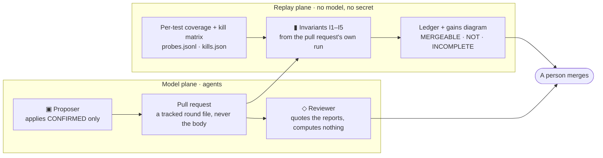

# AI in the loop, invariants in charge

_The plain-words version of what this repository does when an agent changes it, and the first thing
it governs this way: its own test suite. The analysis lives with the frontend's tooling — the
contracts are its [`tools/subsume/README.md`](https://github.com/Check-It-Out-Dev/checkitout-frontend/blob/main/tools/subsume/README.md),
the decision its [ADR](https://github.com/Check-It-Out-Dev/checkitout-frontend/blob/main/docs/ci/ADR-test-subsumption.md);
this repository owns the JUnit listener, the PIT profile and the two workflows._

## The idea in one paragraph

Agents now write and remove code here. Nobody reads every line they produce, and the person who wrote
the passing test is often the same process that wrote the bug. So what keeps the system intact is not
the agent's judgement, and not a reviewer's stamina, but a small set of **invariants**: things that
must stay true after every change, checked by a machine from the change's own measurements, before a
person ever looks. An agent may propose anything. The invariants dispose. A person merges.

## The five invariants

| | Invariant | What it means in plain words | Who checks it |
| :-- | :-- | :-- | :-- |
| I1 | Coverage never drops on unchanged code | For every file, class and method the change did not touch, every line and branch the tests reached before is still reached. New code is judged by the ordinary JaCoCo floor. | `invariant.mjs`, on the pull request's own per-test coverage |
| I2 | Kills are kept | Every deliberate defect (a _mutant_) the suite caught yesterday is still caught by a test that stays in the tier. | `invariant.mjs`, against the last governance run's kill matrix |
| I3 | Green | The suite passes — in the order it was written and in a random one. | the pull request's runs |
| I4 | The numbers move with the code | Every figure this README publishes about itself matches the tree, in the same commit. | `tools/ci/measure-counts.mjs --check` |
| I5 | The reviewer quotes | Every number in the reviewing agent's comment appears in a report the machine produced. | `pr-numbers-check.mjs`, after the comment is written and before it is posted |

## The loop, one picture

Two planes. The **model plane** is where the agents are: one proposes a change and opens a pull
request; one reads the reports and writes a review. The **replay plane** has no model in it and no
secret: it measures the change and replays the invariants. They meet at one place — a person.



Three voices appear on such a pull request, each with a fixed first line, so a reader knows who is
speaking before reading a number: `▣ Proposer — applies CONFIRMED only · never merges`,
`▮ Invariants — replay plane · no model · I1–I5`, `◇ Reviewer — quotes gate numbers only · never
approves`. Numbers come from the reports and nowhere else.

## The first instance: a redundant-test killer, explained

A test suite grows the way a hedge grows: nobody trims it, and after a while a pull request waits on
tests that add nothing. The obvious fix — delete tests that "look" redundant — is how suites lose the
one test that mattered. So the first thing governed by the invariants is the suite itself, and the
rule is deliberately strict.

**Two instruments, and both must agree.** Coverage says a test _walked past_ a line. Mutation
testing says whether a test would _notice_ if that line were wrong: PIT makes one small deliberate
change to the compiled program (a **mutant** — `<` becomes `<=`, a condition is negated, a return
value is replaced), runs the unit tests that reach it, and records who failed (**killed** it). The
`mutation-matrix` profile runs this over every class in `main` and keeps the whole list of killers
for every mutant (`fullMutationMatrix`), not just the first, because the question is never "did
someone catch it" but "would someone _else_ have caught it". The per-test coverage comes from a JUnit
listener (`ProbeListener`) that asks JaCoCo what each test touched, resets it, keeps the union, and
writes the exec file back whole so the ordinary report is unchanged.

**The rule.** A test may leave the pull-request tier only if every line and branch it covers is
covered by tests that stay, _and_ every mutant it kills is killed by tests that stay, _and_ the
mutation run actually exercised it against a mutant, _and_ it is not flaky. Nothing is deleted: the
method gets `@Tag("subsumed")` — never `@Disabled`, which this suite deactivates on purpose — and
surefire's `excludedGroups` leaves it out of the pull-request tier while the nightly passes
`-Dsubsume.excludedGroups=never` and runs everything. The published test count stays true; the row
_Demoted from the pull-request tier_ in the README is the gated count.

**A concrete pair, from the first round** (proposal run `local-2026-09-14`): in
`OpportunityStatusUnitTest$JsonSerialization`, `fromStringShouldParseMixedCase()` reaches the same
two basic blocks as `fromStringShouldParseLowercase()` and kills the same one mutant. The first
leaves the tier with a marker naming the second; if someone later weakens the second, invariant I2 on
their pull request says so, because the mutant the pair used to kill would go unkilled. The round's
pull request draws every such pair, class by class.

**What the machine checks before the door closes.** The governance pull request runs the full tier
on its own machine twice (the before, and the probes that flip between runs), the reduced tier (the
after), the reduced tier again in random order (`MethodOrderer$Random`, `ClassOrderer$Random` — a
kept test that only passed because a demoted one ran before it shows itself), and PIT again with the
demoted group excluded. Then one rule: tests or seconds lower, **and** none of coverage on unchanged
code, kills on unchanged code or mutation score lower, both runs green, the numbers consistent.
Anything unmeasured is INCOMPLETE; silence is never success. The ledger and a before → after diagram
go into the pull request beside the picture of who carries what, and the reviewer's comment lands
after.

**How sure, and how much at a time.** The round policy takes only the surest candidates first — an
exact duplicate of a kept test in the same class before a test with two carriers before one with
one — under a budget (a tenth of the tier's seconds, at most half of any class), never a
parameterised invocation (a method is one unit), and never a test whose name carries a scenario word
(`edge`, `regression`, `null`, `timeout`…) until a person clears it. Saturation is expected to take
rounds, on purpose.

## What it found on its first day

The first re-measurement on a GitHub runner refused the round — and every reason was the two machines
disagreeing, not the round: tier seconds measured on a developer box against a runner, eight methods
whose branches depend on a database file, a key or a thread, and one mutant killed on Windows by
three kept tests that survived the same three on Linux. So the before and the after are now measured
on the same machine, and a mutant lost while every test that killed it stayed is charged to the
machine, listed, and not held against the round. The invariants did exactly their job: they refused
to take a claim on trust.

## Where to look

- The round's pull request: the ledger line, the gains diagram, the subsumption diagram, the
  reviewer's comment.
- `docs/testing/governance/round.json` on a governance branch: what left, what was declined and why.
- `docs/testing/measured-counts.json` → `subsumedMethods`, and the README row the gate keeps.
- The base artefacts of the last governance run on Pages: `subsume/latest/` (probes, classes, the
  kill matrix, the proposal), gzipped JSON.
- The workflows: `.github/workflows/ci-tests.yml` (the `invariants` job on every change),
  `test-governance-pr.yml` (the re-measurement on a governance branch), `ai-review.yml` (the reviewer,
  after a pipeline completes).

## Running a round yourself

```bash
# 1. the instruments, twice for the drift, on the same machine
./mvnw test -Ptest -DskipITs -Dsubsume.probes=true            # target/subsume/probes.jsonl + classes.json → base/
./mvnw test -Ptest -DskipITs -Dsubsume.probes=true            # again → base2/
./mvnw -Pmutation-matrix test-compile org.pitest:pitest-maven:mutationCoverage   # ~13 min on 8 threads
node frontend/tools/subsume/pit-matrix.mjs --xml target/pit-matrix/mutations.xml --root . --out base/kills.json
# 2. the proposal, the pack, the demotion (the tooling is the frontend's tools/subsume, sparse-checked out into frontend/)
node frontend/tools/subsume/propose.mjs --repo backend --probes base/probes.jsonl --classes base/classes.json --kills base/kills.json --out reports/subsume
node frontend/tools/subsume/pack.mjs --report reports/subsume/subsume-report.json --probes base/probes.jsonl --probes2 base2/probes.jsonl --out reports/subsume
git checkout -b test-governance/round-N-<runId>
node frontend/tools/subsume/apply.mjs --repo backend --pack reports/subsume/pack.json --round N --run-id <runId> --base-commit $(git rev-parse --short HEAD)
node tools/ci/measure-counts.mjs --write   # then move the README row, and --check
# 3. the pull request, with the label test-governance: the special job measures the rest
```

## Reference marks, verified at the source

Traditional versus dominator mutation score, 88–99 % against 27–82 % on the Siemens suite — Ammann,
Delamaro & Offutt, ICST 2014. Pseudo-tested methods 9 % of 28,808 across 21 Java projects — Vera-Pérez
et al., EMSE 2019. Partly redundant tests 24 % across 15 Java projects — Vahabzadeh, Stocco & Mesbah,
ICSE 2018. Order-dependent tests about 0.65 % of human-written Java tests — Zhang et al., ISSTA 2014.
Flakiness at Google, 1.5 % of runs and about 16 % of tests — Micco, Google Testing Blog, 2016. Statement
coverage averaging 76 % across 47 coverage-tracking projects — Hilton, Bell & Marinov, ASE 2018.
