```mermaid
flowchart LR
  subgraph n0["OpportunityStatusUnitTest$CanTransitionToInvalidTransitions"]
    direction LR
    n1["#35;appliedCannotTransitionToContentPosted()"]:::demoted
    n1 -- "2 probes · 3 kills" --> n2
    n3["#35;appliedCannotTransitionToDone()"]:::demoted
    n3 -- "2 probes · 3 kills" --> n2
    n4["#35;contentApprovedCannotTransitionToRejectedByCom…"]:::demoted
    n5["#35;toBePaidCannotTransitionBackward()"]
    n4 -- "2 probes · 2 kills" --> n5
    n6["[test-template-invocation: #35;1]"]:::demoted
    n6 -- "2 probes · 1 kills" --> n5
    n7["… 35 more"]:::demoted
  end
  subgraph n8["PartnershipOpportunityUnitTest$PartnershipOpportunityEntityTests$ValidationTests"]
    direction LR
    n9["#35;shouldFailValidationForCompensationAmountMinEx…"]:::demoted
    n9 -- "41 probes · 0 kills" --> n10
    n11["#35;shouldFailValidationForLongCompensationDescrip…"]:::demoted
    n11 -- "42 probes · 0 kills" --> n10
    n12["#35;shouldFailValidationForLongDetails()"]:::demoted
    n12 -- "42 probes · 0 kills" --> n10
    n13["#35;shouldFailValidationForLongName()"]:::demoted
    n13 -- "41 probes · 0 kills" --> n10
    n14["… 23 more"]:::demoted
  end
  subgraph n15["OpportunityStatusUnitTest$JsonSerialization"]
    direction LR
    n16["#35;fromStringShouldParseMixedCase()"]:::demoted
    n17["#35;fromStringShouldParseLowercase()"]
    n16 -- "2 probes · 1 kills" --> n17
    n18["[test-template-invocation: #35;1]"]:::demoted
    n18 -- "2 probes · 1 kills" --> n17
    n19["[test-template-invocation: #35;10]"]:::demoted
    n19 -- "2 probes · 1 kills" --> n17
    n20["[test-template-invocation: #35;11]"]:::demoted
    n20 -- "2 probes · 1 kills" --> n17
    n21["… 20 more"]:::demoted
  end
  subgraph n22["CommonSafetyUnitTest$ProfilePatternMatchingTests"]
    direction LR
    n23["[test-template-invocation: #35;1]"]:::demoted
    n23 -- "25 probes · 2 kills" --> n24
    n25["[test-template-invocation: #35;2]"]:::demoted
    n25 -- "25 probes · 2 kills" --> n24
    n26["[test-template-invocation: #35;3]"]:::demoted
    n26 -- "25 probes · 2 kills" --> n24
    n27["[test-template-invocation: #35;4]"]:::demoted
    n27 -- "25 probes · 2 kills" --> n24
    n28["… 18 more"]:::demoted
  end
  subgraph n29["UserDeletionDtosUnitTest$DeletionBlockerCategoryTests"]
    direction LR
    n30["#35;getDescriptionShouldReturnEnumNameWhenTranslat…"]:::demoted
    n30 -- "3 probes · 1 kills" --> n31
    n32["#35;getDescriptionShouldReturnTranslatedDescriptio…"]:::demoted
    n32 -- "3 probes · 1 kills" --> n31
    n33["#35;getLabelShouldReturnEnumNameWhenTranslationNot…"]:::demoted
    n33 -- "3 probes · 1 kills" --> n34
    n35["#35;getLabelShouldReturnTranslatedLabelWhenAvailab…"]:::demoted
    n35 -- "3 probes · 1 kills" --> n34
    n36["… 18 more"]:::demoted
  end
  subgraph n37["AuthDtoCompleteUnitTest$RegisterUserRequestCompleteTests"]
    direction LR
    n38["#35;shouldAcceptValidHttpsProfilePictureUrl()"]:::demoted
    n38 -- "9 probes · 1 kills" --> n39
    n40["#35;shouldFailForCompanyWithoutAddress()"]:::demoted
    n40 -- "14 probes · 3 kills" --> n41
    n42["#35;shouldFailForCompanyWithoutName()"]:::demoted
    n42 -- "21 probes · 3 kills" --> n43
    n44["#35;shouldFailForInfluencerWithPlatformNoAuthCode()"]:::demoted
    n44 -- "11 probes · 5 kills" --> n45
    n46["… 17 more"]:::demoted
  end
  n2["AppliedOpportunityContentServiceUnitTest$MoveTo…"]
  n10["[test-template-invocation: #35;2]"]
  n24["CommonSafetyUnitTest$DangerousConfigurationProf…"]
  n31["PartnershipAndDeletionUnitTest$DeletionBlockerC…"]
  n34["PartnershipAndDeletionUnitTest$DeletionBlockerC…"]
  n39["RegisterUserRequestUnitTest$AddressDataValidati…"]
  n41["RegisterUserRequestUnitTest$AddressDataValidati…"]
  n43["RegisterUserRequestUnitTest$CompanyDataValidati…"]
  n45["AuthDtoUnitTest$RegisterUserRequestValidationTe…"]
  classDef demoted stroke-dasharray: 4 3
```

| Class | Demoted | Carried by |
| --- | --- | --- |
| `ActiveCooperationControllerUnitTest$PaginationTests` | 20 | 4 tests |
| `FutureOrPresentDateValidatorUnitTest$DirectValidatorTests` | 20 | 3 tests |
| `AppliedOpportunityServiceUnitTest$OpportunityStatusStateMachine` | 17 | 10 tests |
| `AuthDtoCompleteUnitTest$AssessmentResultCompleteTests` | 17 | 6 tests |
| `AppliedOpportunityEnumsUnitTest$OpportunityStatusEnumTests$CanTransitionToTests` | 16 | 11 tests |
| `UserPackageUnitTest$AccountStatusEnumTests$JsonSerializationTests` | 16 | 2 tests |
| `RequestContextUtilsUnitTest$SanitizeSensitiveDataTests` | 16 | 1 tests |
| `OpportunityStatusUnitTest$LocalizationMethods` | 15 | 2 tests |
| `AppliedOpportunityEnumsUnitTest$OpportunityStatusEnumTests$GetNextStatusTests` | 15 | 6 tests |
| `AppliedOpportunityServiceUnitTest$TerminalStatusIdentification` | 15 | 4 tests |
| `AuthDtoUnitTest$RegisterUserRequestValidationTests` | 15 | 9 tests |
| `SpecificationBuilderUnitTest$ParameterizedTests` | 15 | 2 tests |
| `SupportTicketServiceUnitTest$TicketStatusTests` | 15 | 10 tests |
| `CorsLoggingFilterUnitTest$OriginValidationTests` | 14 | 6 tests |
| `CorsLoggingFilterUnitTest$PreflightRequestHandlingTests` | 14 | 5 tests |
| `CorsLoggingFilterUnitTest$SuspiciousOriginDetectionTests` | 14 | 8 tests |
| `RegisterUserRequestUnitTest$EmailValidationTests` | 14 | 1 tests |
| `ConsentDtosUnitTest$ConsentActionEnumTests` | 13 | 8 tests |
| `InstagramSocialAuthUnitTest$InstagramConfigTests$AuthorizationUrlGenerationTests` | 13 | 2 tests |
| `PartnershipOpportunityUnitTest$PartnershipOpportunityEntityTests$BusinessRuleTests` | 13 | 9 tests |
| `RedisUserCacheUnitTest$CacheUserTests` | 13 | 6 tests |
| `RegisterUserRequestUnitTest$UserTypeValidationTests` | 13 | 3 tests |
| `ActiveCooperationControllerUnitTest$GetInfluencersToAcceptTests` | 12 | 2 tests |
| `OpportunityStatusUnitTest$SuccessfulCompletionChecks` | 12 | 2 tests |
| `AppliedOpportunityEnumsUnitTest$ContentApprovalStatusEnumTests` | 12 | 3 tests |
| `AppliedOpportunityEnumsUnitTest$OpportunityStatusEnumTests$EnumPropertiesTests` | 12 | 1 tests |
| `AppliedOpportunityEnumsUnitTest$OpportunityStatusEnumTests$IsSuccessfulCompletionTests` | 12 | 2 tests |
| `AppliedOpportunityEnumsUnitTest$OpportunityStatusEnumTests$IsTerminalStatusTests` | 12 | 2 tests |
| `HashingUtilUnitTest$HashIdentifierTests` | 12 | 4 tests |
| `MetadataUnitTest$OpportunityStatusEnumTests` | 12 | 12 tests |
| `RequestBodyCachingFilterUnitTest$OriginAuthorizationTests` | 12 | 5 tests |
| `OpportunityStatusUnitTest$TerminalStatusChecks` | 11 | 2 tests |
| `UserEntityUnitTest$AccountStatusTransitionsTests` | 11 | 8 tests |
| `NipValidatorUnitTest$IsValid` | 11 | 4 tests |
| `AuthDtoMoreUnitTest$RecaptchaResponseAdditionalTests` | 11 | 2 tests |
| `HtmlEncoderUnitTest$ParameterizedEncodingTests` | 11 | 1 tests |
| `InstagramSocialAuthUnitTest$InstagramConfigTests$ConfigurationValidationTests` | 11 | 7 tests |
| `RegisterUserRequestUnitTest$PasswordValidationTests` | 11 | 1 tests |
| `RegisterUserRequestUnitTest$PhoneNumberValidationTests` | 11 | 2 tests |
| `ActiveCooperationControllerUnitTest$GetInfluencersToRateTests` | 10 | 3 tests |
| `ActiveCooperationControllerUnitTest$GetOpportunitiesInProgressTests` | 10 | 3 tests |
| `OpportunityStatusUnitTest$CanTransitionToValidTransitions` | 10 | 6 tests |
| `OpportunityStatusUnitTest$GetPossibleTransitions` | 10 | 9 tests |
| `AssessmentResultUnitTest$SuccessFactoryMethodTests` | 10 | 4 tests |
| `AuthDtoUnitTest$AssessmentResultTests` | 10 | 5 tests |
| `AuthValidatorsUnitTest$RecaptchaStartupValidatorTests$ValidateThresholdsTests` | 10 | 6 tests |
| `CommonJwtUnitTest$CreateTokenWithClaimsTests` | 10 | 4 tests |
| `CommonSafetyUnitTest$DangerousConfigurationProfileTests` | 10 | 8 tests |
| `InMemoryUserCacheUnitTest$GetAccountStatusTests` | 10 | 6 tests |
| `InstagramConfigUnitTest$AuthorizationUrlTests` | 10 | 2 tests |
| `PartnershipOpportunityEntityUnitTest$NotBlankValidationTests` | 10 | 1 tests |
| `PartnershipOpportunityEntityUnitTest$PatternAndMinMaxTests` | 10 | 3 tests |
| `PartnershipOpportunityMoreUnitTest$PartnershipOpportunityEntityAdvancedTests$UpdaterIdPatternTests` | 10 | 2 tests |
| `StorageHealthUnitTest$SystemLoadDetailsTests` | 10 | 1 tests |
| `HmacUtilsUnitTest$ConstantTimeEquals` | 10 | 2 tests |
| `HmacUtilsUnitTest$GenerateHMAC` | 10 | 3 tests |
| `FileUploadControllerUnitTest$GenerateSignedUrlValidation` | 9 | 3 tests |
| `OpportunityStatusUnitTest$GetNextStatusAcceptPath` | 9 | 2 tests |
| `AppliedOpportunityServiceUnitTest$CanTransitionToValidation` | 9 | 5 tests |
| `CommonJwtUnitTest$ErrorHandlingTests` | 9 | 4 tests |
| `CommonSafetyUnitTest$DangerousConfigurationEnvironmentTests` | 9 | 8 tests |
| `ConsentAndAddressUnitTest$ConsentActionEnumTests$JsonSerializationTests` | 9 | 2 tests |
| `CustomErrorControllerUnitTest$SpecificErrorLoggingTests` | 9 | 7 tests |
| `InMemoryUserCacheUnitTest$CacheUserTests` | 9 | 7 tests |
| `PartnershipAndDeletionUnitTest$CompensationTypeTests` | 9 | 4 tests |
| `PartnershipOpportunityEntityUnitTest$SizeConstraintTests` | 9 | 2 tests |
| `SpecificationBuilderUnitTest$CopyNonNullPropertiesTests` | 9 | 1 tests |
| `StorageRateLimitServiceUnitTest$EdgeCaseTests` | 9 | 4 tests |
| `SupportTicketModelsUnitTest$TicketCategoryEnumTests` | 9 | 2 tests |
| `SupportTicketServiceUnitTest$TicketCategoryTests` | 9 | 2 tests |
| `UserCacheServiceUnitTest$InMemoryUserCacheTests$GetAccountStatusTests` | 9 | 7 tests |
| `UserCacheServiceUnitTest$InMemoryUserCacheTests$IsUserActiveTests` | 9 | 7 tests |
| `UserServiceUnitTest$AccountStatusTransitionsTests` | 9 | 7 tests |
| `HashingUtilUnitTest$HashIdentifier` | 9 | 3 tests |
| `HmacUtilsUnitTest$ValidateHMAC` | 9 | 1 tests |
| `OtpAuthUrlsUnitTest` | 9 | 1 tests |
| `ActiveCooperationControllerUnitTest$UpdateCompanyRatingTests` | 8 | 1 tests |
| `ActiveCooperationControllerUnitTest$UpdateInfluencerRatingTests` | 8 | 1 tests |
| `UserEntityMoreUnitTest$ProfileFieldCriticalityAdditionalTests` | 8 | 3 tests |
| `AssessmentResultUnitTest$AllowedFactoryMethodTests` | 8 | 2 tests |
| `AssessmentResultUnitTest$InvalidFactoryMethodTests` | 8 | 2 tests |
| `AuthorizationServiceUnitTest$BannedUserAuthorizationFilterTests` | 8 | 1 tests |
| `CommonValidatorUnitTest$CheckStorageModeTests` | 8 | 4 tests |
| `CustomErrorControllerUnitTest$MessageKeyResolutionTests` | 8 | 8 tests |
| `EncryptionServicesUnitTest$EdgeCasesTests` | 8 | 1 tests |
| `FutureOrPresentDateValidatorUnitTest$EdgeCaseTests` | 8 | 2 tests |
| `HashingUtilUnitTest$GenerateRedisKeyTests` | 8 | 5 tests |
| `PartnershipOpportunityMoreUnitTest$NumericRangeValidationTests$CompensationAmountValidation` | 8 | 4 tests |
| `PartnershipOpportunityMoreUnitTest$PartnershipOpportunityEntityAdvancedTests$BoundaryValueTests` | 8 | 8 tests |
| `RedisUserCacheUnitTest$GetAccountStatusTests` | 8 | 3 tests |
| `RegisterUserRequestUnitTest$ProfilePictureUrlValidationTests` | 8 | 2 tests |
| `RequestLoggingFiltersUnitTest$RequestCorrelationFilterTests$CorrelationIdGenerationTests` | 8 | 3 tests |
| `SignedUrlValidationServiceUnitTest$GetValidationReportTests` | 8 | 3 tests |
| `UserCacheServiceUnitTest$InMemoryUserCacheTests$CacheUserTests` | 8 | 8 tests |
| `UserPackageUnitTest$AccountStatusEnumTests$CanTransitionToTests` | 8 | 8 tests |
| `RequestContextUtilsUnitTest$GetClientIpAddressTests` | 8 | 3 tests |
| `JwtAuthenticationFilterDevLitePublicUnitTest` | 7 | 4 tests |
| `AssessmentResultUnitTest$BlockedFactoryMethodTests` | 7 | 3 tests |
| `AssessmentResultUnitTest$EdgeCaseTests` | 7 | 4 tests |
| `AuthorizationServiceUnitTest$PermissionUtilsRoleCheckingTests` | 7 | 5 tests |
| `CommonJwtUnitTest$GetSubjectTests` | 7 | 3 tests |
| `CommonSafetyUnitTest$DatabaseUrlPatternMatchingTests` | 7 | 5 tests |
| `CommonValidatorUnitTest$ConfigurationValuesTests` | 7 | 2 tests |
| `CredentialsServiceUnitTest$IsProductionEnvironmentTests` | 7 | 2 tests |
| `CustomErrorControllerUnitTest$UnknownStatusCodeTests` | 7 | 5 tests |
| `DiskAndLiquibaseHealthUnitTest$DiskSpaceHealthIndicatorTests$HealthMethodTests` | 7 | 4 tests |
| `EnumTranslationServiceUnitTest$TranslateToStringTests` | 7 | 1 tests |
| `MetadataUnitTest$OpportunityStatusGetNextStatusTests` | 7 | 5 tests |
| `ProfilePictureProxyServiceUnitTest$IsInstagramCdnUrlTests` | 7 | 4 tests |
| `RecaptchaServiceUnitTest$VerifyTokenScoreThresholdTests` | 7 | 5 tests |
| `RequestBodyCachingFilterUnitTest$ActuatorEndpointFilteringTests` | 7 | 2 tests |
| `RequestLoggingFiltersUnitTest$RequestCorrelationFilterTests$HttpMethodTests` | 7 | 1 tests |
| `RequestLoggingFiltersUnitTest$RequestLoggingFilterTests$ParameterExtractionTests` | 7 | 1 tests |
| `SecretsServiceUnitTest$EdgeCaseTests` | 7 | 5 tests |
| `SecretsServiceUnitTest$GetSecretDevelopmentModeTests` | 7 | 8 tests |
| `SignedUrlServiceUnitTest$ValidationTests` | 7 | 2 tests |
| `SupportTicketModelsUnitTest$SupportTicketEntityTests$HelperMethodTests` | 7 | 2 tests |
| `AdminControllerUnitTest$SetUserClaimsTests$PermissionSettingTests` | 6 | 1 tests |
| `FileUploadControllerUnitTest$GenerateSignedUrl` | 6 | 2 tests |
| `UserEntityUnitTest$AccountStatusEnumTests` | 6 | 4 tests |
| `ApplicationHealthIndicatorUnitTest$HealthMethodTests` | 6 | 1 tests |
| `AppliedOpportunityEnumsUnitTest$RateStatusEnumTests$FromStringTests` | 6 | 1 tests |
| `AuthDtoExtendedUnitTest$ExchangeTokenRequestTests` | 6 | 2 tests |
| `AuthorizationServiceUnitTest$PermissionUtilsUserOwnerTests` | 6 | 6 tests |
| `BaseClassesUnitTest$BaseServiceTests$PatchTests` | 6 | 3 tests |
| `CommonJwtUnitTest$CreateTokenDefaultExpirationTests` | 6 | 3 tests |
| `CommonJwtUnitTest$EdgeCasesTests` | 6 | 4 tests |
| `CommonJwtUnitTest$ValidateTokenTests` | 6 | 4 tests |
| `CommonSafetyUnitTest$DangerousConfigurationDatabaseTests` | 6 | 8 tests |
| `CommonSafetyUnitTest$EdgeCasesTests` | 6 | 8 tests |
| `ConsentEnforcementFilterUnitTest$WhenUserBlocked` | 6 | 2 tests |
| `CorsLoggingFilterUnitTest$EdgeCaseTests` | 6 | 5 tests |
| `CorsLoggingFilterUnitTest$ResponseHeaderLoggingTests` | 6 | 9 tests |
| `EncryptionServicesUnitTest$TokenEncryptionServiceTests$EncryptTokenTests` | 6 | 4 tests |
| `EnumTranslationServiceUnitTest$IsValidEnumValueTests` | 6 | 1 tests |
| `EnumTranslationServiceUnitTest$TranslateRoleTests` | 6 | 1 tests |
| `EnumTranslationServiceUnitTest$TranslateToEnumTests` | 6 | 1 tests |
| `HtmlEncoderUnitTest$IndividualSpecialCharacterTests` | 6 | 1 tests |
| `InstagramConfigUnitTest$EdgeCaseTests` | 6 | 2 tests |
| `InstagramServiceUnitTest$PrivacyUtilitiesTests` | 6 | 6 tests |
| `InstagramSocialAuthUnitTest$InstagramServiceTests$RefreshSocialDataTests` | 6 | 1 tests |
| `PartnershipOpportunityUnitTest$CompensationTypeEnumTests$FromStringTests` | 6 | 1 tests |
| `RedisServiceUnitTest$ConfigurationTests` | 6 | 2 tests |
| `RedisUserCacheUnitTest$IsUserActiveTests` | 6 | 7 tests |
| `RequestLoggingFiltersUnitTest$RequestLoggingFilterTests$HeaderExtractionTests` | 6 | 1 tests |
| `SecretsServiceUnitTest$GetSecretProductionModeTests` | 6 | 4 tests |
| `StorageHealthUnitTest$RedisHealthCheckTests` | 6 | 4 tests |
| `SupportTicketModelsUnitTest$TicketStatusEnumTests$StateTransitionTests` | 6 | 5 tests |
| `UserPackageUnitTest$ProfileFieldCriticalityEnumTests$CriticalFieldsTests` | 6 | 2 tests |
| `UserPackageUnitTest$ProfileFieldCriticalityEnumTests$NonCriticalFieldsTests` | 6 | 3 tests |
| `UserServiceUnitTest$CheckProfileCompletenessTests` | 6 | 4 tests |
| `GeoDistanceCalculatorUnitTest$CalculateDistanceKmTests` | 6 | 1 tests |
| `PiiMaskingUtilsUnitTest$MaskEmailTests` | 6 | 3 tests |
| `PiiMaskingUtilsUnitTest$PseudonymousIdTests` | 6 | 1 tests |
| `AppliedOpportunityEnumsUnitTest$OpportunityStatusEnumTests$FromStringTests` | 5 | 1 tests |
| `AppliedOpportunityEnumsUnitTest$OpportunityStatusEnumTests$GetActiveStatusesTests` | 5 | 1 tests |
| `AppliedOpportunityServiceUnitTest$CollaborationStatusWorkflow` | 5 | 6 tests |
| `AuthDtoCompleteUnitTest$RecaptchaResponseCompleteTests` | 5 | 4 tests |
| `AuthorizationMoreUnitTest$HttpMethodSpecificTests` | 5 | 6 tests |
| `AuthorizationMoreUnitTest$JwtFilterPublicEndpointTests` | 5 | 6 tests |
| `AuthValidatorsUnitTest$ImprovedQRCodeServiceTests$GenerateOtpAuthUrlTests` | 5 | 1 tests |
| `CommonJwtUnitTest$GetClaimTests` | 5 | 2 tests |
| `CommonSafetyUnitTest$MaskSensitiveUrlTests` | 5 | 3 tests |
| `CommonSafetyUnitTest$UrlMaskingPatternsTests` | 5 | 3 tests |
| `CommonValidatorUnitTest$EdgeCasesTests` | 5 | 4 tests |
| `CommonValidatorUnitTest$EnvironmentSpecificValidationTests` | 5 | 2 tests |
| `CredentialsServiceUnitTest$IsBase64Tests` | 5 | 3 tests |
| `DatabaseHealthIndicatorUnitTest$UrlMaskingTests` | 5 | 1 tests |
| `FutureOrPresentDateValidatorUnitTest$BeanValidationIntegrationTests` | 5 | 3 tests |
| `HashingUtilUnitTest$HashIpAddressTests` | 5 | 4 tests |
| `InMemoryUserCacheUnitTest$UserTypeHandlingTests` | 5 | 1 tests |
| `InstagramSocialAuthUnitTest$InstagramServiceTests$AnonymizeIdTests` | 5 | 2 tests |
| `InstagramSocialAuthUnitTest$InstagramServiceTests$MaskUsernameTests` | 5 | 3 tests |
| `PartnershipOpportunityMoreUnitTest$NumericRangeValidationTests$FollowersRangeValidation` | 5 | 2 tests |
| `ProfilePictureProxyServiceUnitTest$IsPermanentFirebaseStorageUrlTests` | 5 | 3 tests |
| `RedisServiceUnitTest$DataTypeTests` | 5 | 1 tests |
| `RedisServiceUnitTest$KeyExpirationTests` | 5 | 1 tests |
| `RequestLoggingFiltersUnitTest$RequestCorrelationFilterTests$ActuatorEndpointFilteringTests` | 5 | 1 tests |
| `RequestLoggingFiltersUnitTest$RequestLoggingFilterTests$ClientIpExtractionTests` | 5 | 2 tests |
| `RequestLoggingFilterUnitTest$ShouldNotFilterTests` | 5 | 2 tests |
| `SignedUrlValidationServiceUnitTest$IsBase64DetectionTests` | 5 | 2 tests |
| `StorageHealthUnitTest$HealthDetailsKeyTests` | 5 | 1 tests |
| `StorageHealthUnitTest$MixedComponentStateTests` | 5 | 5 tests |
| `StorageHealthUnitTest$StatusNoteMessageTests` | 5 | 5 tests |
| `SupportTicketEntityUnitTest$IsResolvedMethodTests` | 5 | 1 tests |
| `SupportTicketModelsUnitTest$TicketStatusEnumTests$DisplayNameTests` | 5 | 1 tests |
| `UserCacheServiceUnitTest$CrossImplementationTests` | 5 | 6 tests |
| `SanitizeFilenameUnitTest` | 5 | 5 tests |
| `HashingUtilUnitTest$GenerateRedisKey` | 5 | 5 tests |
| `LogSafeUnitTest` | 5 | 2 tests |
| `PiiMaskingUtilsUnitTest$MaskIpTests` | 5 | 1 tests |
| `ConsentControllerUnitTest$ResponseStructureTests` | 4 | 4 tests |
| `OpportunityStatusUnitTest$GetNextStatusRejectPath` | 4 | 3 tests |
| `NipValidatorUnitTest$Normalize` | 4 | 1 tests |
| `AppliedOpportunityEnumsUnitTest$OpportunityStatusEnumTests$GetCompletedStatusesTests` | 4 | 1 tests |
| `AppliedOpportunityEnumsUnitTest$OpportunityStatusEnumTests$GetPossibleTransitionsTests` | 4 | 5 tests |
| `AssessmentResultUnitTest$GetterTests` | 4 | 6 tests |
| `AssessmentResultUnitTest$ToStringTests` | 4 | 4 tests |
| `AuthDtoCompleteUnitTest$CrossFieldValidationTests` | 4 | 5 tests |
| `AuthDtoCompleteUnitTest$ExchangeTokenRequestCompleteTests` | 4 | 1 tests |
| `AuthDtoUnitTest$RecaptchaResponseTests` | 4 | 4 tests |
| `AuthorizationMoreUnitTest$JwtFilterInvalidTokenTests` | 4 | 4 tests |
| `AuthValidatorsUnitTest$ImprovedQRCodeServiceTests$GenerateSecretTests` | 4 | 2 tests |
| `AuthValidatorsUnitTest$ImprovedQRCodeServiceTests$IsValidSecretTests` | 4 | 1 tests |
| `BaseClassesUnitTest$EdgeCaseTests` | 4 | 1 tests |
| `CommonExceptionsUnitTest$EdgeCaseTests` | 4 | 2 tests |
| `CommonJwtUnitTest$ClaimTypePreservationTests` | 4 | 1 tests |
| `CommonJwtUnitTest$GetClaimsTests` | 4 | 2 tests |
| `CommonJwtUnitTest$IntegrationScenarioTests` | 4 | 5 tests |
| `CommonJwtUnitTest$IsTokenExpiredTests` | 4 | 1 tests |
| `CommonJwtUnitTest$SecurityTests` | 4 | 2 tests |
| `CommonJwtUnitTest$TokenFormatTests` | 4 | 1 tests |
| `CommonJwtUnitTest$TokenTimingTests` | 4 | 4 tests |
| `CommonSafetyUnitTest$MultipleProfilesHandlingTests` | 4 | 7 tests |
| `CommonSafetyUnitTest$OnApplicationEventTests` | 4 | 2 tests |
| `CommonValidatorUnitTest$ServiceStatusTests` | 4 | 5 tests |
| `CorsLoggingFilterUnitTest$ClientIpExtractionTests` | 4 | 2 tests |
| `CredentialsServiceUnitTest$IsProductionProjectTests` | 4 | 1 tests |
| `CredentialsServiceUnitTest$SanitizeForLoggingTests` | 4 | 2 tests |
| `CustomErrorControllerUnitTest$CorsPreflightTests` | 4 | 4 tests |
| `CustomErrorControllerUnitTest$EdgeCaseTests` | 4 | 5 tests |
| `DatabaseHealthIndicatorUnitTest$HealthUpStatusTests` | 4 | 1 tests |
| `EncryptionServicesUnitTest$TokenEncryptionServiceTests$DecryptTokenTests` | 4 | 4 tests |
| `EnumTranslationServiceUnitTest$TranslateCategoryTests` | 4 | 1 tests |
| `FirebaseStorageServiceUnitTest$DeleteFolderTests$DeleteFolderSuccessTests` | 4 | 2 tests |
| `HashingUtilUnitTest$HashFirebaseUidTests` | 4 | 3 tests |
| `HtmlEncoderUnitTest$XssAttackPatternTests` | 4 | 1 tests |
| `InMemoryUserCacheUnitTest$IsUserActiveTests` | 4 | 6 tests |
| `InstagramSocialAuthUnitTest$InstagramConfigTests$ApiUrlGettersTests` | 4 | 2 tests |
| `InstagramSocialAuthUnitTest$InstagramStartupValidatorTests$OAuthUrlBuildingTests` | 4 | 1 tests |
| `PartnershipOpportunityEntityUnitTest$EndDateNotBeforeStartDateTests` | 4 | 3 tests |
| `PartnershipOpportunityEntityUnitTest$NotNullValidationTests` | 4 | 1 tests |
| `PartnershipOpportunityEntityUnitTest$ValidCompensationRangeTests` | 4 | 4 tests |
| `PartnershipOpportunityEntityUnitTest$ValidFollowersRangeTests` | 4 | 2 tests |
| `PartnershipOpportunityMoreUnitTest$CompensationTypeEnumAdvancedTests$FromStringEdgeCases` | 4 | 1 tests |
| `PartnershipOpportunityMoreUnitTest$PartnershipOpportunityEntityAdvancedTests$DateRangeEdgeCases` | 4 | 4 tests |
| `PartnershipOpportunityUnitTest$EdgeCaseTests` | 4 | 4 tests |
| `ProfilePictureProxyServiceUnitTest$BoundaryAndSpecialCasesTests` | 4 | 2 tests |
| `ProfilePictureProxyServiceUnitTest$HasPreservableProfilePictureTests` | 4 | 5 tests |
| `ProfilePictureProxyServiceUnitTest$UrlDetectionEdgeCasesTests` | 4 | 5 tests |
| `RecaptchaServiceUnitTest$VerifyTokenInvalidTokenTests` | 4 | 1 tests |
| `RedisUserCacheUnitTest$GetTokenVersionTests` | 4 | 4 tests |
| `RegisterUserRequestUnitTest$SocialDataValidationTests` | 4 | 7 tests |
| `RequestBodyCachingFilterUnitTest$CachedBodyHttpServletRequestTests` | 4 | 2 tests |
| `RequestBodyCachingFilterUnitTest$CachedBodyServletInputStreamTests` | 4 | 3 tests |
| `RequestBodyCachingFilterUnitTest$RequestBodyCachingDecisionTests` | 4 | 3 tests |
| `RequestLoggingFiltersUnitTest$EdgeCaseTests` | 4 | 2 tests |
| `RequestLoggingFiltersUnitTest$RequestLoggingFilterTests$ActuatorEndpointExclusionTests` | 4 | 2 tests |
| `RequestLoggingFiltersUnitTest$RequestLoggingFilterTests$RequestBodyHandlingTests` | 4 | 1 tests |
| `RequestLoggingFiltersUnitTest$RequestLoggingFilterTests$ResponseLoggingTests` | 4 | 4 tests |
| `RequestLoggingFilterUnitTest$DoFilterInternalTests` | 4 | 3 tests |
| `SecretsServiceUnitTest$ConvenienceMethodsTests` | 4 | 6 tests |
| `SecretsServiceUnitTest$FileFormatPriorityTests` | 4 | 4 tests |
| `SpecificationBuilderUnitTest$CopyEdgeCasesTests` | 4 | 1 tests |
| `SpecificationBuilderUnitTest$EnumFieldFilterTests` | 4 | 4 tests |
| `StorageHealthUnitTest$FirebaseStorageHealthCheckTests` | 4 | 4 tests |
| `TwoFactorAuthServiceUnitTest$EdgeCasesTests` | 4 | 4 tests |
| `TwoFactorAuthServiceUnitTest$VerifyBackupCodeTests` | 4 | 2 tests |
| `TwoFactorAuthServiceUnitTest$VerifyTotpCodeTests` | 4 | 4 tests |
| `UserCacheServiceUnitTest$RedisUserCacheTests$GetAccountStatusTests` | 4 | 8 tests |
| `UserCacheServiceUnitTest$UserTypeHandlingTests` | 4 | 2 tests |
| `UserPackageUnitTest$ProfileFieldCriticalityEnumTests$UnknownFieldsTests` | 4 | 1 tests |
| `UserServiceUnitTest$AccountStatusEnumTests` | 4 | 5 tests |
| `InterruptsUnitTest` | 4 | 2 tests |
| `ActiveCooperationControllerUnitTest$EdgeCaseTests` | 3 | 2 tests |
| `AdminControllerUnitTest$SetUserClaimsTests$AuthorizationTests` | 3 | 2 tests |
| `FileManagementControllerUnitTest$WebhookControllerEdgeCaseTests` | 3 | 2 tests |
| `FileManagementControllerUnitTest$WebhookControllerTests$ObjectFinalizedTests` | 3 | 3 tests |
| `UserControllerUnitTest$GetAccountStatusListTests` | 3 | 1 tests |
| `UserControllerUnitTest$LocaleHandlingTests` | 3 | 2 tests |
| `OpportunityStatusUnitTest$ActiveStatuses` | 3 | 1 tests |
| `OpportunityStatusUnitTest$GetNextStatusInvalidTransitions` | 3 | 3 tests |
| `NetworkExceptionHandlerUnitTest$HandleNetworkRetryExhaustedExceptionTests` | 3 | 4 tests |
| `AddressServiceUnitTest$SearchReusableAddressesFlexibleTests` | 3 | 3 tests |
| `ApplicationHealthIndicatorUnitTest$EdgeCaseTests` | 3 | 1 tests |
| `ApplicationHealthIndicatorUnitTest$HealthCheckConsistencyTests` | 3 | 1 tests |
| `ApplicationHealthIndicatorUnitTest$HealthDetailsValidationTests` | 3 | 2 tests |
| `AppliedOpportunityEnumsUnitTest$StateMachineIntegrationTests` | 3 | 4 tests |
| `AppliedOpportunityServiceUnitTest$GetActiveAndCompletedStatuses` | 3 | 3 tests |
| `AppliedOpportunityServiceUnitTest$OpportunityStatusJsonSerialization` | 3 | 3 tests |
| `AppliedOpportunityServiceUnitTest$RateStatusJsonSerialization` | 3 | 3 tests |
| `AuthDtoCompleteUnitTest$RecaptchaRequestCompleteTests` | 3 | 1 tests |
| `AuthorizationMoreUnitTest$CookieExtractionTests` | 3 | 2 tests |
| `AuthorizationMoreUnitTest$HmacSignatureValidationTests` | 3 | 3 tests |
| `AuthorizationMoreUnitTest$RoleBasedAuthTests` | 3 | 1 tests |
| `CityFullUnitTest$CityConverterToCityNameTests` | 3 | 1 tests |
| `CommonExceptionsUnitTest$TranslatableExceptionTests` | 3 | 3 tests |
| `CommonJwtUnitTest$CreateTokenWithMinutesExpiryTests` | 3 | 2 tests |
| `CommonSafetyUnitTest$CombinedDangerousConfigurationTests` | 3 | 6 tests |
| `CommonSafetyUnitTest$IntegrationScenarioSimulationsTests` | 3 | 2 tests |
| `CommonValidatorUnitTest$CheckProjectConsistencyTests` | 3 | 3 tests |
| `CommonValidatorUnitTest$CheckReCaptchaTests` | 3 | 4 tests |
| `ConsentAndAddressUnitTest$ConsentActionEnumTests$ActionTypeHelperMethodsTests` | 3 | 3 tests |
| `CorsLoggingFilterUnitTest$ExceptionHandlingTests` | 3 | 4 tests |
| `CorsLoggingFilterUnitTest$MdcContextManagementTests` | 3 | 6 tests |
| `CorsLoggingFilterUnitTest$ShouldNotFilterTests` | 3 | 3 tests |
| `CustomErrorControllerUnitTest$ClientIpExtractionTests` | 3 | 3 tests |
| `DatabaseHealthIndicatorUnitTest$HealthExceptionHandlingTests` | 3 | 2 tests |
| `DatabaseHealthIndicatorUnitTest$QueryTestExecutionTests` | 3 | 1 tests |
| `DiskAndLiquibaseHealthUnitTest$LiquibaseHealthIndicatorTests$EdgeCaseTests` | 3 | 2 tests |
| `EmailVerificationServiceUnitTest$SyncEmailVerificationStatusTests` | 3 | 4 tests |
| `EncryptionServicesUnitTest$TokenEncryptionServiceTests$ValidateKMSServiceTests` | 3 | 3 tests |
| `FirebaseStorageServiceUnitTest$GetFileMetadataTests$GetFileMetadataSuccessTests` | 3 | 1 tests |
| `GdprRateLimiterUnitTest$GdprCompliantRateLimiterServiceTests$CheckLimitTests` | 3 | 2 tests |
| `GdprRateLimiterUnitTest$GdprCompliantRateLimiterServiceTests$ConstructorTests` | 3 | 2 tests |
| `HtmlEncoderUnitTest$UnicodeAndSafeCharacterTests` | 3 | 1 tests |
| `ImprovedQRCodeServiceLoggingUnitTest` | 3 | 2 tests |
| `InMemoryUserCacheUnitTest$ConcurrentAccessTests` | 3 | 6 tests |
| `InMemoryUserCacheUnitTest$EdgeCaseTests` | 3 | 3 tests |
| `InstagramConfigUnitTest$ConfigurationValidationTests` | 3 | 3 tests |
| `InstagramSocialAuthUnitTest$InstagramConfigTests$ClientIdRecognitionTests` | 3 | 1 tests |
| `InstagramSocialAuthUnitTest$InstagramServiceTests$RefreshLongLivedTokenTests` | 3 | 2 tests |
| `OAuthCallbackServiceUnitTest$CookieHandlingTests` | 3 | 2 tests |
| `PartnershipOpportunityMoreUnitTest$EdgeCasesAndCornerCases` | 3 | 1 tests |
| `ProfilePictureProxyServiceUnitTest$PreservableProfilePictureLogicTests` | 3 | 2 tests |
| `ProfilePictureProxyServiceUnitTest$UrlPatternClassificationTests` | 3 | 5 tests |
| `RedisServiceUnitTest$ConnectionHandlingTests` | 3 | 2 tests |
| `RedisServiceUnitTest$EdgeCaseTests` | 3 | 3 tests |
| `RedisServiceUnitTest$RateLimitingSimulationTests` | 3 | 2 tests |
| `RedisServiceUnitTest$ValidateRedisAccessTests` | 3 | 3 tests |
| `RedisUserCacheUnitTest$EdgeCaseTests` | 3 | 1 tests |
| `RedisUserCacheUnitTest$EvictAllTests` | 3 | 3 tests |
| `RedisUserCacheUnitTest$KeyHashingTests` | 3 | 4 tests |
| `RequestBodyCachingFilterUnitTest$EdgeCaseTests` | 3 | 3 tests |
| `RequestBodyCachingFilterUnitTest$MdcContextSetupTests` | 3 | 2 tests |
| `RequestBodyCachingFilterUnitTest$ResponseStatusLoggingTests` | 3 | 4 tests |
| `RequestLoggingFiltersUnitTest$RequestCorrelationFilterTests$MdcContextManagementTests` | 3 | 1 tests |
| `RequestLoggingFiltersUnitTest$RequestCorrelationFilterTests$ResponseHeaderTests` | 3 | 2 tests |
| `RequestLoggingFiltersUnitTest$RequestLoggingFilterTests$ExceptionHandlingTests` | 3 | 2 tests |
| `RequestLoggingFiltersUnitTest$RequestLoggingFilterTests$MdcFallbackGenerationTests` | 3 | 5 tests |
| `RequestLoggingFiltersUnitTest$RequestLoggingFilterTests$RequestLoggingTests` | 3 | 3 tests |
| `RequestLoggingFilterUnitTest$IpAddressExtractionTests` | 3 | 2 tests |
| `SecretsServiceUnitTest$ErrorHandlingTests` | 3 | 3 tests |
| `SignedUrlValidationServiceUnitTest$EdgeCasesTests` | 3 | 1 tests |
| `SpecificationBuilderUnitTest$StringFieldFilterTests` | 3 | 2 tests |
| `StorageHealthUnitTest$ComponentStatusValuesTests` | 3 | 1 tests |
| `StorageHealthUnitTest$EdgeCaseTests` | 3 | 4 tests |
| `StorageHealthUnitTest$OverallHealthStatusTests` | 3 | 4 tests |
| `StorageHealthUnitTest$RateLimiterHealthCheckTests` | 3 | 4 tests |
| `StorageRateLimitServiceUnitTest$ConstructorTests` | 3 | 2 tests |
| `StorageRateLimitServiceUnitTest$HasStorageSpaceTests` | 3 | 2 tests |
| `StorageRateLimitServiceUnitTest$UploadTypeEnumTests` | 3 | 1 tests |
| `TokenEncryptionServiceUnitTest$DecryptTokenTests` | 3 | 4 tests |
| `TokenEncryptionServiceUnitTest$EncryptTokenTests` | 3 | 4 tests |
| `TranslationServiceUnitTest$KeyNormalizationTests` | 3 | 1 tests |
| `TranslationServiceUnitTest$TranslateAccountStatusTests` | 3 | 1 tests |
| `TranslationServiceUnitTest$TranslateCurrencyTests` | 3 | 1 tests |
| `TranslationServiceUnitTest$TranslateOpportunityStatusTests` | 3 | 1 tests |
| `UserCacheServiceUnitTest$InMemoryUserCacheTests$GetTokenVersionTests` | 3 | 5 tests |
| `UserCacheServiceUnitTest$RedisUserCacheTests$GetTokenVersionTests` | 3 | 4 tests |
| `UserPackageUnitTest$AccountStatusEnumTests$GetPossibleTransitionsTests` | 3 | 5 tests |
| `UserPackageUnitTest$AccountStatusEnumTests$HelperMethodsTests` | 3 | 3 tests |
| `UserPackageUnitTest$EdgeCaseTests` | 3 | 7 tests |
| `UserSocialConnectionServiceUnitTest$ConnectionEntityTests` | 3 | 6 tests |
| `HashingUtilUnitTest$HashIpAddress` | 3 | 2 tests |
| `SessionValidationUtilsUnitTest$IsSessionExpired` | 3 | 2 tests |
| `ActiveCooperationControllerUnitTest$SecurityContextTests` | 2 | 5 tests |
| `AdminControllerUnitTest$SetUserClaimsTests$FirebaseErrorHandlingTests` | 2 | 1 tests |
| `AdminControllerUnitTest$SetUserClaimsTests$PathVariableTests` | 2 | 1 tests |
| `AuthControllerUnitTest$Setup2FATests` | 2 | 1 tests |
| `ConsentControllerUnitTest$EdgeCaseTests` | 2 | 1 tests |
| `ConsentControllerUnitTest$GetUserConsentsTests` | 2 | 1 tests |
| `FileUploadControllerUnitTest$GetRateLimitStatus` | 2 | 1 tests |
| `FileUploadControllerUnitTest$HealthCheck` | 2 | 1 tests |
| `UserControllerUnitTest$FindPaginatedTests` | 2 | 1 tests |
| `UserControllerUnitTest$FindPublicPaginatedTests` | 2 | 1 tests |
| `UserControllerUnitTest$GetUserTypeListTests` | 2 | 1 tests |
| `UserEntityMoreUnitTest$DefaultNoteServiceTests$GetDefaultNoteForAdminTypesTests` | 2 | 2 tests |
| `UserEntityMoreUnitTest$DefaultNoteServiceTests$GetDefaultNoteForInfluencerTests` | 2 | 2 tests |
| `UserEntityUnitTest$TokenVersionTests` | 2 | 1 tests |
| `GusBir1ResponseParserUnitTest$ExtractSearchResult` | 2 | 2 tests |
| `GusBir1ResponseParserUnitTest$ExtractSessionId` | 2 | 1 tests |
| `GusBir1ResponseParserUnitTest$IsSoapFault` | 2 | 3 tests |
| `JwtAuthenticationFilterBrokenSessionPublicUnitTest` | 2 | 5 tests |
| `JwtAuthenticationFilterStaleTokenUnitTest` | 2 | 2 tests |
| `ServiceAccountKeyValidatorUnitTest$ValidInput` | 2 | 1 tests |
| `AddressServiceUnitTest$FindByIdTests` | 2 | 3 tests |
| `ApplicationHealthIndicatorUnitTest$HealthIndicatorInterfaceTests` | 2 | 1 tests |
| `ApplicationHealthIndicatorUnitTest$MemoryFormatTests` | 2 | 1 tests |
| `ApplicationHealthIndicatorUnitTest$MultipleInvocationsTests` | 2 | 1 tests |
| `ApplicationHealthIndicatorUnitTest$UpStateTests` | 2 | 2 tests |
| `AppliedOpportunityEnumsUnitTest$RateStatusEnumTests$EnumPropertiesTests` | 2 | 1 tests |
| `AssessmentResultUnitTest$ImmutabilityTests` | 2 | 2 tests |
| `AuthDtoExtendedUnitTest$RegistrationResponseTests` | 2 | 2 tests |
| `AuthDtoMoreUnitTest$RecaptchaRequestAdditionalTests` | 2 | 1 tests |
| `AuthDtoUnitTest$RecaptchaRequestTests` | 2 | 1 tests |
| `AuthorizationMoreUnitTest$AdminCheckRunnerTests` | 2 | 2 tests |
| `AuthorizationMoreUnitTest$JwtClaimsExtractionTests` | 2 | 2 tests |
| `AuthorizationMoreUnitTest$JwtFilterValidTokenTests` | 2 | 3 tests |
| `AuthorizationMoreUnitTest$SecurityContextTests` | 2 | 4 tests |
| `AuthSessionUnitTest$SocialAuthSessionServiceTests$GetSocialDataTests` | 2 | 1 tests |
| `AuthSessionUnitTest$SocialAuthSessionServiceTests$RemoveSessionTests` | 2 | 1 tests |
| `AuthValidatorsUnitTest$QRCodeGeneratorServiceTests$GenerateSimpleQRCodeTests` | 2 | 1 tests |
| `AuthValidatorsUnitTest$RecaptchaStartupValidatorTests$DisabledStateTests` | 2 | 2 tests |
| `AuthValidatorsUnitTest$RecaptchaStartupValidatorTests$ValidateSiteKeyTests` | 2 | 3 tests |
| `BaseClassesUnitTest$BaseControllerTests$DeleteTests` | 2 | 4 tests |
| `BaseClassesUnitTest$BaseServiceTests$GetDataPagedAndFilteredTests` | 2 | 1 tests |
| `BaseClassesUnitTest$BaseServiceTests$SaveTests` | 2 | 2 tests |
| `CityFullUnitTest$CityConverterToCityTests` | 2 | 1 tests |
| `CommonValidatorUnitTest$CheckFirebaseAuthTests` | 2 | 4 tests |
| `CommonValidatorUnitTest$CheckGoogleCloudStorageTests` | 2 | 4 tests |
| `CommonValidatorUnitTest$FinalStatusCalculationTests` | 2 | 3 tests |
| `CommonValidatorUnitTest$MaskEmailTests` | 2 | 2 tests |
| `CommonValidatorUnitTest$ValidateAllServicesTests` | 2 | 2 tests |
| `ConsentServiceUnitTest$GetUserConsentHistoryTests` | 2 | 2 tests |
| `CorsLoggingFilterUnitTest$CorsHeaderValidationTests` | 2 | 3 tests |
| `CorsLoggingFilterUnitTest$FilterInvocationTests` | 2 | 2 tests |
| `CorsLoggingFilterUnitTest$IpAnonymizationTests` | 2 | 1 tests |
| `CorsLoggingFilterUnitTest$LogInjectionTests` | 2 | 6 tests |
| `CorsLoggingFilterUnitTest$UserAgentCategorizationTests` | 2 | 2 tests |
| `CredentialsServiceUnitTest$Base64EdgeCasesTests` | 2 | 2 tests |
| `CredentialsServiceUnitTest$DecodeWithAutoPaddingTests` | 2 | 2 tests |
| `CredentialsServiceUnitTest$ExtractProjectIdFromJsonTests` | 2 | 4 tests |
| `CredentialsServiceUnitTest$MaskEmailTests` | 2 | 1 tests |
| `CustomErrorControllerUnitTest$BadRequestTests` | 2 | 3 tests |
| `CustomErrorControllerUnitTest$ErrorResponseStructureTests` | 2 | 3 tests |
| `CustomErrorControllerUnitTest$InternalServerErrorTests` | 2 | 4 tests |
| `DiskAndLiquibaseHealthUnitTest$DiskSpaceHealthIndicatorTests$FormatBytesTests` | 2 | 3 tests |
| `DiskAndLiquibaseHealthUnitTest$IntegrationLikeTests` | 2 | 3 tests |
| `DiskAndLiquibaseHealthUnitTest$LiquibaseHealthIndicatorTests$LiquibaseConfiguredTests` | 2 | 2 tests |
| `EncryptionServicesUnitTest$ConcurrentAccessTests` | 2 | 2 tests |
| `EncryptionServicesUnitTest$TokenEncryptionServiceTests$EndToEndTests` | 2 | 1 tests |
| `EncryptionServicesUnitTest$TotpEncryptionServiceTests$EncryptBackupCodesTests` | 2 | 1 tests |
| `EncryptionServicesUnitTest$TotpEncryptionServiceTests$EncryptTotpSecretTests` | 2 | 1 tests |
| `EnumTranslationServiceUnitTest$TranslateFieldTests` | 2 | 1 tests |
| `FirebaseServiceUnitTest$CreateOrValidateFirebaseUserTests` | 2 | 3 tests |
| `FirebaseServiceUnitTest$EdgeCasesTests` | 2 | 3 tests |
| `FirebaseServiceUnitTest$GenerateCustomTokenWithClaimsTests` | 2 | 1 tests |
| `FirebaseServiceUnitTest$SetUserClaimsTests` | 2 | 1 tests |
| `GdprRateLimiterUnitTest$GdprComplianceScenariosTests` | 2 | 2 tests |
| `GdprRateLimiterUnitTest$GdprCompliantRateLimiterServiceTests$DataExportTests` | 2 | 1 tests |
| `GdprRateLimiterUnitTest$GdprCompliantRateLimiterServiceTests$HashingTests` | 2 | 2 tests |
| `GdprRateLimiterUnitTest$RateLimiterServiceBaseTests$RateLimitResultTests` | 2 | 3 tests |
| `GeoLocationServiceUnitTest$GeoLocationGdprServiceTests$GetComplianceStatusTests` | 2 | 1 tests |
| `GeoLocationServiceUnitTest$GeoLocationGdprServiceTests$PrivateMethodTests` | 2 | 4 tests |
| `HashingUtilUnitTest$CrossMethodConsistencyTests` | 2 | 3 tests |
| `HtmlEncoderUnitTest$CombinedSpecialCharacterTests` | 2 | 1 tests |
| `HtmlEncoderUnitTest$DoubleEncodingTests` | 2 | 1 tests |
| `HtmlEncoderUnitTest$NullAndEmptyInputTests` | 2 | 2 tests |
| `HtmlEncoderUnitTest$ObjectEncodingTests` | 2 | 1 tests |
| `InMemoryUserCacheUnitTest$EvictAllTests` | 2 | 2 tests |
| `InMemoryUserCacheUnitTest$EvictTests` | 2 | 3 tests |
| `InMemoryUserCacheUnitTest$GetTokenVersionTests` | 2 | 4 tests |
| `InstagramServiceUnitTest$GetPlatformNameTests` | 2 | 2 tests |
| `InstagramServiceUnitTest$RefreshSocialDataTests` | 2 | 1 tests |
| `InstagramSocialAuthUnitTest$InstagramConfigTests$ApiConnectionTestTests` | 2 | 2 tests |
| `InstagramSocialAuthUnitTest$InstagramServiceTests$GetPlatformNameTests` | 2 | 1 tests |
| `InstagramSocialAuthUnitTest$InstagramStartupValidatorTests$HelperMethodsTests` | 2 | 3 tests |
| `MetadataUnitTest$AccountStatusEnumTests` | 2 | 3 tests |
| `MetadataUnitTest$GetOpportunityStatusTransitionsTests` | 2 | 4 tests |
| `PartnershipAndDeletionUnitTest$DeletionBlockerCategoryTests` | 2 | 2 tests |
| `PartnershipOpportunityEntityUnitTest$ValidEntityTests` | 2 | 3 tests |
| `PartnershipOpportunityMoreUnitTest$CompensationTypeEnumAdvancedTests$OrdinalAndValueTests` | 2 | 1 tests |
| `ProfilePictureProxyServiceUnitTest$IntegrationScenarioTests` | 2 | 2 tests |
| `ProfilePictureProxyServiceUnitTest$ProxyToFirebaseStorageErrorHandlingTests` | 2 | 1 tests |
| `RateLimiterServiceUnitTest$RateLimitResultTests` | 2 | 3 tests |
| `RecaptchaServiceUnitTest$ActionSpecificThresholdTests` | 2 | 1 tests |
| `RecaptchaServiceUnitTest$VerifyTokenDisabledTests` | 2 | 2 tests |
| `RecaptchaServiceUnitTest$VerifyTokenIpExtractionTests` | 2 | 2 tests |
| `RecaptchaServiceUnitTest$VerifyTokenSuccessTests` | 2 | 2 tests |
| `RedisServiceUnitTest$GdprComplianceTests` | 2 | 3 tests |
| `RedisServiceUnitTest$HashingUtilIntegrationTests` | 2 | 2 tests |
| `RedisServiceUnitTest$IsRedisOperationalTests` | 2 | 2 tests |
| `RedisServiceUnitTest$SerializationTests` | 2 | 3 tests |
| `RedisServiceUnitTest$ServerInfoTests` | 2 | 1 tests |
| `RedisServiceUnitTest$WriteReadOperationTests` | 2 | 3 tests |
| `RedisUserCacheUnitTest$EvictTests` | 2 | 2 tests |
| `RedisUserCacheUnitTest$SerializationTests` | 2 | 1 tests |
| `RegisterUserRequestUnitTest$CompanyDataValidationTests` | 2 | 5 tests |
| `RegisterUserRequestUnitTest$CompleteValidationTests` | 2 | 8 tests |
| `RequestBodyCachingFilterUnitTest$EarlyRequestLoggingFilterTests` | 2 | 3 tests |
| `RequestLoggingFiltersUnitTest$RequestLoggingFilterTests$RequestWrappingTests` | 2 | 1 tests |
| `RequestLoggingFiltersUnitTest$RequestLoggingFilterTests$UserAgentCategorizationTests` | 2 | 2 tests |
| `RequestLoggingFilterUnitTest$ContentLengthHandlingTests` | 2 | 1 tests |
| `RequestLoggingFilterUnitTest$HeaderHandlingTests` | 2 | 1 tests |
| `RequestLoggingFilterUnitTest$QueryStringHandlingTests` | 2 | 1 tests |
| `SecretsServiceUnitTest$ClearCacheTests` | 2 | 1 tests |
| `ServiceTypeFullUnitTest$ServiceTypeMapperTests` | 2 | 2 tests |
| `SignedUrlServiceUnitTest$GenerateSignedUrlSuccessTests` | 2 | 6 tests |
| `SignedUrlValidationServiceUnitTest$ActualUploadTestFlagTests` | 2 | 2 tests |
| `SignedUrlValidationServiceUnitTest$GetCredentialsTests` | 2 | 2 tests |
| `SignedUrlValidationServiceUnitTest$IsFullyOperationalTests` | 2 | 2 tests |
| `SpecificationBuilderUnitTest$BooleanFieldFilterTests` | 2 | 1 tests |
| `SpecificationBuilderUnitTest$NumberFieldFilterTests` | 2 | 1 tests |
| `StorageHealthUnitTest$ConcurrencyTests` | 2 | 1 tests |
| `StorageHealthUnitTest$ConstructorTests` | 2 | 3 tests |
| `StorageHealthUnitTest$HealthMethodBasicTests` | 2 | 1 tests |
| `StorageRateLimitServiceUnitTest$RateLimitResultTests` | 2 | 4 tests |
| `SupportTicketEntityUnitTest$AddResponseMethodTests` | 2 | 1 tests |
| `TokenEncryptionServiceUnitTest$EndToEndEncryptionTests` | 2 | 1 tests |
| `TokenEncryptionServiceUnitTest$ValidateKMSServiceTests` | 2 | 2 tests |
| `TotpValidationServiceUnitTest$EdgeCasesTests` | 2 | 3 tests |
| `TotpValidationServiceUnitTest$TotpDisabledTests` | 2 | 2 tests |
| `TotpValidationServiceUnitTest$ValidateKMSAccessTests` | 2 | 1 tests |
| `TranslationServiceUnitTest$TranslateContentTypeTests` | 2 | 1 tests |
| `TranslationServiceUnitTest$TranslateServiceTypeTests` | 2 | 1 tests |
| `TwoFactorAuthServiceUnitTest$Is2FARequiredTests` | 2 | 2 tests |
| `UserCacheServiceUnitTest$RedisUserCacheTests$CacheUserTests` | 2 | 1 tests |
| `UserCacheServiceUnitTest$RedisUserCacheTests$IsUserActiveTests` | 2 | 3 tests |
| `UserCacheServiceUnitTest$TokenVersionBehaviorTests` | 2 | 3 tests |
| `UserServiceUnitTest$CheckPermissionsAndReturnUserTests` | 2 | 2 tests |
| `UserServiceUnitTest$ProfileCompletenessResultTests` | 2 | 2 tests |
| `UserServiceUnitTest$UserTokenVersionTests` | 2 | 2 tests |
| `UserSocialConnectionServiceUnitTest$FindByIdTests` | 2 | 3 tests |
| `HashingUtilUnitTest$HashFirebaseUid` | 2 | 1 tests |
| `HmacUtilsUnitTest$IntegrationScenarios` | 2 | 1 tests |
| `PiiMaskingUtilsUnitTest$MaskPhoneNumberTests` | 2 | 1 tests |
| `RequestContextUtilsUnitTest$GenerateTraceIdTests` | 2 | 1 tests |
| `TotpQRCodeStartupValidatorLoggingUnitTest` | 2 | 2 tests |
| `RateLimitResponsesCustomizerUnitTest` | 1 | 3 tests |
| `AdminControllerUnitTest$SetUserClaimsTests$AllPermissionsCombinationTests` | 1 | 1 tests |
| `AdminControllerUnitTest$SetUserClaimsTests$AuditLoggingContextTests` | 1 | 1 tests |
| `AdminControllerUnitTest$SetUserClaimsTests$ContentTypeTests` | 1 | 1 tests |
| `AuthControllerUnitTest$AuthorizationTests` | 1 | 1 tests |
| `AuthControllerUnitTest$Check2FAStatusTests` | 1 | 2 tests |
| `ConsentControllerUnitTest$GetAllConsentDefinitionsTests` | 1 | 1 tests |
| `ConsentControllerUnitTest$GetMyConsentHistoryTests` | 1 | 1 tests |
| `ConsentControllerUnitTest$GetMyConsentsTests` | 1 | 1 tests |
| `FileManagementControllerUnitTest$WebhookControllerTests$UserIdExtractionTests` | 1 | 1 tests |
| `UserControllerUnitTest$ControllerBehaviorTests` | 1 | 1 tests |
| `UserControllerUnitTest$DeletePermanentlyTests` | 1 | 1 tests |
| `UserControllerUnitTest$DeleteUserTests` | 1 | 2 tests |
| `UserControllerUnitTest$EdgeCasesTests` | 1 | 1 tests |
| `OpportunityStatusUnitTest$CompletedStatuses` | 1 | 1 tests |
| `OpportunityStatusUnitTest$FullStateMachinePaths` | 1 | 2 tests |
| `UserEntityMoreUnitTest$DefaultNoteServiceTests$GetDefaultNoteForCompanyTests` | 1 | 2 tests |
| `UserEntityMoreUnitTest$DefaultNoteServiceTests$LocaleHandlingTests` | 1 | 2 tests |
| `NetworkExceptionHandlerUnitTest$HandleWebClientResponseExceptionTests` | 1 | 2 tests |
| `GusBir1ResponseParserUnitTest$ExtractFullReport` | 1 | 1 tests |
| `GeoIpWorkDirectoryUnitTest` | 1 | 1 tests |
| `InMemoryGeoLocationLockUnitTest` | 1 | 1 tests |
| `JwtAuthenticationFilterDebugLoggingUnitTest` | 1 | 1 tests |
| `LocalTotpCipherUnitTest$Provenance` | 1 | 1 tests |
| `LocalTotpCipherUnitTest$RoundTrip` | 1 | 1 tests |
| `SecurityResponseUtilsUnitTest$EdgeCasesTests` | 1 | 1 tests |
| `SecurityResponseUtilsUnitTest$ErrorResponseContentTests` | 1 | 1 tests |
| `SecurityResponseUtilsUnitTest$WriteErrorResponseCustomStatusTests` | 1 | 3 tests |
| `SecurityResponseUtilsUnitTest$WriteForbiddenResponseTests` | 1 | 2 tests |
| `SecurityResponseUtilsUnitTest$WriteUnauthorizedResponseTests` | 1 | 2 tests |
| `AddressServiceUnitTest$AddressEntityTests` | 1 | 2 tests |
| `AddressServiceUnitTest$FindAddressesByUserIdTests` | 1 | 3 tests |
| `AddressServiceUnitTest$FindPrimaryAddressByUserIdTests` | 1 | 3 tests |
| `AddressServiceUnitTest$FixOpportunityPrimaryAddressesTests` | 1 | 1 tests |
| `ApplicationHealthIndicatorUnitTest$JvmMetricsValidationTests` | 1 | 1 tests |
| `AppliedOpportunityServiceUnitTest$FollowerValidationResultTests` | 1 | 2 tests |
| `AuthDtoCompleteUnitTest$RegistrationResponseCompleteTests` | 1 | 2 tests |
| `AuthorizationMoreUnitTest$EdgeCasesTests` | 1 | 1 tests |
| `AuthorizationMoreUnitTest$MultipleAuthoritiesTests` | 1 | 2 tests |
| `AuthorizationServiceUnitTest$PermissionUtilsGetUserIdTests` | 1 | 1 tests |
| `AuthValidatorsUnitTest$RecaptchaStartupValidatorTests$EmailMaskingTests` | 1 | 2 tests |
| `AuthValidatorsUnitTest$RecaptchaStartupValidatorTests$ValidateConfigurationTests` | 1 | 2 tests |
| `AuthValidatorsUnitTest$RecaptchaStartupValidatorTests$ValidateCredentialsTests` | 1 | 2 tests |
| `AuthValidatorsUnitTest$TotpQRCodeStartupValidatorTests$DisabledStateTests` | 1 | 1 tests |
| `AuthValidatorsUnitTest$TotpQRCodeStartupValidatorTests$ManualEntryInfoTests` | 1 | 2 tests |
| `AuthValidatorsUnitTest$TotpValidationServiceExtendedTests$CombinedFailureScenarios` | 1 | 2 tests |
| `AuthValidatorsUnitTest$TotpValidationServiceExtendedTests$ExtendedKMSValidationTests` | 1 | 1 tests |
| `BaseClassesUnitTest$BaseControllerTests$CreateTests` | 1 | 2 tests |
| `BaseClassesUnitTest$BaseControllerTests$FindPaginatedTests` | 1 | 1 tests |
| `BaseClassesUnitTest$BaseControllerTests$GetServiceTests` | 1 | 1 tests |
| `BaseClassesUnitTest$BaseControllerTests$PatchTests` | 1 | 1 tests |
| `BaseClassesUnitTest$BaseControllerTests$UpdateTests` | 1 | 2 tests |
| `BaseClassesUnitTest$BaseServiceTests$CreateFromDtoAsDtoTests` | 1 | 1 tests |
| `BaseClassesUnitTest$BaseServiceTests$CreateSpecificationTests` | 1 | 1 tests |
| `BaseClassesUnitTest$BaseServiceTests$DeleteTests` | 1 | 1 tests |
| `BaseClassesUnitTest$BaseServiceTests$FindByIdAsDtoTests` | 1 | 1 tests |
| `BaseClassesUnitTest$BaseServiceTests$FindByIdTests` | 1 | 1 tests |
| `BaseClassesUnitTest$BaseServiceTests$GetDataPagedAndFilteredAsDtosTests` | 1 | 1 tests |
| `BaseClassesUnitTest$SequentialOperationsTests` | 1 | 3 tests |
| `BaseClassesUnitTest$UpdaterTrackingTests` | 1 | 1 tests |
| `CityFullUnitTest$CityEntityBasicTests` | 1 | 1 tests |
| `CityServiceUnitTest$CityEntityTests` | 1 | 1 tests |
| `CommonSafetyUnitTest$EnvironmentInjectionTests` | 1 | 2 tests |
| `CommonSafetyUnitTest$IsTestContextTests` | 1 | 1 tests |
| `CommonSafetyUnitTest$SafetyErrorMessageTests` | 1 | 1 tests |
| `ConsentCookieServiceUnitTest$ReadConsentCookie` | 1 | 1 tests |
| `ConsentDtosUnitTest$EdgeCaseTests` | 1 | 3 tests |
| `ConsentServiceUnitTest$ConsentActionEnumTests` | 1 | 2 tests |
| `ConsentServiceUnitTest$GetAvailableConsentsWithExistingConsentTests` | 1 | 2 tests |
| `CorsLoggingFilterUnitTest$RejectionReasonDeterminationTests` | 1 | 2 tests |
| `CredentialsServiceUnitTest$GetCredentialsWithScopesTests` | 1 | 1 tests |
| `CredentialsServiceUnitTest$InitErrorHandlingTests` | 1 | 2 tests |
| `CredentialsServiceUnitTest$LoadFromBase64PropertyTests` | 1 | 1 tests |
| `CustomErrorControllerUnitTest$ExceptionDetailsTests` | 1 | 2 tests |
| `CustomErrorControllerUnitTest$FirebaseUidExtractionTests` | 1 | 2 tests |
| `CustomErrorControllerUnitTest$ForbiddenTests` | 1 | 2 tests |
| `CustomErrorControllerUnitTest$LocaleTests` | 1 | 3 tests |
| `CustomErrorControllerUnitTest$MethodNotAllowedTests` | 1 | 2 tests |
| `CustomErrorControllerUnitTest$NotAcceptableTests` | 1 | 2 tests |
| `CustomErrorControllerUnitTest$NotFoundTests` | 1 | 2 tests |
| `CustomErrorControllerUnitTest$TooManyRequestsTests` | 1 | 1 tests |
| `CustomErrorControllerUnitTest$UnauthorizedTests` | 1 | 2 tests |
| `CustomErrorControllerUnitTest$UnsupportedMediaTypeTests` | 1 | 2 tests |
| `DatabaseHealthIndicatorUnitTest$DataSourceConfigurationTests` | 1 | 1 tests |
| `DatabaseHealthIndicatorUnitTest$HealthDownStatusTests` | 1 | 1 tests |
| `DiskAndLiquibaseHealthUnitTest$DiskSpaceHealthIndicatorTests$ConstructorTests` | 1 | 2 tests |
| `DiskAndLiquibaseHealthUnitTest$DiskSpaceHealthIndicatorTests$EdgeCaseTests` | 1 | 2 tests |
| `DiskAndLiquibaseHealthUnitTest$LiquibaseHealthIndicatorTests$ExceptionHandlingTests` | 1 | 1 tests |
| `EmailVerificationServiceUnitTest$ExtractOobCodeTests` | 1 | 1 tests |
| `EncryptionServicesUnitTest$KMSValidationServiceTests$DecryptTokenKmsTests` | 1 | 1 tests |
| `EncryptionServicesUnitTest$KMSValidationServiceTests$EncryptTotpSecretKmsTests` | 1 | 2 tests |
| `EncryptionServicesUnitTest$KMSValidationServiceTests$KmsEndToEndTests` | 1 | 2 tests |
| `EncryptionServicesUnitTest$TokenEncryptionServiceTests$IsEncryptionEnabledTests` | 1 | 1 tests |
| `EncryptionServicesUnitTest$TotpEncryptionServiceTests$InitTests` | 1 | 1 tests |
| `EncryptionServicesUnitTest$TotpEncryptionServiceTests$TotpEndToEndTests` | 1 | 2 tests |
| `EncryptionServicesUnitTest$TotpEncryptionServiceTests$VerifyBackupCodeTests` | 1 | 1 tests |
| `EnumTranslationServiceUnitTest$CaseSensitivityTests` | 1 | 1 tests |
| `FileTrackingServiceUnitTest$CleanupOrphanedUploadsTests` | 1 | 1 tests |
| `FileTrackingServiceUnitTest$GetUserStatsTests` | 1 | 1 tests |
| `FileTrackingServiceUnitTest$RecordUploadRequestTests` | 1 | 1 tests |
| `FirebaseAuthMoreUnitTest$FirestoreServiceTests$UpdateAccessTokenTests` | 1 | 1 tests |
| `FirebaseAuthMoreUnitTest$TotpFirestoreServiceTests$DeleteTotpDataTests` | 1 | 1 tests |
| `FirebaseAuthMoreUnitTest$TotpFirestoreServiceTests$Disable2FATests` | 1 | 1 tests |
| `FirebaseAuthMoreUnitTest$TotpFirestoreServiceTests$Enable2FATests` | 1 | 1 tests |
| `FirebaseAuthMoreUnitTest$TotpFirestoreServiceTests$LogAuditEventTests` | 1 | 2 tests |
| `FirebaseStorageServiceUnitTest$DeleteFileTests$DeleteFileSuccessTests` | 1 | 1 tests |
| `FirebaseStorageServiceUnitTest$FileExistsTests$FileExistsSuccessTests` | 1 | 1 tests |
| `GdprRateLimiterUnitTest$GdprCompliantRateLimiterServiceTests$CleanupTests` | 1 | 1 tests |
| `GdprRateLimiterUnitTest$GdprCompliantRateLimiterServiceTests$DataDeletionTests` | 1 | 1 tests |
| `GdprRateLimiterUnitTest$GdprCompliantRateLimiterServiceTests$KeyTypeExtractionTests` | 1 | 3 tests |
| `GdprRateLimiterUnitTest$GdprCompliantRateLimiterServiceTests$MetricsTests` | 1 | 1 tests |
| `GdprRateLimiterUnitTest$RateLimiterServiceBaseTests$GetTrackedEntriesCountTests` | 1 | 1 tests |
| `GdprRateLimiterUnitTest$SecureRateLimitStorageTests$GetRateLimitStatusTests` | 1 | 2 tests |
| `GdprRateLimiterUnitTest$SecureRateLimitStorageTests$IsUserRateLimitedTests` | 1 | 1 tests |
| `GdprRateLimiterUnitTest$SecureRateLimitStorageTests$RateLimitStatusRecordTests` | 1 | 1 tests |
| `GeoIpServiceUnitTest$InMemoryGeoLocationCacheTests$GetAndPutTests` | 1 | 1 tests |
| `GeoIpServiceUnitTest$InMemoryGeoLocationCacheTests$GetMetricsTests` | 1 | 1 tests |
| `GeoIpServiceUnitTest$InMemoryGeoLocationCacheTests$LockingTests` | 1 | 1 tests |
| `GeoIpServiceUnitTest$InMemoryGeoLocationCacheTests$RecordTravelPatternTests` | 1 | 1 tests |
| `GeoIpServiceUnitTest$RedisGeoLocationCacheTests$GetTests` | 1 | 1 tests |
| `GeoLocationServiceUnitTest$GeoLocationGdprServiceTests$AnonymizeOldDataTests` | 1 | 2 tests |
| `GeoLocationServiceUnitTest$GeoLocationGdprServiceTests$ExportUserLocationDataTests` | 1 | 1 tests |
| `InMemoryUserCacheUnitTest$CacheExpirationTests` | 1 | 1 tests |
| `InMemoryUserCacheUnitTest$CleanExpiredTests` | 1 | 1 tests |
| `InstagramServiceUnitTest$RefreshLongLivedTokenTests` | 1 | 1 tests |
| `InstagramSocialAuthUnitTest$BoundaryValueTests` | 1 | 1 tests |
| `InstagramSocialAuthUnitTest$CrossComponentIntegrationTests` | 1 | 1 tests |
| `InstagramSocialAuthUnitTest$InstagramStartupValidatorTests$AppAccessTokenGenerationTests` | 1 | 1 tests |
| `LegalConsentServiceUnitTest$ComputeDaysToAcceptNewTerms` | 1 | 1 tests |
| `LegalDocumentServiceUnitTest$GetCurrentDocuments` | 1 | 1 tests |
| `LegalDocumentServiceUnitTest$GetLatestPublishedAt` | 1 | 1 tests |
| `LegalDocumentServiceUnitTest$GetLatestVersion` | 1 | 1 tests |
| `MetadataUnitTest$ConsentActionEnumTests` | 1 | 1 tests |
| `MetadataUnitTest$GetAccountStatusTransitionsTests` | 1 | 2 tests |
| `MetadataUnitTest$GetActiveOpportunityStatusesTests` | 1 | 1 tests |
| `MetadataUnitTest$GetCompletedOpportunityStatusesTests` | 1 | 2 tests |
| `OAuthCallbackServiceUnitTest$HandleOAuthErrorTests` | 1 | 2 tests |
| `OAuthCallbackServiceUnitTest$UserClaimsGenerationTests` | 1 | 1 tests |
| `PartnershipOpportunityUnitTest$CompensationTypeEnumTests$ValueAndPropertiesTests` | 1 | 1 tests |
| `ProfilePictureProxyServiceUnitTest$ProxyToFirebaseStorageValidationTests` | 1 | 1 tests |
| `RateLimiterServiceUnitTest$CleanupExpiredEntriesTests` | 1 | 1 tests |
| `RateLimiterServiceUnitTest$EdgeCaseTests` | 1 | 1 tests |
| `RateLimiterServiceUnitTest$GetTrackedEntriesCountTests` | 1 | 1 tests |
| `RecaptchaServiceUnitTest$IsValidTokenTests` | 1 | 2 tests |
| `RecaptchaServiceUnitTest$VerifyTokenActionMismatchTests` | 1 | 1 tests |
| `RecaptchaServiceUnitTest$VerifyTokenProjectIdTests` | 1 | 1 tests |
| `RedisServiceUnitTest$PerformanceTests` | 1 | 1 tests |
| `RedisServiceUnitTest$TtlAndDurationTests` | 1 | 2 tests |
| `RedisUserCacheUnitTest$IntegrationLikeTests` | 1 | 2 tests |
| `RedisUserCacheUnitTest$TtlConfigurationTests` | 1 | 1 tests |
| `RequestBodyCachingFilterUnitTest$FilterIntegrationTests` | 1 | 3 tests |
| `RequestLoggingFiltersUnitTest$FilterIntegrationTests` | 1 | 4 tests |
| `RequestLoggingFiltersUnitTest$RequestCorrelationFilterTests$RequestIdGenerationTests` | 1 | 2 tests |
| `RequestLoggingFiltersUnitTest$RequestLoggingFilterTests$IpAnonymizationTests` | 1 | 1 tests |
| `RequestLoggingFilterUnitTest$ErrorHandlingTests` | 1 | 1 tests |
| `SecretsServiceUnitTest$GetSecretCachingTests` | 1 | 1 tests |
| `SecretsServiceUnitTest$ThreadSafetyTests` | 1 | 2 tests |
| `ServiceTypeFullUnitTest$ServiceTypeControllerTests$FindPaginatedTests` | 1 | 1 tests |
| `ServiceTypeFullUnitTest$ServiceTypeConverterTests` | 1 | 1 tests |
| `SignedUrlServiceUnitTest$ConfirmUploadTests` | 1 | 2 tests |
| `SignedUrlServiceUnitTest$ValidateUploadSuccessTests` | 1 | 3 tests |
| `SignedUrlValidationServiceUnitTest$ConstructorTests` | 1 | 1 tests |
| `SignedUrlValidationServiceUnitTest$InitializationTests` | 1 | 1 tests |
| `SignedUrlValidationServiceUnitTest$RunValidationTests` | 1 | 3 tests |
| `SignedUrlValidationServiceUnitTest$TestSignedUrlLifecycleTests` | 1 | 1 tests |
| `SpecificationBuilderUnitTest$CityFieldSpecialHandlingTests` | 1 | 1 tests |
| `SpecificationBuilderUnitTest$EmptyAndNullFiltersTests` | 1 | 1 tests |
| `SpecificationBuilderUnitTest$MultipleFiltersCombinedTests` | 1 | 3 tests |
| `SpecificationBuilderUnitTest$NestedFieldPathTests` | 1 | 1 tests |
| `SpecificationBuilderUnitTest$UnknownFieldHandlingTests` | 1 | 1 tests |
| `StorageHealthUnitTest$RedisHealthCheckKeyPatternTests` | 1 | 1 tests |
| `StorageRateLimitServiceUnitTest$CheckUploadAllowedWithoutTypeTests` | 1 | 1 tests |
| `StorageRateLimitServiceUnitTest$CheckUploadAllowedWithTypeTests` | 1 | 2 tests |
| `StorageRateLimitServiceUnitTest$GetRemainingDailyUploadsTests` | 1 | 1 tests |
| `StorageRateLimitServiceUnitTest$GetRemainingHourlyUploadsTests` | 1 | 1 tests |
| `StorageRateLimitServiceUnitTest$GracePeriodTests` | 1 | 1 tests |
| `StorageRateLimitServiceUnitTest$RateLimitStatusTests` | 1 | 1 tests |
| `StorageRateLimitServiceUnitTest$RecordUploadTests` | 1 | 1 tests |
| `StorageRateLimitServiceUnitTest$UpdateUserStorageTests` | 1 | 1 tests |
| `FakturowniaAdapterUnitTest$ResultFactories` | 1 | 2 tests |
| `StripeServiceUnitTest$GetPublicKey` | 1 | 1 tests |
| `StripeWebhookHandlerUnitTest$SubscriptionUpdated` | 1 | 3 tests |
| `SupportTicketModelsUnitTest$EdgeCaseTests` | 1 | 7 tests |
| `SupportTicketServiceUnitTest$GetTicketByIdTests` | 1 | 1 tests |
| `SupportTicketServiceUnitTest$SupportTicketEntityTests` | 1 | 2 tests |
| `TokenEncryptionServiceUnitTest$IsEncryptionEnabledTests` | 1 | 1 tests |
| `TotpValidationServiceUnitTest$ApplicationListenerTests` | 1 | 1 tests |
| `TotpValidationServiceUnitTest$TotpEnabledTests` | 1 | 2 tests |
| `TotpValidationServiceUnitTest$ValidationInteractionTests` | 1 | 1 tests |
| `TranslationServiceUnitTest$ConsentTranslationTests` | 1 | 1 tests |
| `TranslationServiceUnitTest$GetServiceTypeDescriptionTests` | 1 | 1 tests |
| `TranslationServiceUnitTest$TranslateCompensationTypeTests` | 1 | 1 tests |
| `TranslationServiceUnitTest$TranslateRateStatusTests` | 1 | 1 tests |
| `TranslationServiceUnitTest$TranslateUserTypeTests` | 1 | 1 tests |
| `TwoFactorAuthServiceUnitTest$Is2FAEnabledTests` | 1 | 1 tests |
| `UserCacheServiceUnitTest$InMemoryUserCacheTests$CleanExpiredTests` | 1 | 2 tests |
| `UserCacheServiceUnitTest$InMemoryUserCacheTests$EvictAllTests` | 1 | 1 tests |
| `UserCacheServiceUnitTest$InMemoryUserCacheTests$EvictTests` | 1 | 2 tests |
| `UserServiceUnitTest$FindByFirebaseUserIdNoPermissionCheckTests` | 1 | 2 tests |
| `UserServiceUnitTest$FindByFirebaseUserIdTests` | 1 | 2 tests |
| `UserServiceUnitTest$FindByIdWithPermissionsTests` | 1 | 2 tests |
| `UserServiceUnitTest$UserEntityTests` | 1 | 3 tests |
| `UserServiceUnitTest$WouldChangeEmailTests` | 1 | 1 tests |
| `UserSocialConnectionServiceUnitTest$DeleteTests` | 1 | 2 tests |
| `UserSocialConnectionServiceUnitTest$GetDataPagedAndFilteredTests` | 1 | 1 tests |
| `UserSocialConnectionServiceUnitTest$GetPrimaryConnectionSafeTests` | 1 | 1 tests |
| `UserSocialConnectionServiceUnitTest$PermissionBehaviorTests` | 1 | 2 tests |
| `WebhookControllerUnitTest` | 1 | 1 tests |
| `GeoDistanceCalculatorUnitTest$IsWithinRadiusTests` | 1 | 1 tests |
| `PiiMaskingUtilsUnitTest$MaskUsernameTests` | 1 | 1 tests |
| `RequestContextUtilsUnitTest$BuildFullRequestDetailsTests` | 1 | 1 tests |
| `RequestContextUtilsUnitTest$GetCurrentUserTests` | 1 | 1 tests |
| `SessionValidationUtilsUnitTest$IsSameCountry` | 1 | 1 tests |
